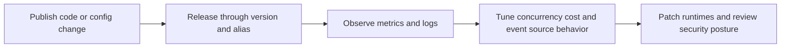

# Operations on AWS Lambda

The Operations section focuses on day-2 Lambda work: safe releases, stable performance, observability, cost control, and ongoing maintenance.

Use this section when your function already exists and you need to run it safely in production.

## What This Section Covers

| Page | Focus | Primary outcome |
|---|---|---|
| [Deployment Strategies](./deployment-strategies.md) | Rollout patterns | Reduce release risk |
| [Versioning and Aliases](./versioning-and-aliases.md) | Immutable releases | Fast rollback and promotion |
| [Provisioned Concurrency](./provisioned-concurrency.md) | Cold-start control | Predictable latency |
| [Monitoring](./monitoring.md) | Metrics and alarms | Faster detection |
| [Cost Optimization](./cost-optimization.md) | Efficiency tuning | Lower cost per request |
| [Environment Management](./environment-management.md) | Config and stage separation | Safer configuration changes |
| [Security Operations](./security-operations.md) | Ongoing security checks | Reduced operational exposure |
| [Updates and Patching](./updates-and-patching.md) | Runtime lifecycle | Lower deprecation risk |
| [Event Source Management](./event-source-management.md) | Mapping lifecycle and retries | Stable event processing |

## Operating Model



## Day-2 Priorities

Start with these priorities in order:

1. Route production traffic through aliases instead of `$LATEST`.
2. Add CloudWatch alarms for errors, throttles, and latency.
3. Separate stage configuration from code using environment variables and parameters.
4. Tune memory, timeout, and concurrency before peak traffic arrives.
5. Review event source retries, destinations, and filtering.

## Common Operations Workflow

```bash
aws lambda get-function-configuration \
    --function-name "$FUNCTION_NAME" \
    --region "$REGION"

aws lambda list-versions-by-function \
    --function-name "$FUNCTION_NAME" \
    --region "$REGION"

aws cloudwatch get-metric-statistics \
    --namespace "AWS/Lambda" \
    --metric-name "Errors" \
    --dimensions Name=FunctionName,Value="$FUNCTION_NAME" \
    --start-time "2026-04-06T00:00:00Z" \
    --end-time "2026-04-07T00:00:00Z" \
    --period 300 \
    --statistics Sum \
    --region "$REGION"
```

## When to Use This Section

- Use before the first production release checklist.
- Use when building alarm, rollback, and rollback-validation runbooks.
- Use when latency, cost, or retry behavior changes after a new event source is added.
- Use during regular platform hygiene work such as runtime updates and IAM review.

## Verification

- Confirm functions are deployed behind versions and aliases where required.
- Confirm key dashboards and alarms exist for each production workload.
- Confirm stage-specific configuration is not hard-coded into handlers.
- Confirm event source mappings and retry behavior match workload requirements.

## See Also

- [Platform Index](../platform/index.md)
- [Concurrency and Scaling](../platform/concurrency-and-scaling.md)
- [Deployment Best Practices](../best-practices/deployment.md)
- [Reliability](../best-practices/reliability.md)
- [Reference Index](../reference/index.md)

## Sources

- https://docs.aws.amazon.com/lambda/latest/dg/lambda-operations.html
- https://docs.aws.amazon.com/lambda/latest/dg/configuration-aliases.html
- https://docs.aws.amazon.com/lambda/latest/dg/monitoring-functions.html
