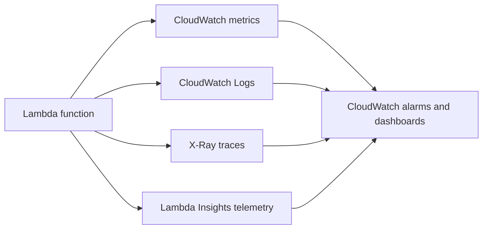

# Monitoring Lambda Workloads

Lambda monitoring combines CloudWatch metrics, alarms, dashboards, tracing, and enhanced runtime telemetry.

## When to Use

- Use this page when establishing minimum production observability.
- Use it when incident response is too slow because symptoms are visible only in logs.
- Use it when you need alarms around concurrency, retry buildup, or consumer lag.

## Monitoring Stack



## Core CloudWatch Metrics

| Metric | What it shows | Operational use |
|---|---|---|
| `Invocations` | Number of requests | Volume baseline |
| `Duration` | Execution time | Latency trend and timeout risk |
| `Errors` | Invocation failures | Alerting and release validation |
| `Throttles` | Rejected requests due to concurrency limits | Capacity pressure |
| `ConcurrentExecutions` | In-flight function executions | Concurrency saturation |
| `IteratorAge` | Stream backlog age | Consumer lag for streams |

Common companion metrics:

- `DeadLetterErrors`
- `DestinationDeliveryFailures`
- `ProvisionedConcurrencySpilloverInvocations`
- `AsyncEventAge`

## Pull Metrics with AWS CLI

```bash
aws cloudwatch get-metric-statistics \
    --namespace "AWS/Lambda" \
    --metric-name "Errors" \
    --dimensions Name=FunctionName,Value="$FUNCTION_NAME" \
    --start-time "2026-04-07T00:00:00Z" \
    --end-time "2026-04-07T01:00:00Z" \
    --period 60 \
    --statistics Sum \
    --region "$REGION"
```

Use alias-qualified dimensions when you need release-specific visibility.

## CloudWatch Alarms

Minimum production alarm set:

1. `Errors` greater than zero over a short period for synchronous APIs.
2. `Throttles` greater than zero.
3. `Duration` close to timeout.
4. `IteratorAge` rising for streams.

```bash
aws cloudwatch put-metric-alarm \
    --alarm-name "$FUNCTION_NAME-errors" \
    --alarm-description "Lambda errors detected" \
    --namespace "AWS/Lambda" \
    --metric-name "Errors" \
    --dimensions Name=FunctionName,Value="$FUNCTION_NAME" \
    --statistic Sum \
    --period 60 \
    --evaluation-periods 1 \
    --threshold 1 \
    --comparison-operator GreaterThanOrEqualToThreshold \
    --treat-missing-data notBreaching \
    --region "$REGION"
```

## X-Ray

Use AWS X-Ray when you need request path analysis across Lambda and downstream services.

Enable tracing in function configuration or infrastructure as code, then use traces to answer:

- Was latency inside Lambda initialization or handler code?
- Which downstream service caused the delay?
- Are retries or faults isolated to one integration?

## Lambda Insights

Lambda Insights adds enhanced telemetry such as memory usage and performance details beyond default CloudWatch metrics.

Use it when:

- Functions show variable memory or CPU-related performance behavior.
- You need faster capacity tuning without instrumenting the handler first.

## CloudWatch Dashboards

Build dashboards around workloads rather than around a single function when an application uses several functions together.

Recommended widgets:

- Invocations and Errors by function and alias
- Duration percentile trend
- Throttles and ConcurrentExecutions
- IteratorAge for streams
- API Gateway 4XX and 5XX if an API front end exists

## Practical Alarm Design

- Prefer short alarm windows for customer-facing failures.
- Add composite alarms if you want fewer pages for correlated symptoms.
- Use anomaly detection for volatile throughput when fixed thresholds create alert noise.
- Keep deployment alarms and steady-state alarms separate.

## Verification

- Confirm metrics populate after a test invocation.
- Confirm alarms transition correctly during controlled test conditions.
- Confirm traces are visible when X-Ray sampling is enabled.
- Confirm dashboards show alias-aware views for production releases.

## See Also

- [Provisioned Concurrency](./provisioned-concurrency.md)
- [Event Source Management](./event-source-management.md)
- [Lambda Diagnostics](../reference/lambda-diagnostics.md)
- [CloudWatch Queries](../reference/cloudwatch-queries.md)

## Sources

- https://docs.aws.amazon.com/lambda/latest/dg/monitoring-functions.html
- https://docs.aws.amazon.com/lambda/latest/dg/monitoring-metrics-types.html
- https://docs.aws.amazon.com/lambda/latest/dg/services-xray.html
- https://docs.aws.amazon.com/AmazonCloudWatch/latest/monitoring/AlarmThatSendsEmail.html
- https://docs.aws.amazon.com/AmazonCloudWatch/latest/monitoring/CloudWatch_Dashboards.html
- https://docs.aws.amazon.com/AmazonCloudWatch/latest/monitoring/Lambda-Insights.html
