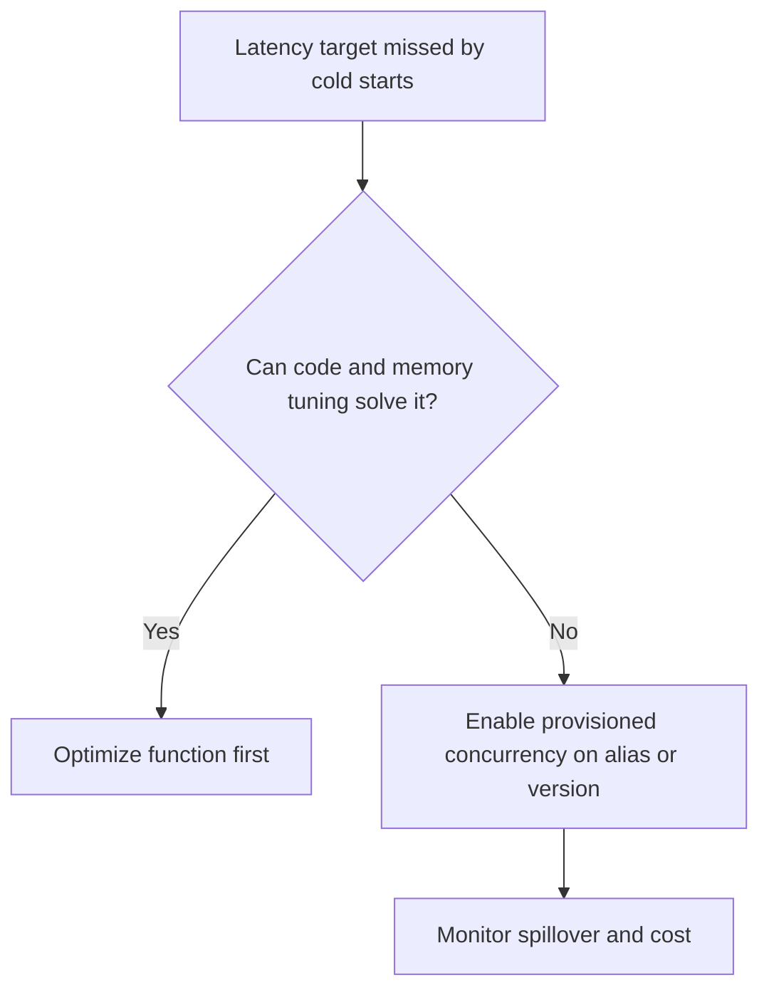

# Provisioned Concurrency Operations

Provisioned concurrency keeps execution environments initialized and ready so latency-sensitive Lambda workloads avoid most cold starts.

## When to Use

- Use for synchronous APIs with strict p95 or p99 latency targets.
- Use for bursty workloads where startup time would materially affect user experience.
- Use for Java or .NET functions, or functions with heavy initialization, when startup cost is operationally significant.
- Do not use by default for low-volume asynchronous jobs that tolerate startup delay.

## Decision Model



## Key Rules

| Rule | Why |
|---|---|
| Attach provisioned concurrency to a published version or alias | `$LATEST` is not supported |
| Size it from observed concurrent demand | Avoid underprovisioning and waste |
| Monitor spillover | Detect when requests exceed provisioned capacity |
| Pair with Application Auto Scaling if demand changes predictably | Reduce manual resizing |

## Configure via AWS CLI

```bash
aws lambda put-provisioned-concurrency-config \
    --function-name "$FUNCTION_NAME" \
    --qualifier "$ALIAS_NAME" \
    --provisioned-concurrent-executions 20 \
    --region "$REGION"

aws lambda get-provisioned-concurrency-config \
    --function-name "$FUNCTION_NAME" \
    --qualifier "$ALIAS_NAME" \
    --region "$REGION"
```

If you remove it:

```bash
aws lambda delete-provisioned-concurrency-config \
    --function-name "$FUNCTION_NAME" \
    --qualifier "$ALIAS_NAME" \
    --region "$REGION"
```

## Configure via AWS SAM

```yaml
Transform: AWS::Serverless-2024-10-16
Resources:
  ApiFunction:
    Type: AWS::Serverless::Function
    Properties:
      CodeUri: .
      Handler: app.handler
      Runtime: python3.12
      AutoPublishAlias: live
      ProvisionedConcurrencyConfig:
        ProvisionedConcurrentExecutions: 20
```

Use infrastructure as code so concurrency settings stay versioned with the release process.

## Auto Scaling Provisioned Concurrency

Application Auto Scaling can adjust provisioned concurrency for an alias.

```bash
aws application-autoscaling register-scalable-target \
    --service-namespace lambda \
    --resource-id "function:$FUNCTION_NAME:$ALIAS_NAME" \
    --scalable-dimension lambda:function:ProvisionedConcurrency \
    --min-capacity 5 \
    --max-capacity 100 \
    --region "$REGION"

aws application-autoscaling put-scaling-policy \
    --service-namespace lambda \
    --resource-id "function:$FUNCTION_NAME:$ALIAS_NAME" \
    --scalable-dimension lambda:function:ProvisionedConcurrency \
    --policy-name "pc-target-tracking" \
    --policy-type TargetTrackingScaling \
    --target-tracking-scaling-policy-configuration '{"TargetValue":0.7,"PredefinedMetricSpecification":{"PredefinedMetricType":"LambdaProvisionedConcurrencyUtilization"}}' \
    --region "$REGION"
```

## Cost Implications

You pay for:

- Provisioned concurrency capacity while it is allocated.
- Function invocation and duration when requests run.

Operational tradeoff:

| Pattern | Cost shape | Typical use |
|---|---|---|
| On-demand only | Pay only when invoked | Irregular or background workloads |
| Provisioned concurrency | Additional standing cost | Predictable low-latency APIs |

Before enabling it, compare:

- Cold-start impact on user experience.
- Traffic predictability.
- Whether memory tuning, package size reduction, or runtime selection already solves the problem.

## Metrics to Watch

- `ProvisionedConcurrentExecutions`
- `ProvisionedConcurrencyInvocations`
- `ProvisionedConcurrencySpilloverInvocations`
- `Duration`
- `Errors`

Spillover indicates requests exceeded provisioned capacity and fell back to standard on-demand concurrency behavior.

## Verification

- Confirm the config state becomes `READY` before sending production traffic.
- Confirm alias invocations use the qualified ARN that has provisioned concurrency.
- Confirm spillover stays low during normal load.
- Confirm cost expectations align with actual usage patterns.

## See Also

- [Monitoring](./monitoring.md)
- [Cost Optimization](./cost-optimization.md)
- [Concurrency and Scaling](../platform/concurrency-and-scaling.md)
- [Performance](../best-practices/performance.md)

## Sources

- https://docs.aws.amazon.com/lambda/latest/dg/provisioned-concurrency.html
- https://docs.aws.amazon.com/autoscaling/application/userguide/services-that-can-integrate-lambda.html
- https://docs.aws.amazon.com/lambda/latest/dg/monitoring-metrics-types.html
