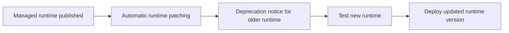

# Lambda Updates and Patching

Runtime updates are an operational responsibility even in a managed serverless platform.

Lambda manages underlying service infrastructure, but you still need a plan for runtime version changes, deprecations, and testing.

## When to Use

- Use when AWS announces a runtime deprecation timeline.
- Use during periodic platform hygiene reviews.
- Use before changing from one major runtime version to another.

## Runtime Lifecycle



## Managed Runtime Auto-Updates

For managed runtimes, AWS applies certain runtime updates automatically.

Operational implication:

- Your function code can stay unchanged while the managed runtime receives updates.
- You still need testing to detect compatibility issues introduced by runtime behavior changes or dependency drift.

## Review Current Runtime

```bash
aws lambda get-function-configuration \
    --function-name "$FUNCTION_NAME" \
    --region "$REGION"
```

Use this output to confirm:

- Runtime family and version
- Architecture
- Last modified timestamp
- Runtime management configuration when applicable

## Runtime Version Updates

Update a function to a supported runtime version deliberately and publish a new version afterward.

```bash
aws lambda update-function-configuration \
    --function-name "$FUNCTION_NAME" \
    --runtime python3.12 \
    --region "$REGION"

aws lambda publish-version \
    --function-name "$FUNCTION_NAME" \
    --description "Runtime update to python3.12" \
    --region "$REGION"
```

## Deprecation Timeline Management

When AWS announces runtime deprecation, create an operational plan with these stages:

1. Inventory affected functions.
2. Identify dependency or library compatibility issues.
3. Test in non-production with representative events.
4. Release using alias-based rollout.
5. Remove or rewrite functions that cannot move safely.

Track deadlines early because runtime blocks can eventually affect create and update operations.

## Migration Strategies Between Runtime Versions

Choose the migration path based on risk:

| Strategy | Best for | Notes |
|---|---|---|
| In-place runtime update + new version | Small compatible change | Fastest, but still needs testing |
| Parallel version under alias | Moderate-risk workload | Good rollback path |
| New function and cutover | Large refactor or packaging change | Clear isolation |

Common migration concerns:

- Dependency compatibility
- TLS or networking library changes
- JSON serialization differences
- Native package rebuild requirements
- Startup behavior differences affecting cold starts

## Runtime Management Controls

If using runtime management controls, review how updates are applied so your testing and release practices match the selected mode.

## Verification

- Confirm the target runtime is supported.
- Confirm integration and load tests pass before production cutover.
- Confirm alias-based rollout has rollback coverage.
- Confirm monitoring watches duration, errors, and cold-start-sensitive paths after runtime change.

## See Also

- [Deployment Strategies](./deployment-strategies.md)
- [Monitoring](./monitoring.md)
- [Security Operations](./security-operations.md)
- [Service Limits](../reference/service-limits.md)

## Sources

- https://docs.aws.amazon.com/lambda/latest/dg/lambda-runtimes.html
- https://docs.aws.amazon.com/lambda/latest/dg/runtime-management-configure-settings.html
- https://docs.aws.amazon.com/lambda/latest/dg/lambda-runtimes.html#runtime-deprecation-policy
