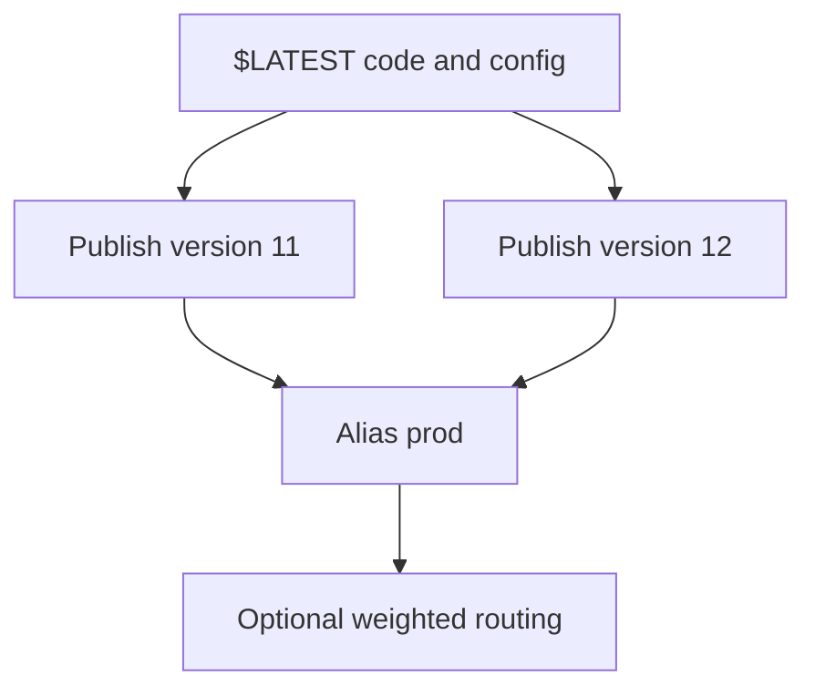

# Lambda Versioning and Aliases

Lambda versions make releases immutable. Aliases provide stable names that can point to specific versions and optionally split traffic between two versions.

## When to Use

- Use versions whenever you need reproducible releases.
- Use aliases for production, staging, and rollback control.
- Use routing configuration when you need a weighted migration between two versions.
- Use version cleanup when you publish frequently and need to reduce operational clutter.

## Model



## Core Rules

| Rule | Why it matters |
|---|---|
| Publish a new version for each release | Prevents accidental mutation of a production artifact |
| Invoke aliases in production integrations | Decouples callers from version numbers |
| Keep `$LATEST` for build-time or test-only flows | Avoids untracked production drift |
| Track version-to-commit mapping | Makes rollback fast and auditable |

## Publish Versions

```bash
aws lambda publish-version \
    --function-name "$FUNCTION_NAME" \
    --description "Commit abc123 release" \
    --region "$REGION"

aws lambda list-versions-by-function \
    --function-name "$FUNCTION_NAME" \
    --region "$REGION"
```

Publish after the code package, layers, and configuration for the release are finalized.

## Create and Update Aliases

Create a stable alias name such as `dev`, `stage`, or `prod`.

```bash
aws lambda create-alias \
    --function-name "$FUNCTION_NAME" \
    --name "$ALIAS_NAME" \
    --function-version 11 \
    --description "Production alias" \
    --region "$REGION"
```

Update the alias to promote a newer version.

```bash
aws lambda update-alias \
    --function-name "$FUNCTION_NAME" \
    --name "$ALIAS_NAME" \
    --function-version 12 \
    --region "$REGION"
```

## Configure Weighted Routing

Lambda alias routing supports a primary version and one additional weighted version.

```bash
aws lambda update-alias \
    --function-name "$FUNCTION_NAME" \
    --name "$ALIAS_NAME" \
    --function-version 11 \
    --routing-config AdditionalVersionWeights={12=0.1} \
    --region "$REGION"
```

Use this only when both versions are safe to handle the same event contract.

## Version Lifecycle Management

Operational lifecycle:

1. Update code and configuration on `$LATEST`.
2. Publish a version.
3. Shift an alias to the new version.
4. Observe alarms, logs, and traces.
5. Keep prior stable versions for rollback.
6. Remove stale versions once they are no longer referenced.

List aliases before cleanup so you do not delete a still-referenced version.

```bash
aws lambda list-aliases \
    --function-name "$FUNCTION_NAME" \
    --region "$REGION"

aws lambda delete-function \
    --function-name "$FUNCTION_NAME" \
    --qualifier 7 \
    --region "$REGION"
```

Only delete a version after confirming:

- No alias points to it.
- No event source mapping or external integration invokes it directly.
- The release is outside the rollback window.

## Alias-Oriented Integrations

Prefer integrations that target the alias-qualified ARN.

- API Gateway integration URI
- Event source mapping target function ARN
- Lambda function URL permission scope
- Cross-account permissions when the consumer should stay on a stable stage name

## Operational Pitfalls

- Publishing versions too early before configuration is final.
- Invoking raw version numbers from clients and losing release abstraction.
- Deleting older versions before the rollback window ends.
- Mixing alias-based releases with ad hoc console edits on `$LATEST`.

## Verification

```bash
aws lambda get-alias \
    --function-name "$FUNCTION_NAME" \
    --name "$ALIAS_NAME" \
    --region "$REGION"

aws lambda get-function \
    --function-name "$FUNCTION_NAME:$ALIAS_NAME" \
    --region "$REGION"
```

Confirm:

- The alias points to the intended function version.
- Any routing weight matches the rollout plan.
- The target version exists and remains available.

## See Also

- [Deployment Strategies](./deployment-strategies.md)
- [Environment Management](./environment-management.md)
- [Deployment Best Practices](../best-practices/deployment.md)
- [Lambda CLI Cheatsheet](../reference/lambda-cli-cheatsheet.md)

## Sources

- https://docs.aws.amazon.com/lambda/latest/dg/configuration-versions.html
- https://docs.aws.amazon.com/lambda/latest/dg/configuration-aliases.html
- https://docs.aws.amazon.com/lambda/latest/dg/configuring-alias-routing.html
