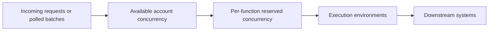
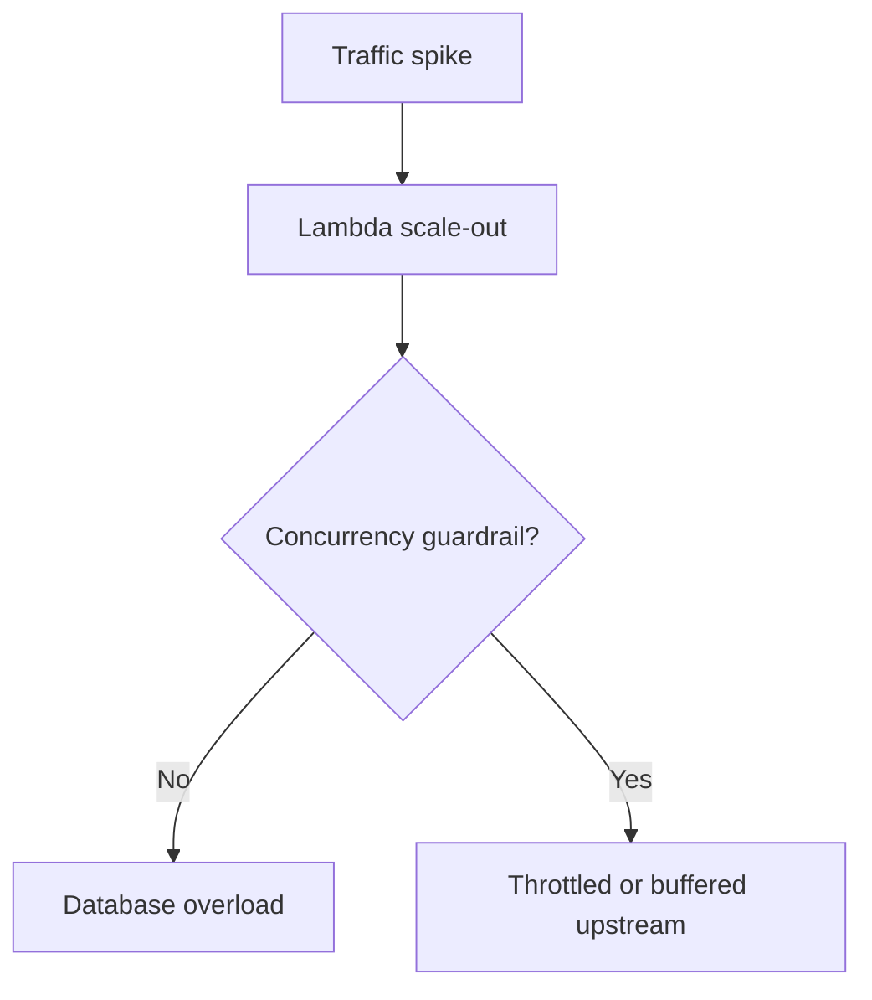

# Concurrency and Scaling

Lambda scales by creating more execution environments, but the exact scaling behavior depends on account quotas, per-function settings, and event source rules.

Concurrency is the single most important control for balancing throughput, latency, and downstream protection.

## Concurrency Mental Model



## Key Terms

| Term | Meaning |
|---|---|
| Concurrency | Number of in-flight invocations at one time |
| Reserved concurrency | Portion of account concurrency dedicated to one function and also a hard cap for that function |
| Provisioned concurrency | Pre-initialized environments for low-latency starts |
| Throttle | Invocation rejected because no concurrency is available |
| Burst scaling | Rapid initial scale-out behavior within service-managed regional rules |

## Account-Level Limits

Each account has a regional concurrency quota.

Operational implications:

- All functions in the Region compete for unreserved concurrency.
- A noisy background function can starve latency-sensitive workloads.
- Reserved concurrency protects critical functions from neighbors.

## Reserved Concurrency

Reserved concurrency does two things at once:

1. Guarantees capacity is held for a function.
2. Caps that function so it cannot exceed the reserved amount.

This makes it both an availability tool and a blast-radius control.

```bash
aws lambda put-function-concurrency \
    --function-name "$FUNCTION_NAME" \
    --reserved-concurrent-executions 50
```

## Provisioned Concurrency

Provisioned concurrency keeps environments initialized and ready.

Use it when:

- Startup latency is part of a hard user-facing SLO.
- Traffic is predictable enough to schedule or pre-allocate capacity.
- Java or large dependency stacks make cold starts expensive.

Do not confuse provisioned concurrency with overall throughput. It improves readiness, not event source semantics.

## Scaling Behavior by Source Type

| Source | Scaling pattern | Main control |
|---|---|---|
| API Gateway / Function URL | Scales with request load up to available concurrency | Reserved/provisioned concurrency |
| S3 / SNS / EventBridge | Async delivery with service-managed retries | Function concurrency and async settings |
| SQS | Lambda pollers increase concurrency based on queue backlog | Batch size, maximum concurrency, reserved concurrency |
| Kinesis / DynamoDB Streams | Concurrency tied to shard processing rules | Shard count, parallelization factor |

## Burst and Steady-State Scaling

Lambda can scale quickly, but not infinitely or uniformly for every source.

Plan for:

- Initial bursts that can create many cold starts.
- Downstream systems that cannot absorb sudden parallelism.
- Queue backlogs that drain more slowly than expected if concurrency is capped.

## Protecting Downstream Systems



Good controls include:

- Reserved concurrency.
- Queue buffering with SQS.
- RDS Proxy for relational connection fan-in.
- Backoff and circuit breaker logic in code.

## Measuring the Right Signals

| Signal | Why it matters |
|---|---|
| ConcurrentExecutions | Current in-flight load |
| Throttles | Hard sign that concurrency ran out |
| Duration | Helps estimate concurrency demand |
| IteratorAge | Indicates stream consumer lag |
| ApproximateAgeOfOldestMessage | Indicates SQS backlog pressure |

## Capacity Estimation Rule of Thumb

Expected concurrency is approximately request rate multiplied by average duration.

That estimate is not enough on its own because:

- Bursts are uneven.
- Different event sources batch differently.
- Cold starts increase observed latency.

## Practical Rules

1. Put reserved concurrency on critical production functions.
2. Use provisioned concurrency only where latency benefit justifies cost.
3. Treat unbounded async fan-in as a reliability risk.
4. Tune event source mappings together with downstream capacity.
5. Monitor throttles as a symptom, not just a metric to suppress.

## See Also

- [Execution Model](./execution-model.md)
- [Event Sources](./event-sources.md)
- [Networking](./networking.md)
- [Best Practices: Production Baseline](../best-practices/production-baseline.md)
- [Best Practices: Reliability](../best-practices/reliability.md)

## Sources

- [Configuring reserved concurrency for a function](https://docs.aws.amazon.com/lambda/latest/dg/configuration-concurrency.html)
- [Configuring provisioned concurrency for a function](https://docs.aws.amazon.com/lambda/latest/dg/provisioned-concurrency.html)
- [Lambda quotas](https://docs.aws.amazon.com/lambda/latest/dg/gettingstarted-limits.html)
- [Using Lambda with Amazon SQS](https://docs.aws.amazon.com/lambda/latest/dg/with-sqs.html)
- [Using Lambda with Amazon Kinesis](https://docs.aws.amazon.com/lambda/latest/dg/with-kinesis.html)
- [Using Lambda with DynamoDB](https://docs.aws.amazon.com/lambda/latest/dg/with-ddb.html)
