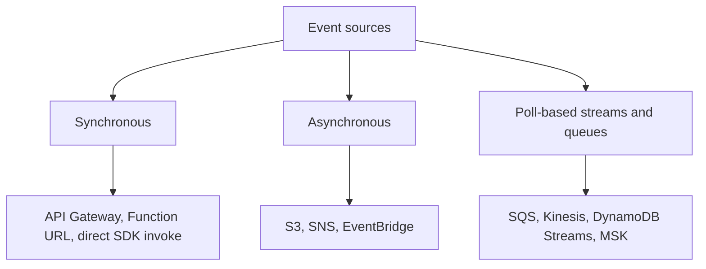
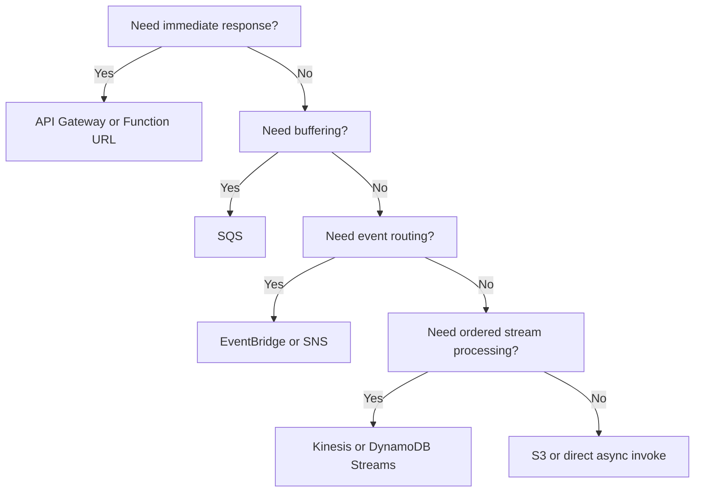

# Event Sources

Lambda supports multiple invocation models, and the event source you choose changes latency, retry behavior, ordering, throughput, and failure handling.

This page groups event sources by delivery model first, then compares the most common AWS integrations.

## Invocation Model Categories



| Model | Delivery path | Examples | Main design concern |
|---|---|---|---|
| Synchronous | Caller waits for result | API Gateway, Function URL, SDK invoke | End-user latency and caller-visible errors |
| Asynchronous | Event accepted, then delivered later | S3, SNS, EventBridge | Retries, duplicates, and failure destinations |
| Poll-based | Lambda service polls source on your behalf | SQS, Kinesis, DynamoDB Streams | Batch handling, ordering, backpressure |

## Synchronous Sources

### API Gateway

Use when you need an HTTPS API surface for request/response workloads.

- Good for APIs, webhooks, and lightweight backend integration.
- Client sees function latency directly.
- Timeouts and error mapping must be intentional.

### Function URL

Use when you need a simple HTTPS endpoint without API Gateway features.

- Lower configuration overhead.
- Supports `AWS_IAM` or `NONE` authentication.
- Lacks many API management features such as authorizers, usage plans, and request transformation.

## Asynchronous Sources

### Amazon S3

Use when object creation, deletion, or restore events should trigger processing.

- Natural fit for media pipelines and document processing.
- Delivery is asynchronous.
- Design for duplicate events and out-of-order arrivals.

### Amazon SNS

Use when one event should fan out to multiple subscribers.

- Good for pub/sub decoupling.
- Lambda receives asynchronous invokes.
- Message attributes can help route behavior.

### Amazon EventBridge

Use when you need event routing based on patterns or SaaS and AWS service integration.

- Good for loosely coupled application events.
- Supports archive, replay, and routing rules.
- Best when events should stay event-shaped instead of request-shaped.

## Poll-Based Sources

### Amazon SQS

Use when you need decoupling, buffering, and retryable asynchronous work.

- Lambda polls queues and invokes with batches.
- Visibility timeout and function timeout must be aligned.
- Standard queues allow duplicates; FIFO queues preserve ordered processing by message group.

### DynamoDB Streams

Use for change data capture from DynamoDB tables.

- Ordering is preserved per shard.
- Consumer lag can grow if processing is slow or repeatedly failing.
- Partial batch response can reduce replay scope.

### Kinesis Data Streams

Use for ordered, shard-based streaming workloads.

- Concurrency is shaped by shard count and parallelization settings.
- Good for near-real-time processing where order matters.

### Step Functions

Step Functions is not just an event source but an orchestration service.

- Use it when a workflow needs branching, retries, waits, compensation, or state tracking.
- Prefer Step Functions over writing orchestration logic inside a single Lambda function.

## Quick Comparison Table

| Source | Invocation type | Best for | Watch out for |
|---|---|---|---|
| API Gateway | Synchronous | APIs and webhooks | User-facing latency |
| Function URL | Synchronous | Simple HTTPS endpoint | Limited gateway features |
| S3 | Asynchronous | Object processing | Duplicate and unordered delivery |
| SNS | Asynchronous | Fan-out notifications | At-least-once delivery |
| EventBridge | Asynchronous | Event routing and integration | Schema governance |
| SQS | Poll-based | Buffering and background jobs | Visibility timeout mismatch |
| DynamoDB Streams | Poll-based | Table change processing | Shard lag and retries |
| Kinesis | Poll-based | Ordered stream processing | Shard throughput planning |
| Step Functions | Orchestration | Multi-step workflows | Extra service boundary and cost |

## Selection Heuristics



## CLI Example: SQS Event Source Mapping

```bash
aws lambda create-event-source-mapping \
    --function-name "$FUNCTION_NAME" \
    --event-source-arn arn:aws:sqs:$REGION:<account-id>:orders-queue \
    --batch-size 10 \
    --maximum-batching-window-in-seconds 5
```

## Decision Rules

- Use **API Gateway** when HTTP semantics, authorization layers, or API management matter.
- Use **Function URLs** for simple internal or low-friction HTTPS endpoints.
- Use **SQS** when you need buffering and independent retry from the caller.
- Use **EventBridge** when event routing flexibility matters more than immediate response.
- Use **Step Functions** when the workflow itself has state and branching.

## See Also

- [How Lambda Works](./how-lambda-works.md)
- [Execution Model](./execution-model.md)
- [Concurrency and Scaling](./concurrency-and-scaling.md)
- [Best Practices: Reliability](../best-practices/reliability.md)
- [Best Practices: Common Anti-Patterns](../best-practices/common-anti-patterns.md)

## Sources

- [Invoking Lambda functions](https://docs.aws.amazon.com/lambda/latest/dg/lambda-invocation.html)
- [Using Lambda with Amazon SQS](https://docs.aws.amazon.com/lambda/latest/dg/with-sqs.html)
- [Using Lambda with Amazon S3](https://docs.aws.amazon.com/lambda/latest/dg/with-s3.html)
- [Using Lambda with Amazon SNS](https://docs.aws.amazon.com/lambda/latest/dg/with-sns.html)
- [Using Lambda with Amazon EventBridge](https://docs.aws.amazon.com/lambda/latest/dg/with-eventbridge.html)
- [Using Lambda with DynamoDB](https://docs.aws.amazon.com/lambda/latest/dg/with-ddb.html)
- [Using Lambda with Amazon Kinesis](https://docs.aws.amazon.com/lambda/latest/dg/with-kinesis.html)
- [Orchestrating Lambda functions with AWS Step Functions](https://docs.aws.amazon.com/lambda/latest/dg/with-step-functions.html)
