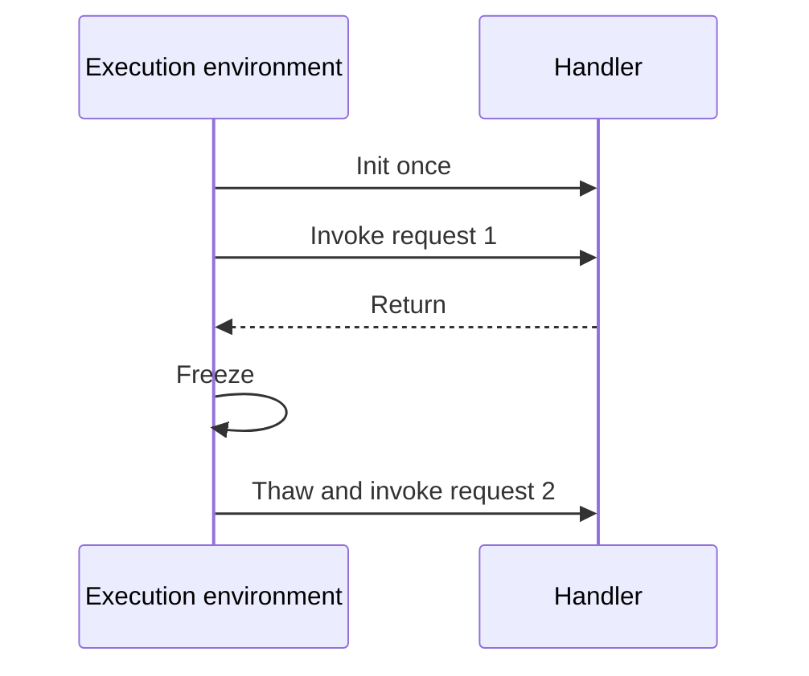

# Execution Model

Lambda does not run your function inside a long-lived server that you manage.

Instead, it creates execution environments, runs an initialization phase, processes one invocation at a time per environment, and may later reuse that environment for another invocation.

## Lifecycle Overview


## Init Phase

During init, Lambda prepares the execution environment and starts your runtime.

Typical init work includes:

- Loading your code package or container image contents.
- Starting the language runtime.
- Evaluating module-level or static initialization logic.
- Initializing extensions.
- Creating SDK clients or connection pools that are defined outside the handler.

Init latency is the main contributor to cold start duration.

## Invoke Phase

After init, Lambda passes an event to the handler and waits for a response or completion.

Key rules:

- One execution environment processes one invocation at a time.
- Handler timeout includes only invocation time, but slow init still affects end-to-end latency.
- Billing includes init and invoke duration for on-demand functions.

## Shutdown, Freeze, and Reuse

Lambda may keep an environment available after a request finishes.

If the environment is reused:

- Memory state can persist.
- Files in `/tmp` can persist.
- Open connections may remain usable if the downstream service and client permit reuse.

If the environment is not reused, Lambda eventually shuts it down and that state disappears.



## Warm Starts Versus Cold Starts

| Start type | What happens | Main latency contributors |
|---|---|---|
| Cold start | New environment must be initialized | Runtime startup, package load, dependency init, VPC setup effects |
| Warm start | Existing environment is reused | Handler work and downstream latency |

Cold starts are normal. The goal is to reduce their frequency or cost for latency-sensitive paths.

## `/tmp` Storage

Each execution environment gets writable temporary storage mounted at `/tmp`.

Operational implications:

- Data in `/tmp` persists only for the lifetime of that specific environment.
- It can be used for caching models, certificates, dependency artifacts, or transformed files.
- It should never be treated as durable shared storage.

## Freeze/Thaw Design Rules

- Safe to cache immutable reference data locally when refresh logic exists.
- Safe to reuse SDK clients and many HTTP connections from global scope.
- Unsafe to rely on background threads finishing after handler return unless the runtime model explicitly supports that pattern.
- Unsafe to store user-specific state that could leak across invocations.

## SnapStart and Specialized Startup Optimizations

AWS Lambda SnapStart is available for supported Java runtimes and reduces startup latency by resuming from a cached initialized snapshot.

That changes startup behavior, but does not remove the need to design safe initialization logic.

## Example Initialization Pattern

```bash
aws lambda update-function-configuration \
    --function-name "$FUNCTION_NAME" \
    --memory-size 1024 \
    --timeout 15
```

More memory often increases CPU allocation, which can reduce init duration as well as invoke duration.

## Common Failures Explained by the Execution Model

| Symptom | Likely explanation |
|---|---|
| First request after idle is slow | Cold start and init work |
| Function times out only during bursts | Many new environments initializing at once |
| Cached file disappears | New execution environment without prior `/tmp` state |
| Connection works sometimes and fails later | Reused environment with stale connection |

## Practical Rules

1. Put reusable clients outside the handler.
2. Delay expensive work until it is actually needed.
3. Keep deployment package size small enough to reduce init overhead.
4. Assume any environment can disappear at any time.
5. Treat warm reuse as an optimization, not a correctness requirement.

!!! tip
    The fastest Lambda function is often the one that moves unnecessary work out of init, shortens code paths, and avoids needless VPC attachment.

## See Also

- [How Lambda Works](./how-lambda-works.md)
- [Concurrency and Scaling](./concurrency-and-scaling.md)
- [Layers and Extensions](./layers-and-extensions.md)
- [Best Practices: Performance](../best-practices/performance.md)
- [Home](../index.md)

## Sources

- [Understanding the Lambda execution environment lifecycle](https://docs.aws.amazon.com/lambda/latest/dg/lambda-runtime-environment.html)
- [Best practices for working with AWS Lambda functions](https://docs.aws.amazon.com/lambda/latest/dg/best-practices.html)
- [Configuring ephemeral storage for Lambda functions](https://docs.aws.amazon.com/lambda/latest/dg/configuration-ephemeral-storage.html)
- [Improving startup performance with Lambda SnapStart](https://docs.aws.amazon.com/lambda/latest/dg/snapstart.html)
