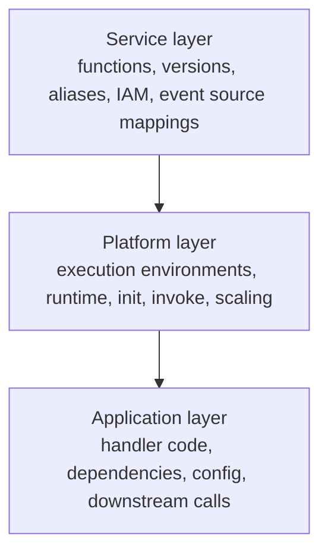
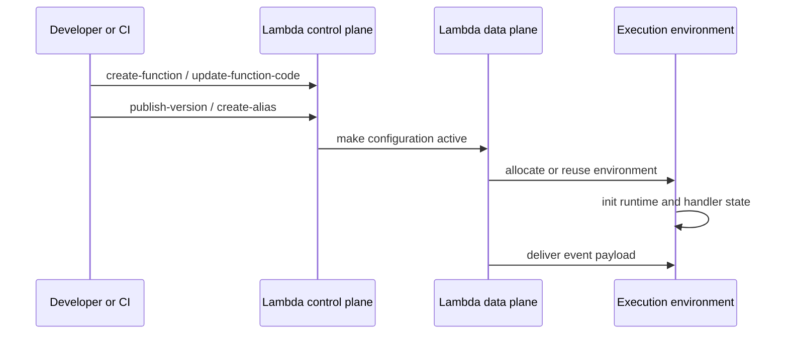

# How Lambda Works

AWS Lambda combines a control plane for managing function resources with a data plane that executes invocations inside isolated runtime environments.

The service is easiest to reason about as three layers: the Lambda service layer, the execution platform layer, and your application layer.

## Three-Layer Operating Model



| Layer | Owned by | Responsibility | Typical artifacts |
|---|---|---|---|
| Service | AWS Lambda service and operators | Resource creation, policy evaluation, versioning, invocation routing | Functions, aliases, resource policies, mappings |
| Platform | AWS-managed runtime platform | Environment startup, code loading, isolation, reuse, telemetry hooks | Execution environments, `/tmp`, runtime process |
| Application | Your team | Business logic, dependency loading, downstream interactions | Handler, libraries, SDK clients, app config |

## Control Plane Versus Data Plane

The control plane handles management APIs such as create, update, publish version, create alias, and update event source mapping.

The data plane handles invocation delivery, environment allocation, and runtime execution.



## Core Resource Model

Lambda uses a small set of resource types that combine into a deployment and invocation graph.

- **Function**: Main compute resource and mutable configuration object.
- **Version**: Immutable snapshot of function code and most configuration.
- **Alias**: Named pointer to a version, optionally with weighted routing.
- **Layer version**: Immutable package mounted into the execution environment.
- **Event source mapping**: Polling configuration for queues and streams.
- **Function URL**: Built-in HTTPS endpoint for direct invocation.

## Function Lifecycle at the Service Level

1. You create or update a function.
2. Lambda stores code and configuration.
3. Optional publish creates an immutable version.
4. Event sources or direct invoke paths send requests.
5. Lambda allocates or reuses execution environments.
6. Observability signals flow to CloudWatch and optional X-Ray.

## Invocation Paths

| Model | Who sends the invoke | Examples | Operational impact |
|---|---|---|---|
| Synchronous | Caller waits for response | API Gateway, Function URL, SDK `Invoke` with `RequestResponse` | Caller sees latency and errors directly. |
| Asynchronous | Lambda queues event before delivery | SNS, EventBridge, S3 | Retries and failure destinations are service-managed. |
| Poll-based | Lambda polls on your behalf | SQS, Kinesis, DynamoDB Streams, MSK | Batch size, shard/queue behavior, and concurrency differ by source. |

## What Lambda Manages for You

- Environment provisioning and isolation.
- Runtime startup and handler invocation.
- Automatic horizontal scaling up to available concurrency.
- Availability across multiple Availability Zones in a Region.
- Integration points for logs, metrics, traces, and extensions.

## What Lambda Does Not Manage for You

- Idempotency of your application logic.
- Safe downstream capacity limits.
- Correct retry handling for your integration pattern.
- Schema evolution for event payloads.
- Least-privilege IAM policies.

## Deployment Objects in Practice

```bash
aws lambda update-function-code \
    --function-name "$FUNCTION_NAME" \
    --zip-file fileb://function.zip

aws lambda publish-version \
    --function-name "$FUNCTION_NAME"

aws lambda update-alias \
    --function-name "$FUNCTION_NAME" \
    --name "$ALIAS_NAME" \
    --function-version 5
```

The mutable function is convenient for iteration, but production release control is built around immutable versions and aliases.

## Service Boundaries That Matter

| Boundary | Why it matters |
|---|---|
| Function configuration to version | Determines what is frozen for a release. |
| Alias to version | Enables rollback and weighted routing. |
| Event source mapping to function or alias | Controls which deployment receives polled events. |
| Resource policy to invoking service | Grants permission to invoke. |
| Execution role to downstream service | Grants runtime access outward. |

## Common Misunderstandings

- A function is not the same as a version.
- An alias does not copy code; it only points to a published version.
- Poll-based event sources are not "push" triggers; Lambda runs pollers for them.
- VPC attachment changes network path, not IAM permission.
- Layers share files, not process memory across functions.

!!! tip
    If you can draw the path from event source to alias to version to execution role to downstream dependency, you can usually explain both deployment behavior and failure behavior.

## See Also

- [Platform Index](./index.md)
- [Execution Model](./execution-model.md)
- [Event Sources](./event-sources.md)
- [Resource Relationships](./resource-relationships.md)
- [Security Model](./security-model.md)

## Sources

- [AWS Lambda Developer Guide](https://docs.aws.amazon.com/lambda/latest/dg/welcome.html)
- [Managing Lambda function versions](https://docs.aws.amazon.com/lambda/latest/dg/configuration-versions.html)
- [Lambda aliases](https://docs.aws.amazon.com/lambda/latest/dg/configuration-aliases.html)
- [Lambda event source mappings](https://docs.aws.amazon.com/lambda/latest/dg/invocation-eventsourcemapping.html)
- [Invoking Lambda functions](https://docs.aws.amazon.com/lambda/latest/dg/lambda-invocation.html)
