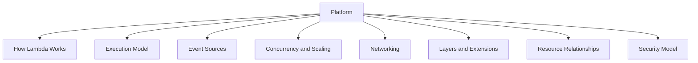
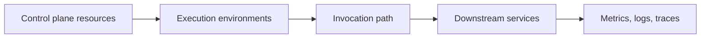

# Platform Index

The platform section explains how AWS Lambda behaves underneath your application code.

Read these pages when you need to understand lifecycle, scaling, networking, security, and the relationships among Lambda resources before making production decisions.

## What This Section Covers

## Page Guide

| Page | Focus | Why it matters |
|---|---|---|
| [How Lambda Works](./how-lambda-works.md) | Control plane, data plane, service/platform/application layers | Gives the architectural vocabulary used across the guide. |
| [Execution Model](./execution-model.md) | Init, invoke, shutdown, freeze/thaw, `/tmp` | Explains cold starts, warm starts, and state reuse. |
| [Event Sources](./event-sources.md) | Sync, async, queue, and stream invocation models | Determines retries, duplication, ordering, and scaling. |
| [Concurrency and Scaling](./concurrency-and-scaling.md) | Reserved concurrency, provisioned concurrency, quotas, burst behavior | Prevents throttling and downstream overload. |
| [Networking](./networking.md) | Default networking, VPC attachment, ENIs, egress | Critical for database access and internet connectivity. |
| [Layers and Extensions](./layers-and-extensions.md) | Shared code, external processes, telemetry | Affects packaging, startup, and observability. |
| [Resource Relationships](./resource-relationships.md) | Functions, versions, aliases, mappings, roles | Helps reason about deployment and rollback safety. |
| [Security Model](./security-model.md) | IAM, policies, encryption, code signing, function URLs | Defines trust boundaries and access control paths. |

## Recommended Reading Order

1. [How Lambda Works](./how-lambda-works.md)
2. [Execution Model](./execution-model.md)
3. [Event Sources](./event-sources.md)
4. [Concurrency and Scaling](./concurrency-and-scaling.md)
5. [Networking](./networking.md)
6. [Security Model](./security-model.md)
7. [Layers and Extensions](./layers-and-extensions.md)
8. [Resource Relationships](./resource-relationships.md)

## Questions This Section Answers

- What exactly happens between `create-function` and the first invocation?
- Why do some functions cold start more often than others?
- Why can SQS and Kinesis cause very different concurrency behavior?
- When does Lambda need ENIs and when does it not?
- What is the operational difference between a version and an alias?
- Which permission must change to let another AWS service invoke a function?

## Typical Reader Journeys

| If you are trying to... | Start with |
|---|---|
| Explain Lambda internals to a team | [How Lambda Works](./how-lambda-works.md) |
| Improve latency and startup behavior | [Execution Model](./execution-model.md) |
| Pick the right trigger pattern | [Event Sources](./event-sources.md) |
| Protect a downstream database from spikes | [Concurrency and Scaling](./concurrency-and-scaling.md) |
| Connect to private services safely | [Networking](./networking.md) |
| Share dependencies or telemetry components | [Layers and Extensions](./layers-and-extensions.md) |
| Standardize release and traffic routing | [Resource Relationships](./resource-relationships.md) |
| Review IAM and invoke boundaries | [Security Model](./security-model.md) |

## Core Mental Model

Use this section to separate four concerns:

| Concern | Example |
|---|---|
| Resource definition | Function configuration, version, alias, role |
| Runtime behavior | Init duration, warm reuse, `/tmp` persistence |
| Invocation semantics | Polling, batching, retries, throttles |
| Security boundary | IAM permissions, resource policy, VPC controls |

## Design Rule

Do not jump directly into best practices until you can explain the event source model and concurrency path for your workload.

Many Lambda production issues are not code defects. They are mismatches between platform behavior and application assumptions.

## What to Capture in Design Reviews

When reviewing a Lambda-based system, document these platform facts explicitly:

- Invocation type and event source retry model.
- Expected steady-state and burst concurrency.
- Whether the function requires VPC access.
- Which alias receives production traffic.
- Which IAM role and resource policies define trust.

These five items usually predict the majority of production surprises.

## See Also

- [Start Here: Overview](../start-here/overview.md)
- [Best Practices Index](../best-practices/index.md)
- [Start Here: Learning Paths](../start-here/learning-paths.md)
- [Home](../index.md)

## Sources

- [AWS Lambda Developer Guide](https://docs.aws.amazon.com/lambda/latest/dg/welcome.html)
- [Lambda execution environment](https://docs.aws.amazon.com/lambda/latest/dg/lambda-runtime-environment.html)
- [Lambda event source mappings](https://docs.aws.amazon.com/lambda/latest/dg/invocation-eventsourcemapping.html)
- [Configuring reserved concurrency for a function](https://docs.aws.amazon.com/lambda/latest/dg/configuration-concurrency.html)
- [Giving Lambda functions access to resources in an Amazon VPC](https://docs.aws.amazon.com/lambda/latest/dg/configuration-vpc.html)
