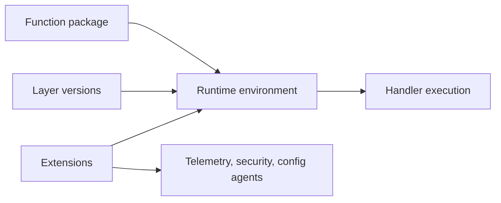
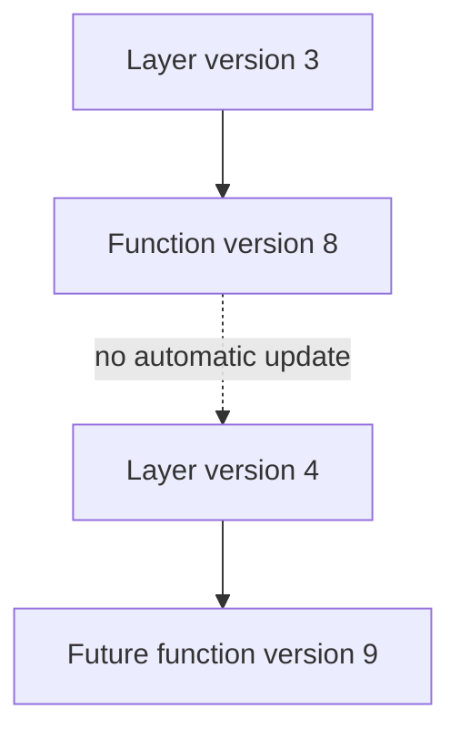

# Layers and Extensions

Lambda layers let you share code and runtime content across functions, while extensions let you integrate additional processes or hooks into the execution environment.

Both features are powerful, but both affect startup behavior and operational complexity.

## Conceptual Split



## Lambda Layers

A layer is an archive that Lambda extracts into the execution environment at `/opt`.

Use layers for:

- Shared libraries across many functions.
- Runtime dependencies that change less often than business code.
- Shared binaries, certificates, or helper utilities.

Avoid layers when:

- Only one function uses the dependency.
- You can package the dependency directly with the function more simply.
- Layer sprawl makes version tracking harder than duplication would.

## Layer Lifecycle

| Step | Meaning |
|---|---|
| Create archive | Prepare dependency package in supported layout |
| Publish layer version | Creates immutable layer version ARN |
| Attach to function | Function references one or more layer versions |
| Update function | New layer version must be attached explicitly |

## Publishing a Layer

```bash
aws lambda publish-layer-version \
    --layer-name shared-dependencies \
    --zip-file fileb://layer.zip \
    --compatible-runtimes python3.12 nodejs22.x
```

## Sharing a Layer

Layer sharing is controlled with layer version permissions.

You can share with:

- Specific AWS accounts.
- All accounts in your organization.
- Public consumers, if intentionally exposed.

## Extensions

Extensions run alongside your function in the execution environment.

Two main types exist:

- **Internal extensions**: Integrated into the runtime process.
- **External extensions**: Separate processes that subscribe to lifecycle events.

Typical uses include:

- Telemetry forwarding.
- Security inspection.
- Secrets or configuration caching.

## Lifecycle Impact

Extensions participate in init and shutdown behavior.

Operational implications:

- Slow extensions increase startup latency.
- Misbehaving extensions can increase memory usage or delay completion.
- Extension count should be kept intentional and minimal.

## Lambda Insights

Lambda Insights provides enhanced metrics and monitoring data using a Lambda extension.

Use it when you need deeper visibility into runtime performance, memory, and system behavior beyond basic CloudWatch metrics.

## Choosing Between Direct Packaging, Layers, and Extensions

| Need | Best fit |
|---|---|
| Single-function dependency | Direct package with function |
| Shared library across many functions | Layer |
| Sidecar-style telemetry or agent logic | Extension |
| Runtime-specific performance library | Depends on operational rollout needs |

## Versioning Rules

- Layer versions are immutable.
- Functions do not automatically move to newer layer versions.
- Production change control should treat layer updates like application dependency releases.



## Practical Rules

1. Keep layers small and purpose-specific.
2. Prefer one shared dependency layer over many overlapping layers.
3. Benchmark extension impact before enabling fleet-wide.
4. Document which functions depend on which layer versions.
5. Roll out layer changes through aliases just like code changes.

## See Also

- [Execution Model](./execution-model.md)
- [Resource Relationships](./resource-relationships.md)
- [Best Practices: Performance](../best-practices/performance.md)
- [Best Practices: Deployment](../best-practices/deployment.md)
- [Home](../index.md)

## Sources

- [Managing Lambda dependencies with layers](https://docs.aws.amazon.com/lambda/latest/dg/chapter-layers.html)
- [Lambda layers API and permissions](https://docs.aws.amazon.com/lambda/latest/dg/adding-layers.html)
- [Using Lambda extensions](https://docs.aws.amazon.com/lambda/latest/dg/using-extensions.html)
- [Monitoring Lambda functions with Lambda Insights](https://docs.aws.amazon.com/AmazonCloudWatch/latest/monitoring/Lambda-Insights.html)
