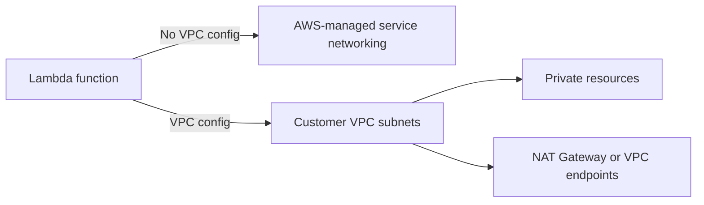
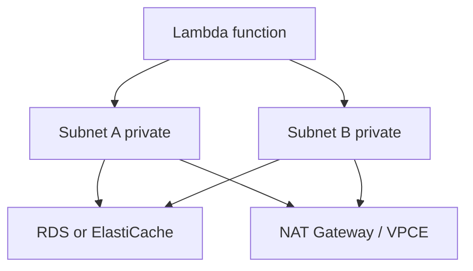

# Networking

Lambda networking changes significantly depending on whether a function runs with default service networking or is attached to your VPC.

Use VPC attachment only when the function must reach resources that live inside a VPC, such as private RDS instances, ElastiCache clusters, or internal services.

## Default Versus VPC-Connected Model



| Mode | Main benefit | Main tradeoff |
|---|---|---|
| Default networking | Simple outbound internet access to public AWS endpoints and public services | No direct access to private VPC-only resources |
| VPC-connected | Access to private IP resources inside your VPC | More network planning, subnet/IP consumption, egress design |

## Hyperplane ENIs

When you attach a function to a VPC, Lambda uses Hyperplane elastic network interfaces to connect execution environments to the selected subnets and security groups.

Important consequences:

- The function needs VPC permissions on its execution role for ENI management.
- Subnet and security group choices affect reachability.
- Internet access is not automatic just because the function is in a VPC.

## Internet Egress from a VPC-Connected Function

Private subnets do not provide direct internet egress.

To reach public endpoints from a VPC-connected Lambda function, you normally need:

1. Private subnets for the function.
2. A route to a NAT Gateway for outbound internet.
3. Security group and network ACL rules that allow the traffic.

## VPC Endpoints

Prefer VPC endpoints when your function mainly talks to AWS services such as S3, DynamoDB, Secrets Manager, or CloudWatch.

Benefits:

- Avoid NAT data processing charges for supported services.
- Keep traffic on the AWS network path.
- Tighten security with endpoint policies where supported.

## Subnet Strategy

Choose subnets across multiple Availability Zones for resilience.

Design rules:

- Use at least two private subnets in different Availability Zones.
- Ensure adequate IP address capacity for attached services.
- Keep route tables and security groups simple enough to reason about during incidents.



## Security Groups

Security groups on a VPC-connected function define outbound and inbound stateful rules from the ENI perspective.

Common pattern:

- Function security group allows egress to database or internal service ports.
- Database security group allows ingress from the function security group.

## Common Failure Modes

| Symptom | Likely cause |
|---|---|
| Timeout on all outbound calls after VPC attachment | Missing NAT Gateway or missing VPC endpoint |
| Cannot connect to private database | Wrong security group or subnet routing |
| Intermittent connection failures | NACL complexity, DNS issues, or downstream saturation |
| Higher startup latency | VPC path plus cold start and init overhead |

## CLI Example: Attach Function to a VPC

```bash
aws lambda update-function-configuration \
    --function-name "$FUNCTION_NAME" \
    --vpc-config SubnetIds="$SUBNET_ID",SecurityGroupIds="sg-xxxxxxxxxxxxxxxxx"
```

## Decision Rules

- Do **not** attach to a VPC just for general security optics.
- Do attach when a private IP destination is required.
- Prefer VPC endpoints to NAT when the traffic is primarily AWS service traffic.
- Revisit subnet sizing before large-scale event-driven rollouts.

!!! tip
    The cheapest and fastest Lambda function is often the one that stays out of your VPC unless private resource access truly requires it.

## See Also

- [Concurrency and Scaling](./concurrency-and-scaling.md)
- [Security Model](./security-model.md)
- [Best Practices: Networking](../best-practices/networking.md)
- [Best Practices: Performance](../best-practices/performance.md)
- [Home](../index.md)

## Sources

- [Giving Lambda functions access to resources in an Amazon VPC](https://docs.aws.amazon.com/lambda/latest/dg/configuration-vpc.html)
- [Internet access for VPC-connected Lambda functions](https://docs.aws.amazon.com/lambda/latest/dg/configuration-vpc-internet.html)
- [Understanding Hyperplane ENIs](https://docs.aws.amazon.com/lambda/latest/dg/configuration-vpc.html#configuration-vpc-enis)
- [Lambda security best practices for VPC access](https://docs.aws.amazon.com/lambda/latest/dg/configuration-vpc.html#configuration-vpc-permissions)
