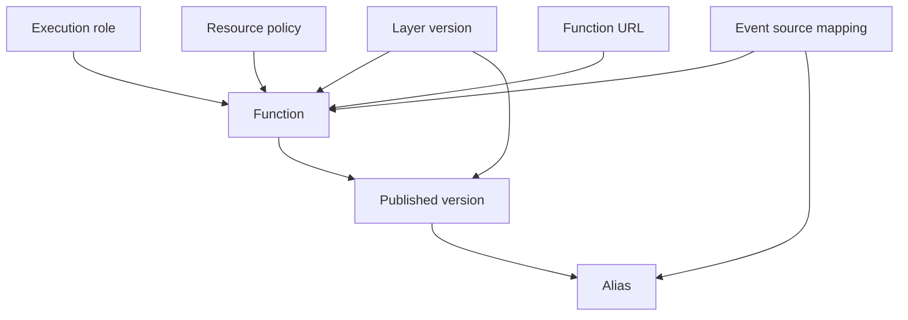
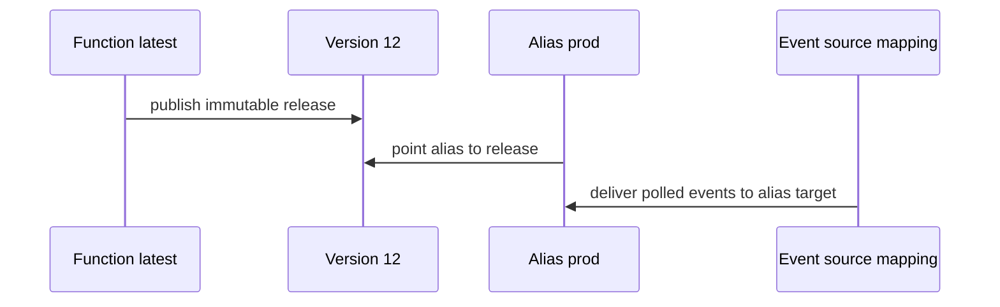

# Resource Relationships

Lambda deployments are easier to operate when you understand how resource objects point to one another.

This page maps the relationships among functions, versions, aliases, layers, event source mappings, execution roles, and invocation permissions.

## Relationship Graph



## Function, Version, and Alias

| Resource | Mutable? | Purpose |
|---|---|---|
| Function | Yes | Main definition and latest working configuration |
| Version | No | Immutable release snapshot |
| Alias | Yes | Stable deployment pointer to one or more versions |

Operationally:

- Deploy code to the function.
- Publish a version for a release artifact.
- Point an alias such as `prod` or `beta` to the chosen version.

## Layers and Layer Versions

Functions reference specific layer versions, not moving tags.

That means:

- Releasing a new layer version has no effect until the function configuration changes.
- Layer updates should be tracked in the same release process as code updates.

## Event Source Mappings

Event source mappings are separate resources that connect Lambda pollers to queues or streams.

Key implications:

- Deleting or disabling the mapping stops the poller without deleting the function.
- Mapping configuration controls batch size, window, failure handling, and source position.
- Mappings can target a function, version, or alias depending on your rollout strategy.

## Execution Role Versus Resource-Based Policy

These are often confused because both involve permissions.

| Permission type | Direction | Example |
|---|---|---|
| Execution role | Function calls out to another service | Lambda reads from Secrets Manager or writes to DynamoDB |
| Resource-based policy | Another principal calls in to Lambda | API Gateway, SNS, or another account invokes the function |

## Function URLs

Function URLs attach directly to a function and expose an HTTPS endpoint with either public or IAM-based auth.

They are simple, but because they bypass API Gateway, their security and rollout design must be deliberate.

## Deployment Relationship Pattern



## Why the Relationship Graph Matters

It affects:

- Safe rollback.
- Which deployment receives traffic.
- How shared dependencies are updated.
- Which IAM entity needs a policy change.
- What object to audit during an incident.

## Common Relationship Errors

- Updating `$LATEST` directly and assuming production is safe.
- Forgetting to update an alias after publishing a version.
- Attaching a new layer version to development but not to the production alias target.
- Granting invoke permission when the real problem is missing execution-role access.
- Editing event source mapping batch settings without evaluating downstream capacity.

## CLI Example: Grant Invoke Permission

```bash
aws lambda add-permission \
    --function-name "$FUNCTION_NAME" \
    --statement-id allow-s3-invoke \
    --action lambda:InvokeFunction \
    --principal s3.amazonaws.com \
    --source-arn arn:aws:s3:::my-example-bucket
```

## Design Rules

1. Treat versions as release artifacts.
2. Treat aliases as traffic control points.
3. Treat event source mappings as separate operational resources.
4. Treat layers as versioned shared dependencies.
5. Distinguish inbound invoke permission from outbound execution permission every time.

## See Also

- [How Lambda Works](./how-lambda-works.md)
- [Layers and Extensions](./layers-and-extensions.md)
- [Security Model](./security-model.md)
- [Best Practices: Deployment](../best-practices/deployment.md)
- [Home](../index.md)

## Sources

- [Managing Lambda function versions](https://docs.aws.amazon.com/lambda/latest/dg/configuration-versions.html)
- [Lambda aliases](https://docs.aws.amazon.com/lambda/latest/dg/configuration-aliases.html)
- [Lambda layers](https://docs.aws.amazon.com/lambda/latest/dg/chapter-layers.html)
- [Lambda event source mappings](https://docs.aws.amazon.com/lambda/latest/dg/invocation-eventsourcemapping.html)
- [Viewing resource-based IAM policies in Lambda](https://docs.aws.amazon.com/lambda/latest/dg/access-control-resource-based.html)
