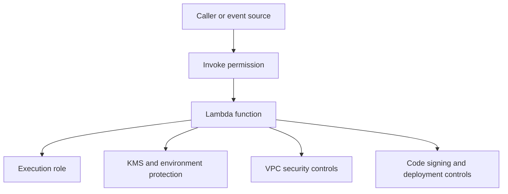

# Security Model

Lambda security is a layered model built from IAM, resource policies, encryption controls, network boundaries, and deployment integrity features.

You need all of them because Lambda both receives events from other services and acts outward against downstream resources.

## Security Layers Overview



## Execution Role

The execution role is the IAM role Lambda assumes while your function runs.

Use it to authorize outbound actions such as:

- Reading secrets.
- Writing logs.
- Calling DynamoDB, S3, SNS, or Step Functions.
- Managing ENIs for VPC attachment.

Least privilege matters because compromised code runs with whatever this role can do.

## Resource-Based Policies

Resource-based policies allow other principals to invoke your function.

Typical examples:

- API Gateway invoking the function.
- S3 bucket notifications invoking the function.
- Cross-account invoke permission.

These policies answer: **who may call in**.

## VPC Security Controls

If the function is VPC-connected, network controls become part of the security model.

Important components:

- Function security groups.
- Route tables.
- Private subnet design.
- VPC endpoints to avoid public egress when possible.

Network isolation complements IAM; it does not replace it.

## Encryption Controls

Lambda supports encryption for:

- Environment variables at rest using AWS KMS.
- Deployment package storage managed by the service.
- Optional customer-managed keys for additional control and audit requirements.

Sensitive values should still come from Secrets Manager or Systems Manager Parameter Store when rotation and access auditing are required.

## Code Signing

Code signing lets you require trusted signing profiles for deployment packages.

Use it when:

- You need stronger software supply chain controls.
- Multiple teams or pipelines can publish code.
- You want deployment rejection for unsigned or untrusted artifacts.

## Function URL Authentication

Function URLs support two auth modes:

| Auth type | Meaning |
|---|---|
| `AWS_IAM` | Requests must be SigV4-signed by authorized IAM principals |
| `NONE` | Public endpoint unless constrained by additional controls |

Public function URLs should be rare and deliberate.

## Security Responsibility Split

| Area | AWS responsibility | Your responsibility |
|---|---|---|
| Service infrastructure | Managed runtime, underlying service security | Configure the function safely |
| Identity | IAM enforcement engine | Least-privilege policies and role boundaries |
| Network | Service-managed networking and VPC integration support | Subnets, routes, SGs, endpoints |
| Deployment integrity | Code signing capability | Require and operate trusted artifacts |

## Example: Environment Variable KMS Key

```bash
aws lambda update-function-configuration \
    --function-name "$FUNCTION_NAME" \
    --kms-key-arn arn:aws:kms:$REGION:<account-id>:key/12345678-1234-1234-1234-123456789012
```

## Common Security Mistakes

- Using wildcard IAM permissions in the execution role.
- Treating VPC attachment as sufficient security by itself.
- Putting long-lived secrets directly into plaintext deployment artifacts.
- Allowing public function URLs without strong reason and compensating controls.
- Skipping code-signing requirements in regulated environments.

!!! tip
    When diagnosing access problems, first ask whether the action is inbound to Lambda or outbound from Lambda.
    That single distinction usually identifies the right policy surface.

## See Also

- [Networking](./networking.md)
- [Resource Relationships](./resource-relationships.md)
- [Best Practices: Security](../best-practices/security.md)
- [Best Practices: Networking](../best-practices/networking.md)
- [Home](../index.md)

## Sources

- [Managing permissions in AWS Lambda](https://docs.aws.amazon.com/lambda/latest/dg/lambda-permissions.html)
- [Execution role for Lambda](https://docs.aws.amazon.com/lambda/latest/dg/lambda-intro-execution-role.html)
- [Using resource-based policies for Lambda](https://docs.aws.amazon.com/lambda/latest/dg/access-control-resource-based.html)
- [Securing Lambda environment variables](https://docs.aws.amazon.com/lambda/latest/dg/configuration-envvars-encryption.html)
- [Configuring code signing for Lambda](https://docs.aws.amazon.com/lambda/latest/dg/configuration-codesigning.html)
- [Lambda function URLs](https://docs.aws.amazon.com/lambda/latest/dg/urls-intro.html)
