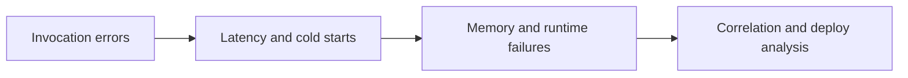

# CloudWatch Logs Insights Queries for Lambda

Use these Logs Insights queries as quick references for the query patterns used across the troubleshooting content.

## Query Families



## Error Rate Over Time

```sql
fields @timestamp, @message
| filter @message like /ERROR|Task timed out|Process exited/
| stats count() as errorCount by bin(5m)
| sort bin(5m) desc
```

## Timeout Messages

```sql
fields @timestamp, @message, @logStream
| filter @message like /Task timed out/
| sort @timestamp desc
| limit 50
```

## Runtime Exceptions

```sql
fields @timestamp, @message, @requestId
| filter @message like /Exception|Traceback|Unhandled/
| sort @timestamp desc
| limit 100
```

## Cold Start Indicators

```sql
fields @timestamp, @message
| filter @message like /Init Duration/
| parse @message /Init Duration: (?<initDuration>[0-9.]+) ms/
| stats avg(initDuration) as avgInitMs, max(initDuration) as maxInitMs by bin(5m)
| sort bin(5m) desc
```

## Memory Pressure Signals

```sql
fields @timestamp, @message
| filter @message like /REPORT RequestId/
| parse @message /Max Memory Used: (?<maxMemory>[0-9]+) MB/
| stats avg(maxMemory) as avgMemoryMb, max(maxMemory) as peakMemoryMb by bin(5m)
| sort bin(5m) desc
```

## Request Duration from REPORT Lines

```sql
fields @timestamp, @message
| filter @message like /REPORT RequestId/
| parse @message /Duration: (?<duration>[0-9.]+) ms/
| stats avg(duration) as avgDurationMs, max(duration) as maxDurationMs by bin(5m)
| sort bin(5m) desc
```

## Throttle-Related Messages

```sql
fields @timestamp, @message
| filter @message like /Rate Exceeded|TooManyRequestsException/
| sort @timestamp desc
| limit 50
```

## Deploy vs Error Correlation

```sql
fields @timestamp, @message
| filter @message like /ERROR|Exception|Task timed out|START|END|REPORT/
| stats count(*) as matchingEvents by bin(15m)
| sort bin(15m) desc
```

## Extension and Init Failures

```sql
fields @timestamp, @message
| filter @message like /INIT_REPORT|Extension|Init error/
| sort @timestamp desc
| limit 50
```

## Usage Notes

- Run queries in the function log group or in an account-wide aggregated log group if configured.
- Adjust `bin()` windows to match burstiness and incident duration.
- Pair logs queries with CloudWatch metrics because some failures appear first in metrics, not in logs.

## See Also

- [Troubleshooting](./troubleshooting.md)
- [Lambda Diagnostics](./lambda-diagnostics.md)
- [Monitoring](../operations/monitoring.md)
- [Troubleshooting CloudWatch Index](../troubleshooting/cloudwatch/index.md)

## Sources

- https://docs.aws.amazon.com/AmazonCloudWatch/latest/logs/CWL_QuerySyntax.html
- https://docs.aws.amazon.com/lambda/latest/dg/monitoring-cloudwatchlogs.html
