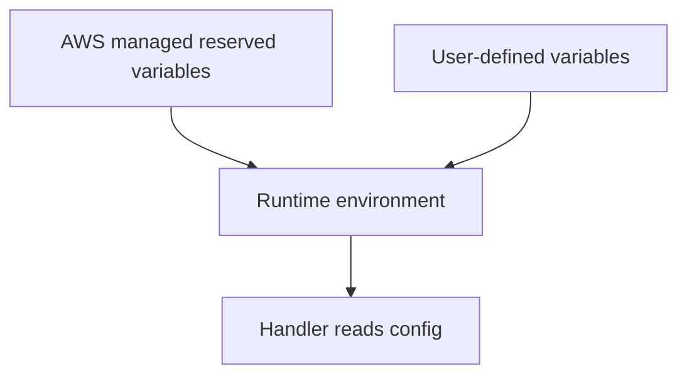

# Lambda Environment Variables Reference

Lambda provides reserved environment variables and supports user-defined variables that are encrypted at rest.

## Environment Variable Model



## Reserved Environment Variables

| Variable | Meaning |
|---|---|
| `AWS_LAMBDA_FUNCTION_NAME` | Function name |
| `AWS_LAMBDA_FUNCTION_VERSION` | Version identifier for the current runtime context |
| `AWS_LAMBDA_FUNCTION_MEMORY_SIZE` | Configured memory in MB |
| `AWS_REGION` | Region where the function runs |
| `AWS_EXECUTION_ENV` | Runtime environment identifier |
| `AWS_LAMBDA_LOG_GROUP_NAME` | CloudWatch Logs group |
| `AWS_LAMBDA_LOG_STREAM_NAME` | CloudWatch Logs stream |
| `_HANDLER` | Configured handler string |
| `LAMBDA_TASK_ROOT` | Function code root |
| `LAMBDA_RUNTIME_DIR` | Runtime libraries directory |
| `TZ` | Time zone environment setting |

Some variables vary by runtime and execution model. Always verify with the runtime-specific Lambda documentation when building language-dependent logic.

## User-Defined Variables

Typical uses:

- Application environment name
- Downstream table or queue names
- Feature toggles
- Logging or tracing configuration

Set them with AWS CLI:

```bash
aws lambda update-function-configuration \
    --function-name "$FUNCTION_NAME" \
    --environment 'Variables={APP_ENV=prod,LOG_LEVEL=INFO,ORDERS_TABLE=orders-prod}' \
    --region "$REGION"
```

## Encryption Notes

Lambda encrypts environment variables at rest by default.

Use a customer managed KMS key if you need more explicit control:

```bash
aws lambda update-function-configuration \
    --function-name "$FUNCTION_NAME" \
    --kms-key-arn "arn:aws:kms:$REGION:<account-id>:key/12345678-1234-1234-1234-123456789012" \
    --region "$REGION"
```

## Operational Constraints

| Item | Limit or note |
|---|---|
| Total environment variable size | 4 KB |
| Encryption at rest | Enabled by Lambda |
| Customer managed KMS key | Optional |
| Secret storage recommendation | Prefer Secrets Manager or Parameter Store for sensitive values |

## Practical Guidance

- Do not store high-rotation secrets as plain environment values.
- Do not rely on reserved variables staying identical across all runtimes without validation.
- Keep user-defined keys consistent across applications so operational tooling is reusable.
- Treat environment changes as release events because they can alter runtime behavior.

## Verification

```bash
aws lambda get-function-configuration \
    --function-name "$FUNCTION_NAME" \
    --region "$REGION"
```

## See Also

- [Environment Management](../operations/environment-management.md)
- [Security Operations](../operations/security-operations.md)
- [Service Limits](./service-limits.md)
- [Security](../best-practices/security.md)

## Sources

- https://docs.aws.amazon.com/lambda/latest/dg/configuration-envvars.html
- https://docs.aws.amazon.com/lambda/latest/dg/configuration-envvars-encryption.html
