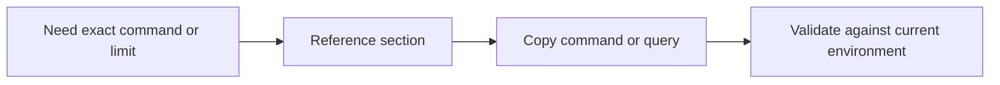

# Lambda Reference

Use the Reference section for quick lookup during implementation, operations, and troubleshooting.

These pages are optimized for copy-paste commands, service limits, environment variable details, and diagnostic shortcuts.

## Reference Map

| Page | Use it for |
|---|---|
| [Lambda CLI Cheatsheet](./lambda-cli-cheatsheet.md) | Common create, update, invoke, alias, and event-source commands |
| [Service Limits](./service-limits.md) | Lambda quotas and sizing boundaries |
| [Environment Variables](./environment-variables.md) | Reserved variables and encryption notes |
| [Troubleshooting](./troubleshooting.md) | Quick error pattern lookup |
| [CloudWatch Queries](./cloudwatch-queries.md) | Logs Insights snippets |
| [Lambda Diagnostics](./lambda-diagnostics.md) | Investigation toolset overview |

## How to Use This Section

## Recommended Workflow

1. Start with the CLI cheatsheet for direct actions.
2. Check service limits before assuming Lambda behavior is abnormal.
3. Use troubleshooting and query pages during incident triage.
4. Use diagnostics references when you need deeper evidence from metrics, traces, or CloudTrail.

## See Also

- [Operations Index](../operations/index.md)
- [Troubleshooting Index](../troubleshooting/index.md)
- [Event Sources](../platform/event-sources.md)
- [Security Model](../platform/security-model.md)

## Sources

- https://docs.aws.amazon.com/lambda/latest/dg/welcome.html
- https://docs.aws.amazon.com/lambda/latest/dg/lambda-operations.html
