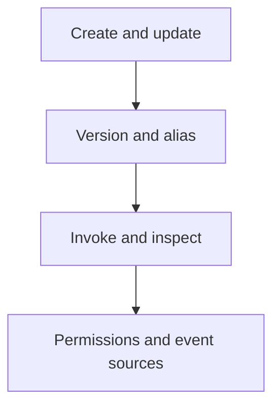

# Lambda CLI Cheatsheet

Use this page as a copy-paste reference for common `aws lambda` and supporting AWS CLI operations.

## Command Groups



## Core Variables

| Variable | Example |
|---|---|
| `$FUNCTION_NAME` | `orders-api` |
| `$REGION` | `ap-northeast-2` |
| `$ROLE_ARN` | `arn:aws:iam::<account-id>:role/lambda-exec` |
| `$ALIAS_NAME` | `prod` |

## Create and Update Functions

Create a zip-based function:

```bash
aws lambda create-function \
    --function-name "$FUNCTION_NAME" \
    --runtime python3.12 \
    --role "$ROLE_ARN" \
    --handler app.handler \
    --zip-file fileb://function.zip \
    --timeout 30 \
    --memory-size 512 \
    --region "$REGION"
```

Update code:

```bash
aws lambda update-function-code \
    --function-name "$FUNCTION_NAME" \
    --zip-file fileb://function.zip \
    --region "$REGION"
```

Update configuration:

```bash
aws lambda update-function-configuration \
    --function-name "$FUNCTION_NAME" \
    --handler app.handler \
    --runtime python3.12 \
    --memory-size 1024 \
    --timeout 60 \
    --region "$REGION"
```

## Publish Versions and Manage Aliases

```bash
aws lambda publish-version \
    --function-name "$FUNCTION_NAME" \
    --description "Release 2026-04-07" \
    --region "$REGION"

aws lambda create-alias \
    --function-name "$FUNCTION_NAME" \
    --name "$ALIAS_NAME" \
    --function-version 1 \
    --region "$REGION"

aws lambda update-alias \
    --function-name "$FUNCTION_NAME" \
    --name "$ALIAS_NAME" \
    --function-version 2 \
    --region "$REGION"

aws lambda list-versions-by-function \
    --function-name "$FUNCTION_NAME" \
    --region "$REGION"

aws lambda list-aliases \
    --function-name "$FUNCTION_NAME" \
    --region "$REGION"
```

Weighted alias routing:

```bash
aws lambda update-alias \
    --function-name "$FUNCTION_NAME" \
    --name "$ALIAS_NAME" \
    --function-version 2 \
    --routing-config AdditionalVersionWeights={3=0.1} \
    --region "$REGION"
```

## Invoke and Inspect

Invoke synchronously:

```bash
aws lambda invoke \
    --function-name "$FUNCTION_NAME" \
    --payload '{"health":"check"}' \
    --cli-binary-format raw-in-base64-out \
    --region "$REGION" \
    response.json
```

Get function details:

```bash
aws lambda get-function \
    --function-name "$FUNCTION_NAME" \
    --region "$REGION"

aws lambda get-function-configuration \
    --function-name "$FUNCTION_NAME" \
    --region "$REGION"

aws lambda list-functions \
    --region "$REGION"
```

Fetch policy and URL config:

```bash
aws lambda get-policy \
    --function-name "$FUNCTION_NAME" \
    --region "$REGION"

aws lambda get-function-url-config \
    --function-name "$FUNCTION_NAME" \
    --region "$REGION"
```

## Permissions

Allow API Gateway invocation:

```bash
aws lambda add-permission \
    --function-name "$FUNCTION_NAME" \
    --statement-id "AllowApiGatewayInvoke" \
    --action "lambda:InvokeFunction" \
    --principal apigateway.amazonaws.com \
    --source-arn "arn:aws:execute-api:$REGION:<account-id>:$API_ID/*/*/" \
    --region "$REGION"
```

Remove a permission statement:

```bash
aws lambda remove-permission \
    --function-name "$FUNCTION_NAME" \
    --statement-id "AllowApiGatewayInvoke" \
    --region "$REGION"
```

## Event Source Mappings

Create mapping:

```bash
aws lambda create-event-source-mapping \
    --function-name "$FUNCTION_NAME" \
    --event-source-arn "arn:aws:sqs:$REGION:<account-id>:orders-queue" \
    --batch-size 10 \
    --enabled \
    --region "$REGION"
```

List and inspect mappings:

```bash
aws lambda list-event-source-mappings \
    --function-name "$FUNCTION_NAME" \
    --region "$REGION"

aws lambda get-event-source-mapping \
    --uuid "a1b2c3d4-1111-2222-3333-444455556666" \
    --region "$REGION"
```

Update or disable a mapping:

```bash
aws lambda update-event-source-mapping \
    --uuid "a1b2c3d4-1111-2222-3333-444455556666" \
    --batch-size 50 \
    --maximum-batching-window-in-seconds 5 \
    --region "$REGION"

aws lambda update-event-source-mapping \
    --uuid "a1b2c3d4-1111-2222-3333-444455556666" \
    --no-enabled \
    --region "$REGION"
```

## Concurrency and Async Controls

Reserved concurrency:

```bash
aws lambda put-function-concurrency \
    --function-name "$FUNCTION_NAME" \
    --reserved-concurrent-executions 25 \
    --region "$REGION"

aws lambda delete-function-concurrency \
    --function-name "$FUNCTION_NAME" \
    --region "$REGION"
```

Provisioned concurrency:

```bash
aws lambda put-provisioned-concurrency-config \
    --function-name "$FUNCTION_NAME" \
    --qualifier "$ALIAS_NAME" \
    --provisioned-concurrent-executions 20 \
    --region "$REGION"
```

Async invoke configuration:

```bash
aws lambda put-function-event-invoke-config \
    --function-name "$FUNCTION_NAME" \
    --maximum-retry-attempts 1 \
    --maximum-event-age-in-seconds 3600 \
    --destination-config '{"OnFailure":{"Destination":"arn:aws:sqs:$REGION:<account-id>:lambda-failures"}}' \
    --region "$REGION"
```

## Tags and Code Signing

```bash
aws lambda tag-resource \
    --resource "arn:aws:lambda:$REGION:<account-id>:function:$FUNCTION_NAME" \
    --tags Environment=prod Application=orders-api \
    --region "$REGION"

aws lambda get-function-code-signing-config \
    --function-name "$FUNCTION_NAME" \
    --region "$REGION"
```

## Helpful Supporting Commands

CloudWatch metrics:

```bash
aws cloudwatch get-metric-statistics \
    --namespace "AWS/Lambda" \
    --metric-name "Errors" \
    --dimensions Name=FunctionName,Value="$FUNCTION_NAME" \
    --start-time "2026-04-07T00:00:00Z" \
    --end-time "2026-04-07T01:00:00Z" \
    --period 60 \
    --statistics Sum \
    --region "$REGION"
```

CloudTrail events:

```bash
aws cloudtrail lookup-events \
    --lookup-attributes AttributeKey=ResourceName,AttributeValue="$FUNCTION_NAME" \
    --max-results 20 \
    --region "$REGION"
```

## See Also

- [Versioning and Aliases](../operations/versioning-and-aliases.md)
- [Event Source Management](../operations/event-source-management.md)
- [Lambda Diagnostics](./lambda-diagnostics.md)
- [Troubleshooting](./troubleshooting.md)

## Sources

- https://docs.aws.amazon.com/cli/latest/reference/lambda/index.html
- https://docs.aws.amazon.com/cli/latest/reference/cloudwatch/index.html
- https://docs.aws.amazon.com/cli/latest/reference/cloudtrail/index.html
