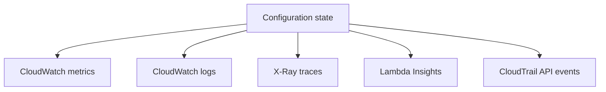

# Lambda Diagnostics Reference

Use this page as a quick map of the main AWS tools for investigating Lambda behavior.

## Diagnostic Stack



## `aws lambda get-function`

Use it to retrieve deployment package metadata, function ARN, and configuration links.

```bash
aws lambda get-function \
    --function-name "$FUNCTION_NAME" \
    --region "$REGION"
```

Best for:

- Verifying the function exists and the expected qualifier resolves.
- Confirming code location and configuration envelope.

## `aws lambda get-function-configuration`

Use it to inspect runtime, handler, memory, timeout, role, VPC config, environment variables, and tracing mode.

```bash
aws lambda get-function-configuration \
    --function-name "$FUNCTION_NAME" \
    --region "$REGION"
```

Best for:

- Deployment validation
- Runtime mismatch diagnosis
- Timeout or memory investigation

## CloudWatch Metrics

Use CloudWatch metrics for symptom detection and alert-driven triage.

Important metrics:

- `Invocations`
- `Duration`
- `Errors`
- `Throttles`
- `ConcurrentExecutions`
- `IteratorAge`

```bash
aws cloudwatch get-metric-statistics \
    --namespace "AWS/Lambda" \
    --metric-name "Throttles" \
    --dimensions Name=FunctionName,Value="$FUNCTION_NAME" \
    --start-time "2026-04-07T00:00:00Z" \
    --end-time "2026-04-07T01:00:00Z" \
    --period 60 \
    --statistics Sum \
    --region "$REGION"
```

## X-Ray

Use X-Ray when you need request-level latency and fault decomposition.

Best for:

- Identifying downstream latency hotspots
- Separating initialization latency from handler latency
- Understanding distributed request paths

## Lambda Insights

Use Lambda Insights when default metrics are not enough to explain runtime behavior.

Best for:

- Memory usage analysis
- Runtime performance trend review
- Faster right-sizing decisions

## CloudTrail Events

Use CloudTrail to answer who changed what and when.

```bash
aws cloudtrail lookup-events \
    --lookup-attributes AttributeKey=ResourceName,AttributeValue="$FUNCTION_NAME" \
    --max-results 20 \
    --region "$REGION"
```

Best for:

- Investigating unexpected configuration changes
- Auditing update or delete actions
- Correlating deployment activity with incident start time

## Practical Diagnostic Order

| Symptom | Start here | Then |
|---|---|---|
| Timeouts | `Duration` metric | X-Ray and logs |
| Throttles | `Throttles` and concurrency settings | Traffic pattern and reserved concurrency |
| Deployment failure | `get-function-configuration` | CloudTrail and package structure |
| Permission issue | execution role and `get-policy` | CloudTrail and target service policy |
| Stream lag | `IteratorAge` | event source mapping settings |

## See Also

- [Monitoring](../operations/monitoring.md)
- [Troubleshooting](./troubleshooting.md)
- [CloudWatch Queries](./cloudwatch-queries.md)
- [Security Operations](../operations/security-operations.md)

## Sources

- https://docs.aws.amazon.com/lambda/latest/dg/monitoring-functions.html
- https://docs.aws.amazon.com/lambda/latest/dg/services-xray.html
- https://docs.aws.amazon.com/AmazonCloudWatch/latest/monitoring/Lambda-Insights.html
- https://docs.aws.amazon.com/awscloudtrail/latest/userguide/view-cloudtrail-events.html
- https://docs.aws.amazon.com/cli/latest/reference/lambda/get-function.html
