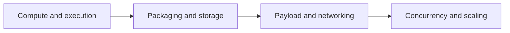

# Lambda Service Limits

Use this page to check the most common Lambda sizing and quota boundaries before treating behavior as a bug.

## Limit Categories



## Core Function Limits

| Item | Limit |
|---|---|
| Memory | 128 MB to 10,240 MB |
| Timeout | 1 to 900 seconds |
| Ephemeral `/tmp` storage | 512 MB to 10,240 MB |
| Environment variables | 4 KB total |
| Resource-based policy size | 20 KB |
| Layers per function | 5 |
| File descriptors | 1,024 |
| Processes and threads | 1,024 |

## Deployment Package Limits

| Packaging mode | Limit |
|---|---|
| Zip upload through API or console | 50 MB zipped |
| Zip deployment package contents | 250 MB unzipped including layers |
| Container image | 10 GB uncompressed |
| Layers | 5 layers per function |

## Concurrency and Scaling Limits

| Item | Typical default |
|---|---|
| Account concurrency quota | 1,000 concurrent executions per Region |
| Reserved concurrency | Up to available account concurrency |
| Provisioned concurrency | Subject to account concurrency and quota |
| Burst scaling behavior | Region-specific managed scaling behavior |

Always confirm current quotas in Service Quotas because account settings can differ from default values.

## Payload Limits

| Path | Limit |
|---|---|
| Synchronous request payload | 6 MB |
| Synchronous response payload | 6 MB |
| Streamed response payload | Up to 200 MB with throttled bandwidth after first 6 MB |
| Asynchronous invocation payload | 1 MB |

## API and Control Plane Limits to Remember

| Item | Limit or note |
|---|---|
| Function name length | 64 characters |
| Description length | 256 characters |
| Alias name length | 128 characters |
| Layers per account | Quota-based |
| Event source mappings | Quota-based per account and Region |

## Operational Guidance

- Check package size before deployment failure analysis.
- Check timeout before treating long-running work as an application bug.
- Check concurrency limits when you see throttles.
- Check environment variable size when configuration updates fail unexpectedly.
- Check stream or queue source parameters when lag increases.

## Verification Commands

```bash
aws lambda get-account-settings \
    --region "$REGION"

aws service-quotas get-service-quota \
    --service-code lambda \
    --quota-code L-B99A9384 \
    --region "$REGION"
```

## See Also

- [Cost Optimization](../operations/cost-optimization.md)
- [Provisioned Concurrency](../operations/provisioned-concurrency.md)
- [Environment Variables](./environment-variables.md)
- [Troubleshooting](./troubleshooting.md)

## Sources

- https://docs.aws.amazon.com/lambda/latest/dg/gettingstarted-limits.html
- https://docs.aws.amazon.com/lambda/latest/dg/configuration-memory.html
- https://docs.aws.amazon.com/lambda/latest/dg/configuration-timeout.html
- https://docs.aws.amazon.com/lambda/latest/dg/configuration-ephemeral-storage.html
- https://docs.aws.amazon.com/servicequotas/latest/userguide/intro.html
