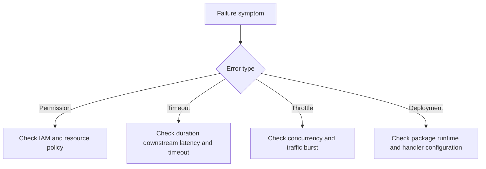

# Lambda Troubleshooting Quick Reference

Use this page during incidents when you need a fast map from symptom to likely investigation path.

## Triage Flow



## Common Error Patterns

| Symptom | Likely cause | First checks |
|---|---|---|
| `AccessDeniedException` | Missing IAM permission or blocked resource policy | Execution role, KMS key policy, Lambda resource policy |
| `Task timed out after ... seconds` | Timeout too low or downstream latency too high | `Duration`, downstream calls, VPC path |
| `Rate Exceeded` or throttles | Concurrency saturation or API rate control | `Throttles`, account concurrency, reserved concurrency |
| `Unhandled` or runtime exception | Code or dependency issue | Logs, recent deployment, stack trace |
| `Handler not found` | Wrong handler string or package layout | Function config, zip contents, runtime |
| `InvalidRuntime` or unsupported runtime | Deprecated or wrong runtime setting | Runtime config, deployment template |
| Deployment package too large | Zip or image exceeds limit | Package size, layers, dependencies |

## Permission Errors

Check both sides:

1. The execution role for what the function calls.
2. The resource-based policy for who can invoke the function.

Useful commands:

```bash
aws lambda get-policy \
    --function-name "$FUNCTION_NAME" \
    --region "$REGION"

aws iam list-attached-role-policies \
    --role-name "lambda-exec" \
    --region "$REGION"
```

## Timeout Patterns

Timeouts usually come from one of these categories:

- Slow downstream API or database call
- Insufficient memory causing low CPU availability
- VPC networking misconfiguration or cold ENI path
- Batch size too large for per-record processing time

Check:

- `Duration`
- `Timeout` setting
- X-Ray trace segments
- Database and API dependency metrics

## Deployment Failures

Common deployment checks:

| Failure class | What to verify |
|---|---|
| Handler error | Handler string matches file and symbol |
| Package error | Zip contains expected files in correct root |
| Runtime mismatch | Template runtime is supported |
| IAM error | Deployer has required create or update permissions |
| Layer issue | Compatible runtime and architecture |

## Quick Commands

```bash
aws lambda get-function \
    --function-name "$FUNCTION_NAME" \
    --region "$REGION"

aws lambda get-function-configuration \
    --function-name "$FUNCTION_NAME" \
    --region "$REGION"

aws cloudwatch get-metric-statistics \
    --namespace "AWS/Lambda" \
    --metric-name "Duration" \
    --dimensions Name=FunctionName,Value="$FUNCTION_NAME" \
    --start-time "2026-04-07T00:00:00Z" \
    --end-time "2026-04-07T01:00:00Z" \
    --period 60 \
    --statistics Average Maximum \
    --region "$REGION"
```

## See Also

- [Lambda Diagnostics](./lambda-diagnostics.md)
- [CloudWatch Queries](./cloudwatch-queries.md)
- [Monitoring](../operations/monitoring.md)
- [Troubleshooting Index](../troubleshooting/index.md)

## Sources

- https://docs.aws.amazon.com/lambda/latest/dg/troubleshooting-invocation.html
- https://docs.aws.amazon.com/lambda/latest/dg/troubleshooting-configuration.html
- https://docs.aws.amazon.com/lambda/latest/dg/gettingstarted-limits.html
