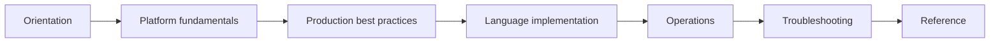
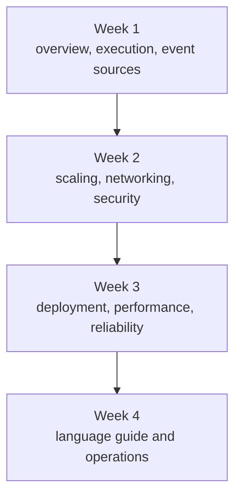

# Learning Paths

AWS Lambda spans architecture, coding, deployment, observability, and failure handling.

This page gives you role-based and experience-based paths so you can study the repository in an order that matches your goal.

## Recommended Study Flow

## Beginner Path

Choose this path if you are new to Lambda, serverless, or event-driven application design.

| Step | Focus | Read |
|---|---|---|
| 1 | Service overview | [Start Here: Overview](./overview.md) |
| 2 | Study order and map | [Repository Map](./repository-map.md) |
| 3 | Core architecture | [Platform Index](../platform/index.md) |
| 4 | Execution lifecycle | [Execution Model](../platform/execution-model.md) |
| 5 | Event-driven thinking | [Event Sources](../platform/event-sources.md) |
| 6 | First implementation track | Runtime-specific language guides in `docs/language-guides/` |
| 7 | Safe defaults | [Production Baseline](../best-practices/production-baseline.md) |

Beginner outcomes:

- Understand what a function, version, alias, and trigger are.
- Know why timeouts, memory, retries, and IAM are not optional details.
- Recognize the difference between synchronous and asynchronous invocation.

## Intermediate Path

Choose this path if you can already deploy a function and now need reliable production behavior.

| Step | Focus | Read |
|---|---|---|
| 1 | Refine mental model | [How Lambda Works](../platform/how-lambda-works.md) |
| 2 | Scaling model | [Concurrency and Scaling](../platform/concurrency-and-scaling.md) |
| 3 | Network decisions | [Platform Networking](../platform/networking.md) |
| 4 | Security boundaries | [Security Model](../platform/security-model.md) |
| 5 | Deployment safety | [Deployment Best Practices](../best-practices/deployment.md) |
| 6 | Performance tuning | [Performance Best Practices](../best-practices/performance.md) |
| 7 | Failure handling | [Reliability Best Practices](../best-practices/reliability.md) |

Intermediate outcomes:

- Select the right event source and retry pattern for each workload.
- Prevent accidental throttling and downstream overload.
- Decide when to use layers, aliases, VPC integration, and provisioned concurrency.

## Advanced Path

Choose this path if you already run Lambda in production and need deeper operational control.

| Step | Focus | Read |
|---|---|---|
| 1 | Resource graph | [Resource Relationships](../platform/resource-relationships.md) |
| 2 | Layers and extensions | [Layers and Extensions](../platform/layers-and-extensions.md) |
| 3 | Deployment controls | [Deployment Best Practices](../best-practices/deployment.md) |
| 4 | Alias and version operations | [Resource Relationships](../platform/resource-relationships.md) |
| 5 | Fleet readiness | [Concurrency and Scaling](../platform/concurrency-and-scaling.md) |
| 6 | Observability | [Production Baseline](../best-practices/production-baseline.md) |
| 7 | Failure diagnosis | [Troubleshooting Decision Tree](../troubleshooting/decision-tree.md) |

Advanced outcomes:

- Model rollback and rollout using immutable versions and weighted aliases.
- Tune event source mappings for batch size, bisect, and failure destinations.
- Separate platform issues from application issues during incident response.

## Role-Based Shortcuts

### API builder

Start with:

- [Execution Model](../platform/execution-model.md)
- [Event Sources](../platform/event-sources.md)
- [Security Best Practices](../best-practices/security.md)
- [Performance Best Practices](../best-practices/performance.md)

### Data pipeline engineer

Start with:

- [Event Sources](../platform/event-sources.md)
- [Concurrency and Scaling](../platform/concurrency-and-scaling.md)
- [Reliability Best Practices](../best-practices/reliability.md)
- [Common Anti-Patterns](../best-practices/common-anti-patterns.md)

### Platform or SRE engineer

Start with:

- [How Lambda Works](../platform/how-lambda-works.md)
- [Networking](../platform/networking.md)
- [Security Model](../platform/security-model.md)
- [Home](../index.md)

## Suggested Reading Cadence

## When to Leave the Main Learning Path

Jump directly to another section when:

- You are deploying now and need [Deployment Best Practices](../best-practices/deployment.md).
- You are debugging production and need the [Troubleshooting Decision Tree](../troubleshooting/decision-tree.md).
- You need command syntax and limits from the [CLI Cheatsheet](../reference/lambda-cli-cheatsheet.md).
- You need runtime-specific examples from the language-guides section.

!!! tip
    If an event source is involved, always read the event model page before implementing business logic.
    Invocation semantics determine retries, duplicates, and concurrency pressure.

## Path Selection Checklist

- Choose **Beginner** if you still translate Lambda concepts back into server-based thinking.
- Choose **Intermediate** if you already deploy functions but need safer architecture decisions.
- Choose **Advanced** if you own production readiness, rollout safety, or incident response.

## See Also

- [Overview](./overview.md)
- [Repository Map](./repository-map.md)
- [Platform Index](../platform/index.md)
- [Best Practices Index](../best-practices/index.md)
- [Home](../index.md)

## Sources

- [AWS Lambda Developer Guide](https://docs.aws.amazon.com/lambda/latest/dg/welcome.html)
- [Invoking Lambda functions](https://docs.aws.amazon.com/lambda/latest/dg/lambda-invocation.html)
- [Lambda event source mappings](https://docs.aws.amazon.com/lambda/latest/dg/invocation-eventsourcemapping.html)
- [Configuring Lambda function concurrency](https://docs.aws.amazon.com/lambda/latest/dg/configuration-concurrency.html)
- [Monitoring Lambda functions](https://docs.aws.amazon.com/lambda/latest/dg/monitoring-functions.html)
