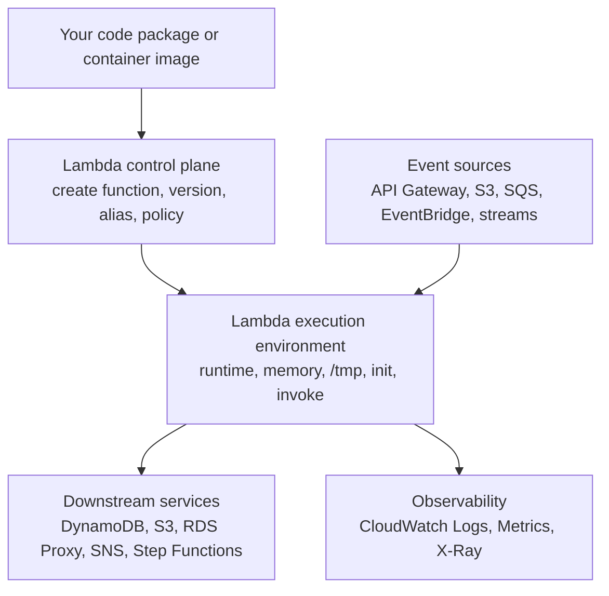
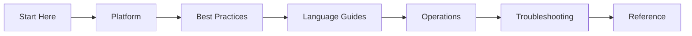

# Overview

AWS Lambda is a managed compute service that runs your code in response to events and manages the underlying execution environment for you.

This guide is for engineers who need to understand how Lambda behaves in production, not just how to click through a first deployment. Use it when you need a mental model for execution, event integration, scaling, security, and safe operations.

## What Lambda Actually Provides

Lambda is best understood as a service boundary between your application code and AWS-managed runtime infrastructure.



Core characteristics:

- You deploy code as a **ZIP package** or **container image**.
- You configure **memory, timeout, runtime, architecture, IAM role, and networking**.
- Lambda creates and reuses **execution environments** to process invocations.
- Billing is based on **requests** and **compute duration**, with pricing affected by memory size and architecture.
- Scaling behavior depends on **event source type** and **available concurrency**.

## Who This Guide Is For

| Audience | What you need | Where to start |
|---|---|---|
| New to serverless | Basic Lambda concepts, first deployment flow, service boundaries | [Learning Paths](./learning-paths.md) |
| Building production APIs | Event source selection, networking, IAM, deployment safety | [Platform Index](../platform/index.md) |
| Operating existing functions | Concurrency controls, retries, tracing, troubleshooting | [Best Practices Index](../best-practices/index.md) |
| Standardizing team guidance | Shared platform vocabulary and production baselines | [Repository Map](./repository-map.md) |

## How to Use This Guide

Read the guide in layers.

1. **Start Here** for orientation and study order.
2. **Platform** to understand what Lambda does on your behalf.
3. **Best Practices** to establish a safe production baseline.
4. **Language Guides** for implementation details by runtime.
5. **Operations** for day-2 changes such as deployments, monitoring, and cost tuning.
6. **Troubleshooting** when behavior does not match your expectations.



## Lambda Is a Good Fit When

- Work is event-driven and naturally request scoped.
- You want fine-grained scaling without managing servers.
- Traffic is spiky or unpredictable.
- Functions can be designed as stateless handlers.
- You can tolerate or mitigate cold starts.

## Lambda Is Not a Universal Default

Lambda is less attractive when:

- You need very long-running compute beyond Lambda timeout limits.
- The workload depends on heavy startup cost per instance.
- Stateful in-memory sessions are central to the design.
- Network requirements force costly or complex VPC patterns without clear value.
- Downstream systems cannot absorb burst traffic.

!!! tip
    Start by choosing the event model and failure model before choosing the runtime.
    In Lambda, invocation semantics usually matter more than language choice.

## Mental Model to Keep Throughout the Guide

Use this three-part model on every page:

| Layer | Main question |
|---|---|
| Service layer | What Lambda resource or control plane setting is involved? |
| Execution layer | What happens inside the execution environment during init and invoke? |
| Integration layer | How does the event source retry, batch, scale, and fail? |

If you can answer those three questions, most Lambda behaviors become predictable.

## Core Resources You Will See Repeatedly

- **Function**: Deployable compute definition.
- **Version**: Immutable snapshot of code and configuration.
- **Alias**: Stable pointer to a version.
- **Layer**: Shared dependency or runtime content.
- **Event source mapping**: Poller configuration for queues and streams.
- **Execution role**: IAM role assumed by the function.
- **Resource-based policy**: Permissions that allow external services to invoke the function.

## Example Control Plane Workflow

```bash
aws lambda create-function \
    --function-name "$FUNCTION_NAME" \
    --runtime python3.12 \
    --role "$ROLE_ARN" \
    --handler app.handler \
    --zip-file fileb://function.zip

aws lambda publish-version \
    --function-name "$FUNCTION_NAME"

aws lambda create-alias \
    --function-name "$FUNCTION_NAME" \
    --name "$ALIAS_NAME" \
    --function-version 1
```

This guide explains what each of those resources changes operationally, not just how to create it.

## What Success Looks Like

By the time you finish the core sections, you should be able to:

- Predict scaling and retry behavior for common event sources.
- Decide when VPC attachment is necessary and how to wire egress safely.
- Use aliases and versions for controlled deployments.
- Set memory, timeout, concurrency, and logging baselines intentionally.
- Diagnose whether a problem is in code, integration, permissions, or platform configuration.

## See Also

- [Learning Paths](./learning-paths.md)
- [Repository Map](./repository-map.md)
- [Platform Index](../platform/index.md)
- [Best Practices Index](../best-practices/index.md)
- [Home](../index.md)

## Sources

- [What is AWS Lambda?](https://docs.aws.amazon.com/lambda/latest/dg/welcome.html)
- [Lambda execution environment](https://docs.aws.amazon.com/lambda/latest/dg/lambda-runtime-environment.html)
- [Getting started with Lambda](https://docs.aws.amazon.com/lambda/latest/dg/getting-started.html)
- [Configuring Lambda functions](https://docs.aws.amazon.com/lambda/latest/dg/configuration-function-common.html)
- [Lambda pricing](https://docs.aws.amazon.com/lambda/latest/dg/lambda-pricing.html)
