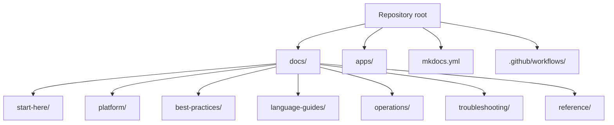
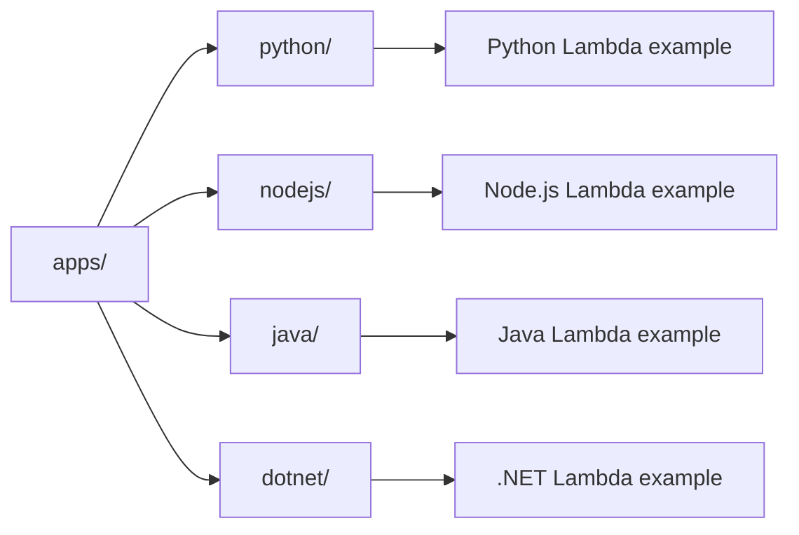

# Repository Map

This repository is organized so you can move from orientation, to platform understanding, to production implementation, to incident response.

Use this page when you need to know where a topic belongs before you start reading or editing documentation.

## Top-Level Layout

## Root Files and Directories

| Path | Purpose |
|---|---|
| `README.md` | Project overview for GitHub visitors. |
| `mkdocs.yml` | Site navigation, theme, and build configuration. |
| `docs/` | Published documentation source. |
| `apps/` | Reference Lambda applications by runtime. |
| `.github/workflows/` | GitHub Pages or documentation automation. |
| `AGENTS.md` | Repository-specific guidance for AI agents and contributors. |

## Documentation Sections

### `docs/start-here/`

Orientation pages for new readers.

- `overview.md` explains what Lambda is and how to use the guide.
- `learning-paths.md` provides role-based and skill-based reading order.
- `repository-map.md` explains where content lives.

### `docs/platform/`

Architecture and operating model pages.

- Use this section to understand execution environments, event sources, scaling, networking, layers, and security boundaries.
- Read this section before writing deep operational advice because it defines the platform vocabulary used elsewhere.

### `docs/best-practices/`

Production guidance for teams running real workloads.

- This section translates platform behavior into decisions.
- Topics include baseline configuration, networking, security, deployment, performance, reliability, and anti-patterns.

### `docs/language-guides/`

Runtime-specific implementation tracks.

- Python, Node.js, Java, and .NET each have a structured tutorial sequence.
- Recipes cover common integrations such as S3, SQS, EventBridge, DynamoDB Streams, and API Gateway.

### `docs/operations/`

Day-2 operational guidance.

- Focuses on deployment strategies, versioning, provisioned concurrency, monitoring, cost optimization, and ongoing environment management.

### `docs/troubleshooting/`

Incident-oriented diagnosis content.

- Architecture overview and mental model pages explain where to look first.
- Playbooks map symptoms to evidence collection and corrective action.
- CloudWatch query pages provide repeatable investigation patterns.

### `docs/reference/`

Quick lookup material.

- Use this section for commands, limits, environment variables, and concise factual checks.
- Reference pages should support, not replace, the narrative pages in platform and best practices.

## Reference Applications

The `apps/` directory gives runtime-specific examples that should align with documentation patterns in the language guides.

## How Navigation Is Built

The left navigation and top tabs are driven by `mkdocs.yml`.

Important implications:

- A page is not fully integrated until it is present in `nav`.
- Broken internal links are easier to catch with `mkdocs build --strict`.
- Section index pages should link to every child page because users may enter the site from search rather than from the nav tree.

## How to Read the Repository Efficiently

| Goal | Start here |
|---|---|
| Learn Lambda from scratch | `docs/start-here/` then `docs/platform/` |
| Ship a function quickly | `docs/language-guides/` plus `docs/best-practices/production-baseline.md` |
| Design a new integration | `docs/platform/event-sources.md` and runtime recipes |
| Improve production posture | `docs/best-practices/` and `docs/operations/` |
| Debug an outage | `docs/troubleshooting/` |

## Contribution Rules That Affect Structure

- Keep filenames in kebab case.
- Keep CLI examples on long flags only.
- Use AWS-official documentation for every source link.
- Add at least one Mermaid diagram per page.
- End pages with `## See Also` followed by `## Sources`.

!!! tip
    Put concept explanations in `platform/`, decision guidance in `best-practices/`, and step-by-step execution in `operations/` or language guides.
    Mixing those categories makes the repository harder to navigate.

## Quick Navigation Table

| If you need... | Go to... |
|---|---|
| Architectural model | `platform/` |
| Production guardrails | `best-practices/` |
| Runtime-specific tutorials | `language-guides/` |
| Day-2 operations | `operations/` |
| Incident response | `troubleshooting/` |
| Command and limit lookup | `reference/` |

## See Also

- [Overview](./overview.md)
- [Learning Paths](./learning-paths.md)
- [Platform Index](../platform/index.md)
- [Best Practices Index](../best-practices/index.md)
- [Home](../index.md)

## Sources

- [MkDocs Material setup concepts are repository-local; Lambda product overview](https://docs.aws.amazon.com/lambda/latest/dg/welcome.html)
- [AWS Lambda Developer Guide](https://docs.aws.amazon.com/lambda/latest/dg/lambda-dg.pdf)
- [Developing Lambda applications](https://docs.aws.amazon.com/lambda/latest/dg/foundation-progmodel.html)
- [Creating Lambda functions with ZIP or container images](https://docs.aws.amazon.com/lambda/latest/dg/gettingstarted-package.html)
