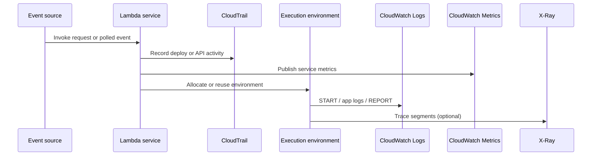

# Troubleshooting Architecture Overview

Lambda troubleshooting works best when you separate observable service boundaries from AWS-managed internals that you cannot inspect directly. That keeps investigations focused on signals you can actually collect and compare.

## Observability Surface

```mermaid
flowchart LR
    A[Event source] --> B[Lambda service]
    B --> C[Execution environment]
    C --> D[Handler code]
    D --> E[Downstream service]

    B -. control plane records .-> F[CloudTrail]
    C -. runtime logs .-> G[CloudWatch Logs]
    B -. service metrics .-> H[CloudWatch Metrics]
    C -. traces .-> I[AWS X-Ray]

    J[Internal scheduler]\n[AZ placement]\n[ENI allocation internals]:::hidden
    B -. not directly observable .-> J

    classDef hidden fill:#f8d7da,stroke:#b02a37,color:#842029;
```

## What You Can Observe

| Signal | What it tells you | Typical Lambda troubleshooting use |
|---|---|---|
| CloudWatch Logs | Runtime output, `START`, `END`, `REPORT`, timeout text, uncaught exceptions | Confirm handler behavior, duration, memory use, cold starts |
| CloudWatch Metrics | `Invocations`, `Errors`, `Duration`, `Throttles`, `ConcurrentExecutions`, `IteratorAge` | Confirm whether the issue is systemic, bursty, or capacity-related |
| AWS X-Ray | Segment timeline, downstream latency, initialization vs handler time | Separate code latency from dependency latency |
| CloudTrail | `UpdateFunctionCode`, `UpdateFunctionConfiguration`, IAM and invoke API records | Correlate regressions with deploys or permission changes |

## What You Cannot Observe Directly

| Internal detail | Why it matters | Practical troubleshooting implication |
|---|---|---|
| Internal placement and scheduling decisions | Explains where an invocation ran, but not exposed directly | Use concurrency, cold start, and latency signals instead |
| Exact ENI allocation lifecycle internals | VPC-attached functions depend on Hyperplane-managed networking | Infer issues from timeout patterns, subnet/IP pressure, and VPC config |
| Internal retry scheduling for every asynchronous delivery step | AWS manages queueing and retries internally | Use destination, DLQ, async metrics, and service docs |
| Underlying host-level resource state | Hidden by the managed runtime model | Focus on memory limits, duration, concurrency, and downstream saturation |

## Observable Boundaries That Matter Most

1. **Before invocation reaches your code**: check event source configuration, invoke permissions, throttles, and CloudTrail activity.
2. **Inside initialization**: check `Init Duration`, layer loading, extension startup, and dependency import cost.
3. **Inside handler execution**: check application logs, traces, timeouts, exceptions, and downstream calls.
4. **After handler returns**: check caller response, async retry behavior, and destination or DLQ records.

## Practical Architecture View



!!! tip
    Treat Lambda troubleshooting as boundary analysis. If the failure appears before `START RequestId`, investigate permissions, invoke path, or throttling. If it appears after `START`, investigate init cost, handler logic, memory, or downstream latency.

## See Also

- [Troubleshooting Hub](./index.md)
- [Decision Tree](./decision-tree.md)
- [Mental Model](./mental-model.md)
- [Evidence Map](./evidence-map.md)
- [CloudWatch Query Library](./cloudwatch/index.md)

## Sources

- [Monitoring Lambda functions with CloudWatch](https://docs.aws.amazon.com/lambda/latest/dg/monitoring-functions.html)
- [Lambda execution environment](https://docs.aws.amazon.com/lambda/latest/dg/lambda-runtime-environment.html)
- [AWS X-Ray and Lambda](https://docs.aws.amazon.com/lambda/latest/dg/services-xray.html)
- [Logging AWS Lambda function invocations](https://docs.aws.amazon.com/lambda/latest/dg/monitoring-cloudwatchlogs.html)
- [Logging AWS API calls with CloudTrail](https://docs.aws.amazon.com/lambda/latest/dg/logging-using-cloudtrail.html)
