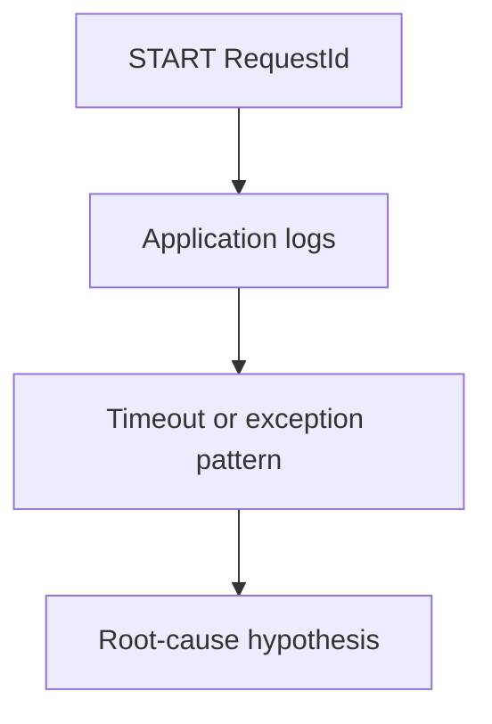

# Application Queries

Application queries focus on what happened after the runtime entered your function. Use them for timeout messages, stack traces, and handler-level exceptions.

## Included Queries

| Query | Use it for |
|---|---|
| [Timeout Errors](./timeout-errors.md) | Find `Task timed out` messages and bucket them by timeout duration |
| [Runtime Exceptions](./runtime-exceptions.md) | Surface common exception and error lines from Lambda logs |

## Investigation Pattern

1. Confirm that the request reached your handler.
2. Identify whether the failure is timeout-driven or exception-driven.
3. Compare the log findings with duration, memory, and trace signals.

!!! tip
    Timeout and exception investigations often overlap. A handler can throw errors because a downstream service became slow, so always compare application findings with platform signals.

## See Also

- [CloudWatch Query Library](../index.md)
- [Invocation Queries](../invocation/index.md)
- [Platform Queries](../platform/index.md)
- [Function Timeout Playbook](../../playbooks/invocation-errors/function-timeout.md)
- [Runtime Crash Playbook](../../playbooks/invocation-errors/runtime-crash.md)

## Sources

- [Logging AWS Lambda function invocations](https://docs.aws.amazon.com/lambda/latest/dg/monitoring-cloudwatchlogs.html)
- [Troubleshoot Lambda invocation issues](https://docs.aws.amazon.com/lambda/latest/dg/troubleshooting-invocation.html)
- [CloudWatch Logs Insights query syntax](https://docs.aws.amazon.com/AmazonCloudWatch/latest/logs/CWL_QuerySyntax.html)
