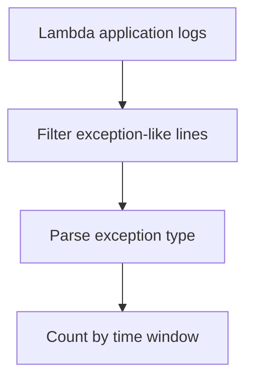

# Lambda Runtime Exceptions

## When to Use
Use this query when the function returns an error and you need to surface the dominant exception patterns quickly. It is a good first pass for grouping stack-trace-heavy logs into something you can triage by time window and exception type.



## Prerequisites
-    Log group: `/aws/lambda/$FUNCTION_NAME`
-    IAM permissions: `logs:StartQuery`, `logs:GetQueryResults`, and `logs:DescribeLogGroups`
-    Application logs must emit exception text, runtime error lines, or stack-trace markers

## Query
```text
fields @timestamp, @message, @logStream
| filter @message like /Exception/ or @message like /ERROR/ or @message like /Traceback/ or @message like /Process exited before completing request/
| parse @message /(?<exceptionType>[A-Za-z0-9_.]+(?:Exception|Error))/
| stats count() as hitCount by bin(15m) as timeWindow, exceptionType
| sort timeWindow desc, hitCount desc
```

## Example Output
| timeWindow | exceptionType | hitCount |
| --- | --- | ---: |
| 2026-04-07 14:00:00 | AccessDeniedException | 18 |
| 2026-04-07 14:00:00 | TimeoutError | 11 |
| 2026-04-07 13:45:00 | ValidationError | 4 |

## How to Read the Results
!!! tip
    When one `exceptionType` dominates a time window, start there before reading raw logs. If `exceptionType` is blank for many rows, your runtime may be logging free-form errors, so switch to the variation that lists recent matching lines.

## Variations
-    List recent raw exception lines:

    ```text
    fields @timestamp, @message, @logStream
    | filter @message like /Exception/ or @message like /ERROR/ or @message like /Traceback/ or @message like /Process exited before completing request/
    | sort @timestamp desc
    | limit 50
    ```

-    Focus on one exception family:

    ```text
    fields @timestamp, @message, @logStream
    | filter @message like /AccessDeniedException/
    | stats count() as hitCount by bin(5m) as timeWindow
    | sort timeWindow desc
    ```

## See Also
-    [Application Queries](./index.md)
-    [Timeout Errors](./timeout-errors.md)
-    [Quick Diagnosis Cards](../../quick-diagnosis-cards.md)
-    [Permission Denied Playbook](../../playbooks/invocation-errors/permission-denied.md)

## Sources
-    https://docs.aws.amazon.com/AmazonCloudWatch/latest/logs/CWL_QuerySyntax.html
-    https://docs.aws.amazon.com/lambda/latest/dg/monitoring-cloudwatchlogs.html
-    https://docs.aws.amazon.com/lambda/latest/dg/troubleshooting-invocation.html
