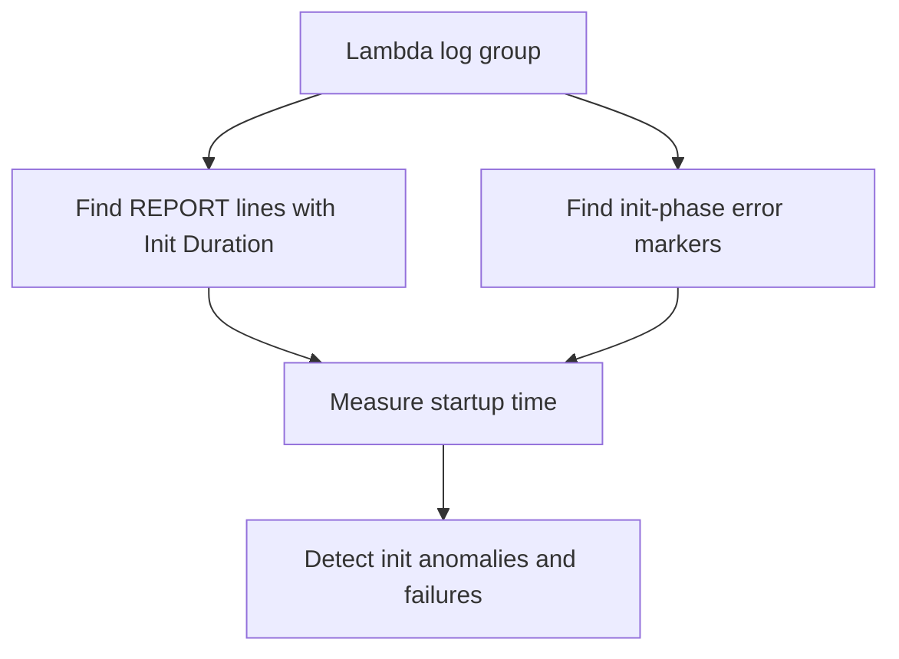

# Lambda Startup Errors

## When to Use
Use this query when new execution environments fail before the handler runs or when `Init Duration` suddenly increases after a deployment. It combines cold-start timing from `REPORT` lines with init-phase failure markers so you can tell whether startup degradation is becoming a reliability issue.



## Prerequisites
-    Log group: `/aws/lambda/$FUNCTION_NAME`
-    IAM permissions: `logs:StartQuery`, `logs:GetQueryResults`, and `logs:DescribeLogGroups`
-    Standard Lambda `REPORT` lines and init-phase runtime messages must be present in the function log group
-    This query is log-derived. Compare findings with the Lambda `Duration`, `Errors`, and cold-start behavior around the same time window.

## Query
```sql
fields @timestamp, @message,
    if(@message like /REPORT RequestId:/ and @message like /Init Duration:/, 1, 0) as coldStartMarker,
    if(@message like /INIT_REPORT/ or @message like /Phase: init/ or @message like /Init Error/ or @message like /Runtime.ExitError/ or @message like /Extension.Crash/, 1, 0) as initFailureMarker
| filter coldStartMarker = 1 or initFailureMarker = 1
| parse @message /Init Duration: (?<initDurationMs>[0-9.]+) ms/
| stats sum(coldStartMarker) as coldStartCount,
    avg(initDurationMs) as avgInitDurationMs,
    max(initDurationMs) as maxInitDurationMs,
    sum(initFailureMarker) as initFailureCount by bin(15m) as timeWindow
| sort timeWindow desc
```

## Example Output
| timeWindow | coldStartCount | avgInitDurationMs | maxInitDurationMs | initFailureCount |
| --- | ---: | ---: | ---: | ---: |
| 2026-04-07 14:00:00 | 41 | 388.6 | 1402.3 | 6 |
| 2026-04-07 13:45:00 | 33 | 174.2 | 442.7 | 0 |
| 2026-04-07 13:30:00 | 29 | 161.9 | 298.1 | 0 |

## How to Read the Results
!!! tip
    Rising `avgInitDurationMs` without `initFailureCount` suggests startup is slowing but still succeeding, often because of larger packages, layer changes, VPC initialization, or extension overhead. Non-zero `initFailureCount` means some environments never reached a healthy invoke path, so investigate deployment artifacts, runtime configuration, layers, and extensions first.

## Variations
-    Show the most recent init-phase failure lines:

    ```sql
    fields @timestamp, @message, @logStream
    | filter @message like /INIT_REPORT/ or @message like /Phase: init/ or @message like /Init Error/ or @message like /Runtime.ExitError/ or @message like /Extension.Crash/
    | sort @timestamp desc
    | limit 50
    ```

-    Focus only on cold starts with unusually high init duration:

    ```sql
    fields @timestamp, @message, @logStream
    | filter @message like /REPORT RequestId:/ and @message like /Init Duration:/
    | parse @message /Init Duration: (?<initDurationMs>[0-9.]+) ms/
    | filter initDurationMs > 500
    | sort initDurationMs desc
    | limit 50
    ```

-    Inspect one execution environment for repeated startup failures:

    ```sql
    fields @timestamp, @message, @logStream
    | filter @logStream = "2026/04/07/[$LATEST]abcdefgh12345678"
    | filter @message like /INIT_REPORT/ or @message like /Phase: init/ or @message like /Init Duration:/
    | sort @timestamp desc
    ```

## See Also
-    [Application Queries](./index.md)
-    [Cold Start Duration](../invocation/cold-start-duration.md)
-    [Memory Utilization](../platform/memory-utilization.md)
-    [Cold Start Latency Playbook](../../playbooks/invocation-errors/cold-start-latency.md)

## Sources
-    https://docs.aws.amazon.com/AmazonCloudWatch/latest/logs/CWL_QuerySyntax.html
-    https://docs.aws.amazon.com/lambda/latest/dg/lambda-runtime-environment.html
-    https://docs.aws.amazon.com/lambda/latest/dg/monitoring-cloudwatchlogs.html
-    https://docs.aws.amazon.com/lambda/latest/dg/runtimes-extensions-api.html
