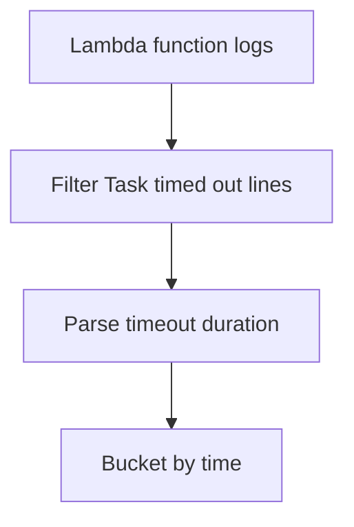

# Lambda Timeout Errors

## When to Use
Use this query when invocations hang until the configured timeout and you want to confirm how often the failure occurs and what timeout threshold is being hit. It is useful for separating rare downstream stalls from broad saturation or configuration problems.



## Prerequisites
-    Log group: `/aws/lambda/$FUNCTION_NAME`
-    IAM permissions: `logs:StartQuery`, `logs:GetQueryResults`, and `logs:DescribeLogGroups`
-    Standard Lambda timeout message format must be present in the log stream

## Query
```text
fields @timestamp, @message, @logStream
| filter @message like /Task timed out after/
| parse @message /Task timed out after (?<timeoutSeconds>[0-9.]+) seconds/
| stats count() as timeoutCount, max(timeoutSeconds) as configuredTimeoutSeconds by bin(15m) as timeWindow
| sort timeWindow desc
```

## Example Output
| timeWindow | timeoutCount | configuredTimeoutSeconds |
| --- | ---: | ---: |
| 2026-04-07 14:00:00 | 24 | 30.0 |
| 2026-04-07 13:45:00 | 7 | 30.0 |
| 2026-04-07 13:30:00 | 1 | 30.0 |

## How to Read the Results
!!! tip
    Rising `timeoutCount` with a stable timeout value usually means the handler is consistently exceeding the configured ceiling, not that the timeout setting changed. Compare this result with downstream latency, memory headroom, and cold-start duration before simply increasing the timeout.

## Variations
-    Show the most recent timeout lines for direct context:

    ```text
    fields @timestamp, @message, @logStream
    | filter @message like /Task timed out after/
    | sort @timestamp desc
    | limit 50
    ```

-    Count timeouts by execution environment:

    ```text
    fields @timestamp, @message, @logStream
    | filter @message like /Task timed out after/
    | stats count() as timeoutCount by @logStream
    | sort timeoutCount desc
    ```

## See Also
-    [Application Queries](./index.md)
-    [Cold Start Duration](../invocation/cold-start-duration.md)
-    [Memory Utilization](../platform/memory-utilization.md)
-    [Function Timeout Playbook](../../playbooks/invocation-errors/function-timeout.md)

## Sources
-    https://docs.aws.amazon.com/AmazonCloudWatch/latest/logs/CWL_QuerySyntax.html
-    https://docs.aws.amazon.com/lambda/latest/dg/configuration-timeout.html
-    https://docs.aws.amazon.com/lambda/latest/dg/monitoring-cloudwatchlogs.html
