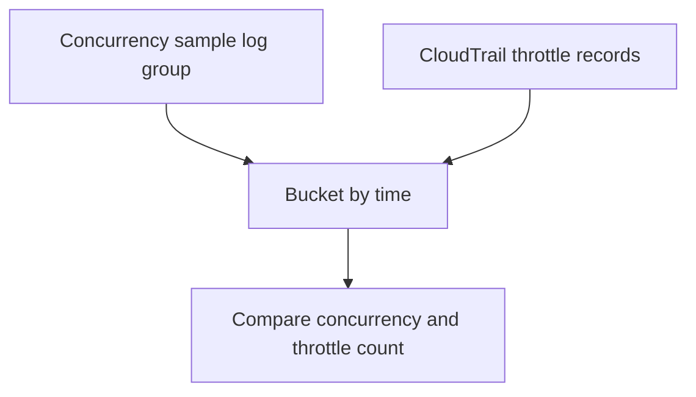

# Lambda Concurrency vs Throttles

## When to Use
Use this query when you suspect throttling is caused by concurrency saturation rather than random caller retries. It is designed for teams that write concurrency samples into a CloudWatch Logs log group and want to compare those samples with throttle events in the same time buckets.



## Prerequisites
-    Log groups: a custom concurrency snapshot log group and a CloudTrail log group with Lambda invoke throttle events
-    IAM permissions: `logs:StartQuery`, `logs:GetQueryResults`, and `logs:DescribeLogGroups`
-    Select both log groups before running the query
-    Concurrency samples must be emitted as JSON records such as `{"functionName":"$FUNCTION_NAME","metricName":"ConcurrentExecutions","value":42}`

## Query
```text
fields @timestamp, @log, functionName, metricName, value, eventSource, errorCode, requestParameters.functionName as requestFunctionName
| fields if(functionName = "$FUNCTION_NAME" and metricName = "ConcurrentExecutions", value, 0) as concurrencyValue,
    if(eventSource = "lambda.amazonaws.com" and requestFunctionName = "$FUNCTION_NAME" and errorCode = "TooManyRequestsException", 1, 0) as throttleValue
| filter concurrencyValue > 0 or throttleValue > 0
| stats max(concurrencyValue) as concurrencySample, sum(throttleValue) as throttleCount by bin(5m) as timeWindow
| sort timeWindow desc
```

## Example Output
| timeWindow | concurrencySample | throttleCount |
| --- | ---: | ---: |
| 2026-04-07 14:00:00 | 1000 | 44 |
| 2026-04-07 13:55:00 | 998 | 17 |
| 2026-04-07 13:50:00 | 720 | 0 |

## How to Read the Results
!!! tip
    If `throttleCount` rises only when `concurrencySample` is near your known function or account limit, concurrency saturation is the likely cause. If throttles appear while concurrency remains low, inspect reserved concurrency settings, invoke patterns, or incomplete data collection.

## Variations
-    Use 1-minute buckets during a burst event:

    ```text
    fields @timestamp, @log, functionName, metricName, value, eventSource, errorCode, requestParameters.functionName as requestFunctionName
    | fields if(functionName = "$FUNCTION_NAME" and metricName = "ConcurrentExecutions", value, 0) as concurrencyValue,
        if(eventSource = "lambda.amazonaws.com" and requestFunctionName = "$FUNCTION_NAME" and errorCode = "TooManyRequestsException", 1, 0) as throttleValue
    | filter concurrencyValue > 0 or throttleValue > 0
    | stats max(concurrencyValue) as concurrencySample, sum(throttleValue) as throttleCount by bin(1m) as timeWindow
    | sort timeWindow desc
    ```

-    Break out only buckets that contained throttles:

    ```text
    fields @timestamp, @log, functionName, metricName, value, eventSource, errorCode, requestParameters.functionName as requestFunctionName
    | fields if(functionName = "$FUNCTION_NAME" and metricName = "ConcurrentExecutions", value, 0) as concurrencyValue,
        if(eventSource = "lambda.amazonaws.com" and requestFunctionName = "$FUNCTION_NAME" and errorCode = "TooManyRequestsException", 1, 0) as throttleValue
    | filter concurrencyValue > 0 or throttleValue > 0
    | stats max(concurrencyValue) as concurrencySample, sum(throttleValue) as throttleCount by bin(5m) as timeWindow
    | filter throttleCount > 0
    | sort timeWindow desc
    ```

## See Also
-    [Correlation Queries](./index.md)
-    [Throttle Trend](../invocation/throttle-trend.md)
-    [Platform: Concurrency and Scaling](../../../platform/concurrency-and-scaling.md)
-    [Concurrency Limits Playbook](../../playbooks/performance/concurrency-limits.md)

## Sources
-    https://docs.aws.amazon.com/AmazonCloudWatch/latest/logs/CWL_QuerySyntax.html
-    https://docs.aws.amazon.com/lambda/latest/dg/monitoring-metrics-types.html
-    https://docs.aws.amazon.com/lambda/latest/dg/logging-using-cloudtrail.html
-    https://docs.aws.amazon.com/lambda/latest/dg/gettingstarted-limits.html
