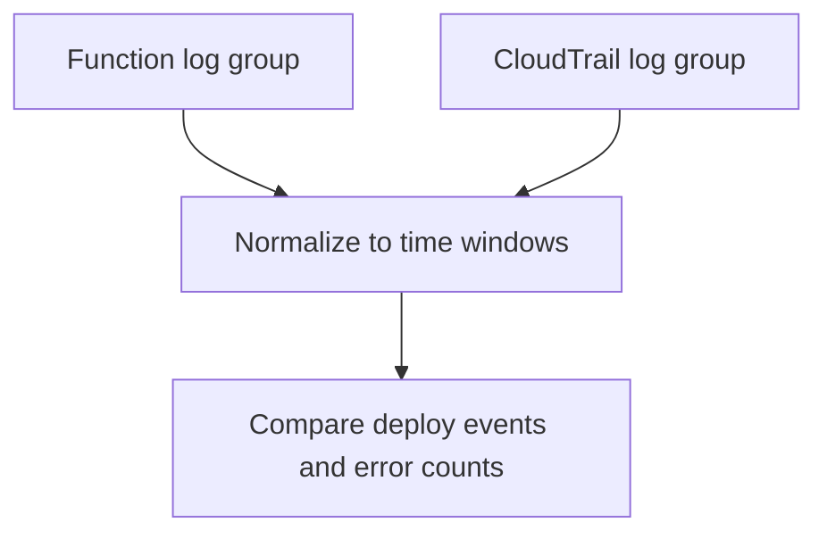

# Lambda Deploy vs Errors

## When to Use
Use this query when the incident may be release-related and you need one timeline that shows both deployment activity and function-side error bursts. It is most effective immediately after a new version, alias shift, or configuration rollout.



## Prerequisites
-    Log groups: `/aws/lambda/$FUNCTION_NAME` and a CloudTrail log group that contains Lambda management events
-    IAM permissions: `logs:StartQuery`, `logs:GetQueryResults`, and `logs:DescribeLogGroups`
-    Select both log groups before running the query in CloudWatch Logs Insights

## Query
```text
fields @timestamp, @message, @log, eventSource, eventName, requestParameters.functionName as functionName
| filter (@log like /\/aws\/lambda\/$FUNCTION_NAME/ and (@message like /ERROR/ or @message like /Task timed out/ or @message like /Process exited before completing request/))
    or (eventSource = "lambda.amazonaws.com" and functionName = "$FUNCTION_NAME" and (eventName = "UpdateFunctionCode" or eventName = "UpdateFunctionConfiguration" or eventName = "PublishVersion" or eventName = "UpdateAlias"))
| fields if(@log like /\/aws\/lambda\/$FUNCTION_NAME/, "functionError", "deployment") as recordType
| stats count() as eventCount by bin(15m) as timeWindow, recordType
| sort timeWindow desc, recordType asc
```

## Example Output
| timeWindow | recordType | eventCount |
| --- | --- | ---: |
| 2026-04-07 14:00:00 | deployment | 2 |
| 2026-04-07 14:00:00 | functionError | 31 |
| 2026-04-07 13:45:00 | functionError | 3 |

## How to Read the Results
!!! tip
    When `deployment` events appear in the same or immediately preceding bucket as a sharp rise in `functionError`, the deployment becomes the leading hypothesis. If errors rise without nearby deploy activity, shift attention to traffic patterns, downstream failures, or concurrency pressure.

## Variations
-    Increase granularity for recent incidents:

    ```text
    fields @timestamp, @message, @log, eventSource, eventName, requestParameters.functionName as functionName
    | filter (@log like /\/aws\/lambda\/$FUNCTION_NAME/ and (@message like /ERROR/ or @message like /Task timed out/))
        or (eventSource = "lambda.amazonaws.com" and functionName = "$FUNCTION_NAME" and (eventName = "UpdateFunctionCode" or eventName = "UpdateFunctionConfiguration" or eventName = "PublishVersion" or eventName = "UpdateAlias"))
    | fields if(@log like /\/aws\/lambda\/$FUNCTION_NAME/, "functionError", "deployment") as recordType
    | stats count() as eventCount by bin(5m) as timeWindow, recordType
    | sort timeWindow desc, recordType asc
    ```

-    Show raw deployment events next to recent error lines:

    ```text
    fields @timestamp, @message, @log, eventName, requestParameters.functionName as functionName
    | filter (@log like /\/aws\/lambda\/$FUNCTION_NAME/ and (@message like /ERROR/ or @message like /Task timed out/))
        or (eventSource = "lambda.amazonaws.com" and functionName = "$FUNCTION_NAME" and (eventName = "UpdateFunctionCode" or eventName = "UpdateFunctionConfiguration" or eventName = "PublishVersion" or eventName = "UpdateAlias"))
    | sort @timestamp desc
    | limit 100
    ```

## See Also
-    [Correlation Queries](./index.md)
-    [Deployment Events](../platform/deployment-events.md)
-    [Error Rate Over Time](../invocation/error-rate-over-time.md)
-    [Mental Model](../../mental-model.md)

## Sources
-    https://docs.aws.amazon.com/AmazonCloudWatch/latest/logs/CWL_QuerySyntax.html
-    https://docs.aws.amazon.com/lambda/latest/dg/logging-using-cloudtrail.html
-    https://docs.aws.amazon.com/lambda/latest/dg/monitoring-cloudwatchlogs.html
