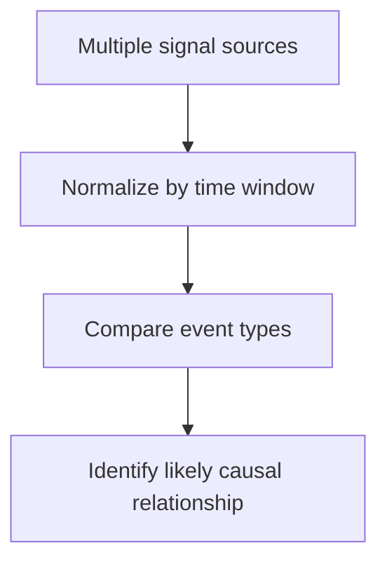

# Correlation Queries

Correlation queries combine records from more than one log source so you can compare symptom onset with change activity or load pressure. Use them when a single log group answers only part of the incident story.

## Included Queries

| Query | Use it for |
|---|---|
| [Deploy vs Errors](./deploy-vs-errors.md) | Compare deployment timestamps with error counts |
| [Concurrency vs Throttles](./concurrency-vs-throttles.md) | Compare concurrency samples with throttle events |

## Investigation Pattern

1. Define the incident start time.
2. Pull one change signal and one symptom signal into the same query or time bucket.
3. Look for leading indicators rather than exact one-to-one matches.

!!! tip
    Correlation is not proof by itself, but it is often enough to decide whether the next step should be rollback, concurrency tuning, or deeper application debugging.

## See Also

- [CloudWatch Query Library](../index.md)
- [Invocation Queries](../invocation/index.md)
- [Platform Queries](../platform/index.md)
- [Mental Model](../../mental-model.md)
- [Decision Tree](../../decision-tree.md)

## Sources

- [Analyzing log data with CloudWatch Logs Insights](https://docs.aws.amazon.com/AmazonCloudWatch/latest/logs/AnalyzingLogData.html)
- [Logging AWS API calls with CloudTrail](https://docs.aws.amazon.com/lambda/latest/dg/logging-using-cloudtrail.html)
- [Monitoring Lambda functions with CloudWatch](https://docs.aws.amazon.com/lambda/latest/dg/monitoring-functions.html)
