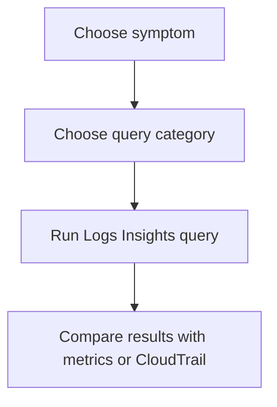

# CloudWatch Logs Insights Query Library

This library gives you reusable CloudWatch Logs Insights queries for common Lambda troubleshooting patterns. Use it when you already know the symptom category and want a precise query instead of manually scanning log streams.

## Query Categories

| Category | Focus | Start here |
|---|---|---|
| Invocation | Error rate, throttles, cold starts | [Invocation Queries](./invocation/index.md) |
| Application | Timeout text, runtime exceptions | [Application Queries](./application/index.md) |
| Platform | Deploy activity, memory use from `REPORT` lines | [Platform Queries](./platform/index.md) |
| Correlation | Overlay logs from multiple systems | [Correlation Queries](./correlation/index.md) |

## How to Use This Library

1. Select the smallest relevant time window first.
2. Choose the function log group `/aws/lambda/$FUNCTION_NAME` unless the page explicitly requires CloudTrail or another log source.
3. Copy the base query before adding filters.
4. Save useful variants for recurring incidents.

## Recommended Reading Order

- Start with [Invocation Queries](./invocation/index.md) for symptom confirmation.
- Use [Application Queries](./application/index.md) when the function reached your code.
- Use [Platform Queries](./platform/index.md) when a deploy or resource limit is suspected.
- Use [Correlation Queries](./correlation/index.md) when one signal is not enough.

!!! tip
    Logs Insights is strongest when you use it to answer one question at a time: when did the symptom start, which requests were affected, or what changed near the first failure.

## See Also

- [Troubleshooting Hub](../index.md)
- [Evidence Map](../evidence-map.md)
- [Invocation Queries](./invocation/index.md)
- [Platform Queries](./platform/index.md)
- [Reference: CloudWatch Queries](../../reference/cloudwatch-queries.md)

## Sources

- [Analyzing log data with CloudWatch Logs Insights](https://docs.aws.amazon.com/AmazonCloudWatch/latest/logs/AnalyzingLogData.html)
- [CloudWatch Logs Insights query syntax](https://docs.aws.amazon.com/AmazonCloudWatch/latest/logs/CWL_QuerySyntax.html)
- [Logging AWS Lambda function invocations](https://docs.aws.amazon.com/lambda/latest/dg/monitoring-cloudwatchlogs.html)
