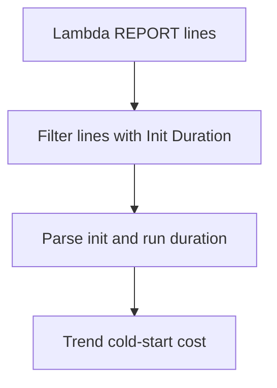

# Lambda Cold Start Duration

## When to Use
Use this query when latency spikes appear after idle periods, scale-out events, or new deployments. It extracts `Init Duration` from Lambda `REPORT` lines so you can measure cold-start cost directly from the function log group.



## Prerequisites
-    Log group: `/aws/lambda/$FUNCTION_NAME`
-    IAM permissions: `logs:StartQuery`, `logs:GetQueryResults`, and `logs:DescribeLogGroups`
-    The query assumes standard Lambda `REPORT` line formatting that includes `Init Duration` for cold starts

## Query
```text
fields @timestamp, @message
| filter @message like /REPORT RequestId:/ and @message like /Init Duration:/
| parse @message /Init Duration: (?<initDurationMs>[0-9.]+) ms/
| parse @message /Duration: (?<durationMs>[0-9.]+) ms/
| parse @message /Billed Duration: (?<billedDurationMs>[0-9]+) ms/
| stats avg(initDurationMs) as avgInitDurationMs, max(initDurationMs) as maxInitDurationMs, avg(durationMs) as avgHandlerDurationMs by bin(15m) as timeWindow
| sort timeWindow desc
```

## Example Output
| timeWindow | avgInitDurationMs | maxInitDurationMs | avgHandlerDurationMs |
| --- | ---: | ---: | ---: |
| 2026-04-07 14:00:00 | 248.4 | 612.7 | 91.6 |
| 2026-04-07 13:45:00 | 102.1 | 208.5 | 88.4 |
| 2026-04-07 13:30:00 | 0 | 0 | 86.9 |

## How to Read the Results
!!! tip
    If `avgInitDurationMs` rises while `avgHandlerDurationMs` stays flat, the latency issue is likely initialization rather than business logic. That usually points to package size, dependency loading, extension startup, or VPC-related initialization overhead.

## Variations
-    Inspect individual cold starts instead of buckets:

    ```text
    fields @timestamp, @message
    | filter @message like /REPORT RequestId:/ and @message like /Init Duration:/
    | parse @message /Init Duration: (?<initDurationMs>[0-9.]+) ms/
    | parse @message /Duration: (?<durationMs>[0-9.]+) ms/
    | sort @timestamp desc
    | limit 50
    ```

-    Focus on a single execution environment:

    ```text
    fields @timestamp, @message, @logStream
    | filter @logStream = "2026/04/07/[$LATEST]abcdefgh12345678"
    | filter @message like /REPORT RequestId:/ and @message like /Init Duration:/
    | parse @message /Init Duration: (?<initDurationMs>[0-9.]+) ms/
    | parse @message /Duration: (?<durationMs>[0-9.]+) ms/
    | sort @timestamp desc
    ```

## See Also
-    [Invocation Queries](./index.md)
-    [Memory Utilization](../platform/memory-utilization.md)
-    [Quick Diagnosis Cards](../../quick-diagnosis-cards.md)
-    [Cold Start Optimization Playbook](../../playbooks/performance/cold-start-optimization.md)

## Sources
-    https://docs.aws.amazon.com/AmazonCloudWatch/latest/logs/CWL_QuerySyntax.html
-    https://docs.aws.amazon.com/lambda/latest/dg/lambda-runtime-environment.html
-    https://docs.aws.amazon.com/lambda/latest/dg/monitoring-cloudwatchlogs.html
