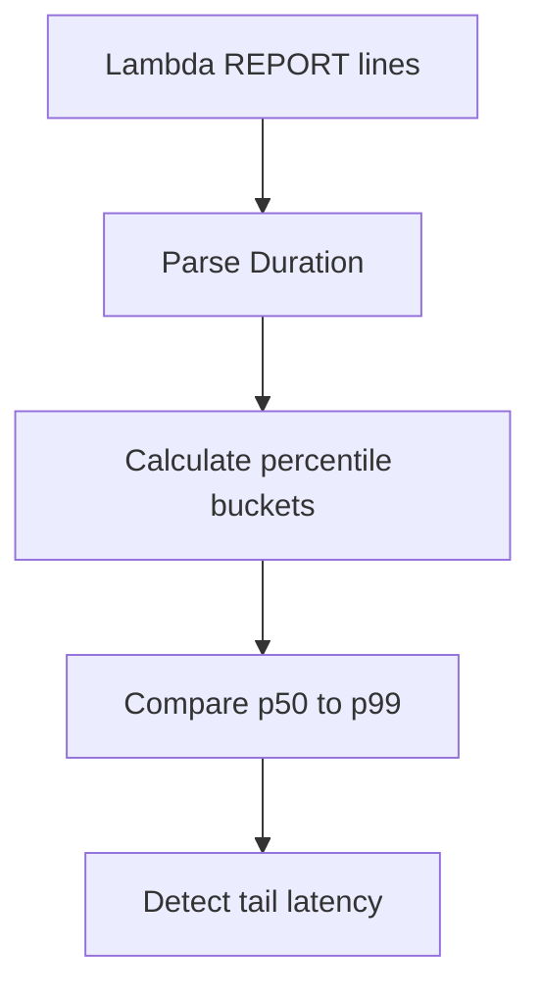

# Lambda Duration Percentiles

## When to Use
Use this query when average duration looks normal but some users still see slow responses. It parses Lambda `REPORT` lines so you can see whether p90, p95, or p99 latency is drifting even when the median stays stable.



## Prerequisites
-    Log group: `/aws/lambda/$FUNCTION_NAME`
-    IAM permissions: `logs:StartQuery`, `logs:GetQueryResults`, and `logs:DescribeLogGroups`
-    Standard Lambda `REPORT` lines must be present in the function log group

## Query
```sql
fields @timestamp, @message
| filter @message like /REPORT RequestId:/
| parse @message /Duration: (?<durationMs>[0-9.]+) ms/
| stats pct(durationMs, 50) as p50DurationMs,
    pct(durationMs, 90) as p90DurationMs,
    pct(durationMs, 95) as p95DurationMs,
    pct(durationMs, 99) as p99DurationMs,
    avg(durationMs) as avgDurationMs,
    count() as invocationCount by bin(15m) as timeWindow
| sort timeWindow desc
```

## Example Output
| timeWindow | invocationCount | avgDurationMs | p50DurationMs | p90DurationMs | p95DurationMs | p99DurationMs |
| --- | ---: | ---: | ---: | ---: | ---: | ---: |
| 2026-04-07 14:00:00 | 1820 | 94.3 | 71.8 | 188.4 | 246.1 | 612.9 |
| 2026-04-07 13:45:00 | 1764 | 88.6 | 69.4 | 141.2 | 182.7 | 290.6 |
| 2026-04-07 13:30:00 | 1711 | 86.9 | 68.8 | 136.9 | 174.1 | 251.7 |

## How to Read the Results
!!! tip
    If `p50DurationMs` stays flat while `p95DurationMs` or `p99DurationMs` rises, you likely have a tail-latency problem rather than a broad performance regression. That usually points to cold starts, downstream jitter, or uneven work distribution across a smaller set of invocations.

## Variations
-    Focus on tail latency only during an active incident:

    ```sql
    fields @timestamp, @message
    | filter @message like /REPORT RequestId:/
    | parse @message /Duration: (?<durationMs>[0-9.]+) ms/
    | stats pct(durationMs, 95) as p95DurationMs, pct(durationMs, 99) as p99DurationMs by bin(5m) as timeWindow
    | sort timeWindow desc
    ```

-    List the slowest individual invocations for direct inspection:

    ```sql
    fields @timestamp, @message, @logStream
    | filter @message like /REPORT RequestId:/
    | parse @message /Duration: (?<durationMs>[0-9.]+) ms/
    | sort durationMs desc
    | limit 50
    ```

-    Compare cold starts only:

    ```sql
    fields @timestamp, @message
    | filter @message like /REPORT RequestId:/ and @message like /Init Duration:/
    | parse @message /Duration: (?<durationMs>[0-9.]+) ms/
    | stats pct(durationMs, 50) as p50DurationMs, pct(durationMs, 95) as p95DurationMs, pct(durationMs, 99) as p99DurationMs by bin(15m) as timeWindow
    | sort timeWindow desc
    ```

## See Also
-    [Invocation Queries](./index.md)
-    [Cold Start Duration](./cold-start-duration.md)
-    [Memory Utilization](../platform/memory-utilization.md)
-    [High Duration Playbook](../../playbooks/performance/high-duration.md)

## Sources
-    https://docs.aws.amazon.com/AmazonCloudWatch/latest/logs/CWL_QuerySyntax.html
-    https://docs.aws.amazon.com/lambda/latest/dg/monitoring-cloudwatchlogs.html
-    https://docs.aws.amazon.com/lambda/latest/dg/monitoring-metrics-types.html
