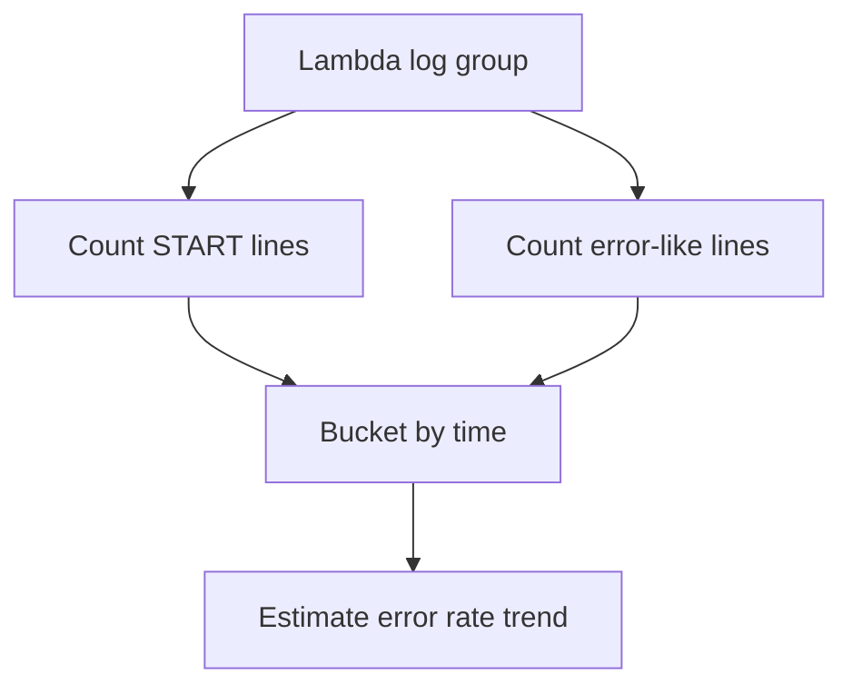

# Lambda Error Rate Over Time

## When to Use
Use this query when users report intermittent failures and you want a log-derived error trend without leaving CloudWatch Logs Insights. It is most useful for quickly spotting whether error bursts align with a deployment window or traffic spike.



## Prerequisites
-    Log group: `/aws/lambda/$FUNCTION_NAME`
-    IAM permissions: `logs:StartQuery`, `logs:GetQueryResults`, and `logs:DescribeLogGroups`
-    This is a log-derived approximation. For an authoritative service-level rate, compare with the Lambda `Errors` metric.

## Query
```text
fields @timestamp, @message,
    if(@message like /START RequestId:/, 1, 0) as invocationMarker,
    if(@message like /ERROR/ or @message like /Task timed out/ or @message like /Process exited before completing request/, 1, 0) as errorMarker
| filter invocationMarker = 1 or errorMarker = 1
| stats sum(invocationMarker) as invocationCount, sum(errorMarker) as errorCount by bin(5m) as timeWindow
| filter invocationCount > 0
| fields timeWindow, invocationCount, errorCount, round((errorCount * 100.0) / invocationCount, 2) as errorRatePercent
| sort timeWindow desc
```

## Example Output
| timeWindow | invocationCount | errorCount | errorRatePercent |
| --- | ---: | ---: | ---: |
| 2026-04-07 14:00:00 | 480 | 19 | 3.96 |
| 2026-04-07 13:55:00 | 502 | 4 | 0.80 |
| 2026-04-07 13:50:00 | 497 | 3 | 0.60 |

## How to Read the Results
!!! tip
    A sudden jump in `errorRatePercent` usually means either a deployment regression or a downstream dependency failure. If the increase is sharp but short-lived, compare the same window with `Throttles`, `ConcurrentExecutions`, and CloudTrail deployment records.

## Variations
-    Increase resolution during an incident:

    ```text
    fields @timestamp, @message,
        if(@message like /START RequestId:/, 1, 0) as invocationMarker,
        if(@message like /ERROR/ or @message like /Task timed out/ or @message like /Process exited before completing request/, 1, 0) as errorMarker
    | filter invocationMarker = 1 or errorMarker = 1
    | stats sum(invocationMarker) as invocationCount, sum(errorMarker) as errorCount by bin(1m) as timeWindow
    | filter invocationCount > 0
    | fields timeWindow, invocationCount, errorCount, round((errorCount * 100.0) / invocationCount, 2) as errorRatePercent
    | sort timeWindow desc
    ```

-    Focus on one log stream to inspect a single execution environment:

    ```text
    fields @timestamp, @message, @logStream,
        if(@message like /START RequestId:/, 1, 0) as invocationMarker,
        if(@message like /ERROR/ or @message like /Task timed out/, 1, 0) as errorMarker
    | filter @logStream = "2026/04/07/[$LATEST]abcdefgh12345678"
    | filter invocationMarker = 1 or errorMarker = 1
    | stats sum(invocationMarker) as invocationCount, sum(errorMarker) as errorCount by bin(5m) as timeWindow
    | filter invocationCount > 0
    | fields timeWindow, invocationCount, errorCount, round((errorCount * 100.0) / invocationCount, 2) as errorRatePercent
    | sort timeWindow desc
    ```

## See Also
-    [Invocation Queries](./index.md)
-    [Runtime Exceptions](../application/runtime-exceptions.md)
-    [Deploy vs Errors](../correlation/deploy-vs-errors.md)
-    [Decision Tree](../../decision-tree.md)

## Sources
-    https://docs.aws.amazon.com/AmazonCloudWatch/latest/logs/CWL_QuerySyntax.html
-    https://docs.aws.amazon.com/lambda/latest/dg/monitoring-cloudwatchlogs.html
-    https://docs.aws.amazon.com/lambda/latest/dg/monitoring-metrics-types.html
