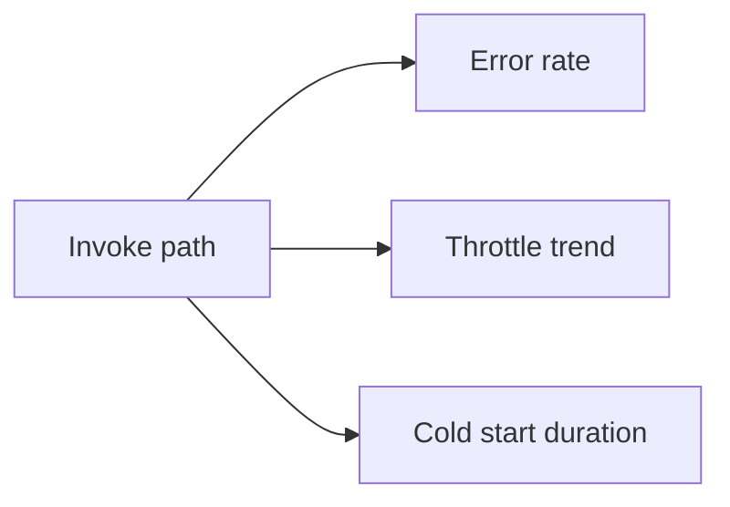

# Invocation Queries

Use invocation queries to confirm whether Lambda accepted the invoke, how frequently errors appeared, whether throttling is visible in invoke records, and whether cold-start cost is contributing to latency.

## Included Queries

| Query | Use it for |
|---|---|
| [Error Rate Over Time](./error-rate-over-time.md) | Bucket log-derived invocation and error signals by time |
| [Throttle Trend](./throttle-trend.md) | Inspect invoke failures that indicate throttling in CloudTrail or caller-side logs |
| [Cold Start Duration](./cold-start-duration.md) | Extract `Init Duration` from Lambda `REPORT` lines |

## Investigation Pattern

1. Confirm whether the symptom is bursty or continuous.
2. Separate invoke-path failures from handler-path failures.
3. Check whether scale-out or concurrency pressure changed the shape of the incident.

!!! tip
    If the function log group does not contain the failing request, suspect throttling or invoke-path rejection and move to CloudTrail-backed queries.

## See Also

- [CloudWatch Query Library](../index.md)
- [Application Queries](../application/index.md)
- [Correlation Queries](../correlation/index.md)
- [Decision Tree](../../decision-tree.md)
- [Quick Diagnosis Cards](../../quick-diagnosis-cards.md)

## Sources

- [Invoking Lambda functions](https://docs.aws.amazon.com/lambda/latest/dg/lambda-invocation.html)
- [Monitoring Lambda functions with CloudWatch](https://docs.aws.amazon.com/lambda/latest/dg/monitoring-functions.html)
- [CloudWatch Logs Insights query syntax](https://docs.aws.amazon.com/AmazonCloudWatch/latest/logs/CWL_QuerySyntax.html)
