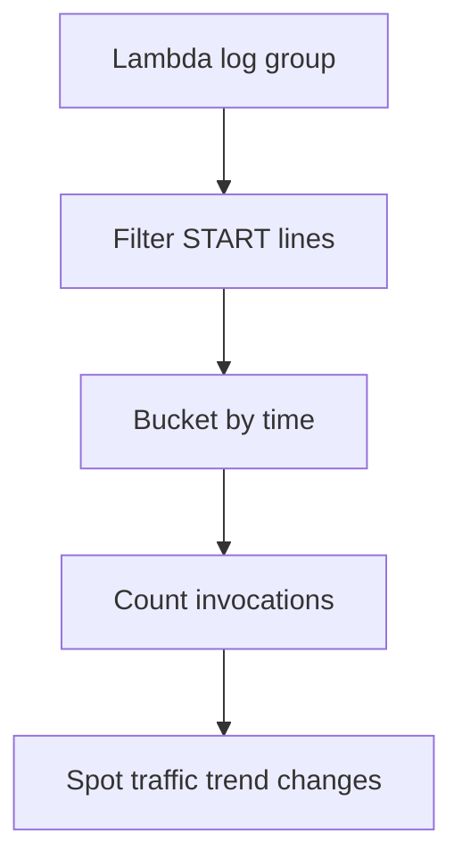

# Lambda Invocation Count

## When to Use
Use this query when you need a fast log-derived view of traffic volume without switching to the Metrics console. It is useful for confirming whether an incident lines up with a sudden invoke surge, a traffic drop, or a deployment window that changed request volume.



## Prerequisites
-    Log group: `/aws/lambda/$FUNCTION_NAME`
-    IAM permissions: `logs:StartQuery`, `logs:GetQueryResults`, and `logs:DescribeLogGroups`
-    This is a log-derived invocation count based on Lambda `START` lines. Compare with the Lambda `Invocations` metric when you need the authoritative service-side total.

## Query
```sql
fields @timestamp, @message
| filter @message like /START RequestId:/
| stats count() as invocationCount by bin(5m) as timeWindow
| sort timeWindow desc
```

## Example Output
| timeWindow | invocationCount |
| --- | ---: |
| 2026-04-07 14:00:00 | 1540 |
| 2026-04-07 13:55:00 | 1508 |
| 2026-04-07 13:50:00 | 1192 |

## How to Read the Results
!!! tip
    A sharp rise in `invocationCount` usually means either legitimate traffic growth, retry amplification, or a caller-side bug that increased request volume. A sudden drop can indicate an upstream outage, event source mapping pause, or routing change before the function is invoked.

## Variations
-    Increase resolution during a short-lived spike:

    ```sql
    fields @timestamp, @message
    | filter @message like /START RequestId:/
    | stats count() as invocationCount by bin(1m) as timeWindow
    | sort timeWindow desc
    ```

-    Compare invocation count by execution environment:

    ```sql
    fields @timestamp, @message, @logStream
    | filter @message like /START RequestId:/
    | stats count() as invocationCount by @logStream
    | sort invocationCount desc
    | limit 50
    ```

-    Show only low-volume buckets that may indicate an upstream interruption:

    ```sql
    fields @timestamp, @message
    | filter @message like /START RequestId:/
    | stats count() as invocationCount by bin(5m) as timeWindow
    | filter invocationCount < 100
    | sort timeWindow desc
    ```

## See Also
-    [Invocation Queries](./index.md)
-    [Error Rate Over Time](./error-rate-over-time.md)
-    [Throttle Trend](./throttle-trend.md)
-    [Decision Tree](../../decision-tree.md)

## Sources
-    https://docs.aws.amazon.com/AmazonCloudWatch/latest/logs/CWL_QuerySyntax.html
-    https://docs.aws.amazon.com/lambda/latest/dg/monitoring-cloudwatchlogs.html
-    https://docs.aws.amazon.com/lambda/latest/dg/monitoring-metrics-types.html
