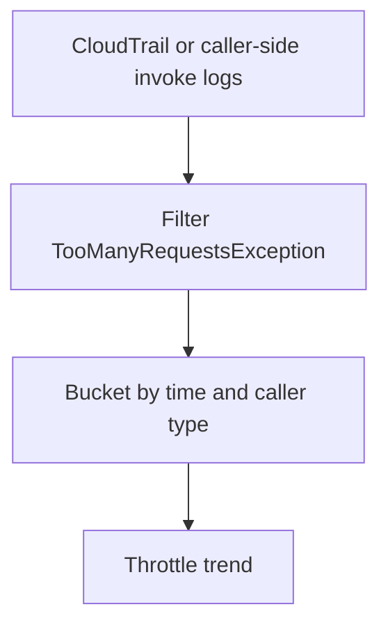

# Lambda Throttle Trend

## When to Use
Use this query when callers report `TooManyRequestsException` or a dashboard shows Lambda throttles and you need a time-bucketed view from log records. This query is especially useful when you send CloudTrail Lambda invoke activity into CloudWatch Logs.



## Prerequisites
-    Log group: CloudTrail log group that contains Lambda invoke records for `$FUNCTION_NAME`
-    IAM permissions: `logs:StartQuery`, `logs:GetQueryResults`, and `logs:DescribeLogGroups`
-    CloudTrail data events or equivalent caller-side invoke logs must be enabled for the relevant invocation path

## Query
```text
fields @timestamp, eventSource, eventName, errorCode, requestParameters.functionName as functionName, userIdentity.type as callerType
| filter eventSource = "lambda.amazonaws.com"
| filter functionName = "$FUNCTION_NAME"
| filter errorCode = "TooManyRequestsException"
| stats count() as throttleCount by bin(5m) as timeWindow, callerType
| sort timeWindow desc, callerType asc
```

## Example Output
| timeWindow | callerType | throttleCount |
| --- | --- | ---: |
| 2026-04-07 14:00:00 | AssumedRole | 37 |
| 2026-04-07 13:55:00 | AWSService | 12 |
| 2026-04-07 13:50:00 | AssumedRole | 3 |

## How to Read the Results
!!! tip
    If `throttleCount` rises for `AWSService`, look at event source mappings, asynchronous producers, or service integrations. If it rises for `AssumedRole` or `IAMUser`, the immediate pressure may be direct invoke traffic or an upstream application burst.

## Variations
-    Break down by event name:

    ```text
    fields @timestamp, eventSource, eventName, errorCode, requestParameters.functionName as functionName
    | filter eventSource = "lambda.amazonaws.com"
    | filter functionName = "$FUNCTION_NAME"
    | filter errorCode = "TooManyRequestsException"
    | stats count() as throttleCount by bin(15m) as timeWindow, eventName
    | sort timeWindow desc, eventName asc
    ```

-    Narrow to a single caller identity type:

    ```text
    fields @timestamp, eventSource, eventName, errorCode, requestParameters.functionName as functionName, userIdentity.type as callerType
    | filter eventSource = "lambda.amazonaws.com"
    | filter functionName = "$FUNCTION_NAME"
    | filter errorCode = "TooManyRequestsException"
    | filter callerType = "AWSService"
    | stats count() as throttleCount by bin(5m) as timeWindow
    | sort timeWindow desc
    ```

## See Also
-    [Invocation Queries](./index.md)
-    [Concurrency vs Throttles](../correlation/concurrency-vs-throttles.md)
-    [Quick Diagnosis Cards](../../quick-diagnosis-cards.md)
-    [Throttling Playbook](../../playbooks/invocation-errors/throttling.md)

## Sources
-    https://docs.aws.amazon.com/AmazonCloudWatch/latest/logs/CWL_QuerySyntax.html
-    https://docs.aws.amazon.com/lambda/latest/dg/logging-using-cloudtrail.html
-    https://docs.aws.amazon.com/lambda/latest/dg/monitoring-metrics-types.html
-    https://docs.aws.amazon.com/lambda/latest/dg/gettingstarted-limits.html
