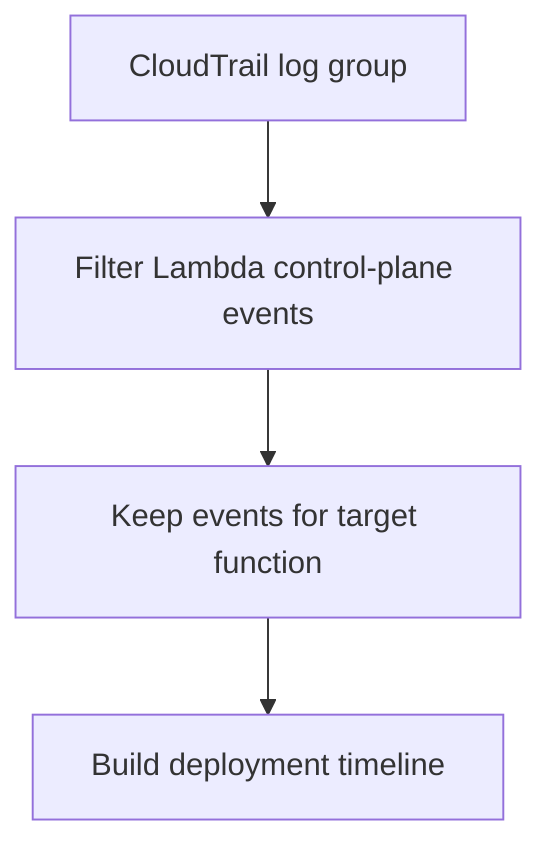

# Lambda Deployment Events

## When to Use
Use this query when errors started after a release, alias shift, or configuration change and you need a CloudTrail-backed deployment timeline. It helps confirm whether code or configuration activity happened near the first visible symptom.



## Prerequisites
-    Log group: CloudTrail log group that contains Lambda management events
-    IAM permissions: `logs:StartQuery`, `logs:GetQueryResults`, and `logs:DescribeLogGroups`
-    CloudTrail management events for Lambda must be delivered to CloudWatch Logs

## Query
```text
fields @timestamp, eventSource, eventName, requestParameters.functionName as functionName, userIdentity.arn as actorArn, errorCode, sourceIPAddress
| filter eventSource = "lambda.amazonaws.com"
| filter functionName = "$FUNCTION_NAME"
| filter eventName = "UpdateFunctionCode" or eventName = "UpdateFunctionConfiguration" or eventName = "PublishVersion" or eventName = "UpdateAlias"
| sort @timestamp desc
```

## Example Output
| @timestamp | eventName | functionName | actorArn | errorCode |
| --- | --- | --- | --- | --- |
| 2026-04-07 13:58:12 | UpdateFunctionCode | my-api-handler | arn:aws:sts::<account-id>:assumed-role/deploy-role/pipeline |  |
| 2026-04-07 13:59:04 | PublishVersion | my-api-handler | arn:aws:sts::<account-id>:assumed-role/deploy-role/pipeline |  |
| 2026-04-07 14:00:18 | UpdateAlias | my-api-handler | arn:aws:sts::<account-id>:assumed-role/deploy-role/pipeline |  |

## How to Read the Results
!!! tip
    If the first error spike follows `UpdateFunctionCode`, `UpdateFunctionConfiguration`, or `UpdateAlias` by only a few minutes, treat the release change as your primary hypothesis. Confirm with function logs before rolling back so you know whether code, config, or traffic shift caused the regression.

## Variations
-    Show only failed deployment actions:

    ```text
    fields @timestamp, eventSource, eventName, requestParameters.functionName as functionName, userIdentity.arn as actorArn, errorCode, errorMessage
    | filter eventSource = "lambda.amazonaws.com"
    | filter functionName = "$FUNCTION_NAME"
    | filter errorCode != ""
    | sort @timestamp desc
    ```

-    Bucket deployment actions by time:

    ```text
    fields @timestamp, eventSource, eventName, requestParameters.functionName as functionName
    | filter eventSource = "lambda.amazonaws.com"
    | filter functionName = "$FUNCTION_NAME"
    | filter eventName = "UpdateFunctionCode" or eventName = "UpdateFunctionConfiguration" or eventName = "PublishVersion" or eventName = "UpdateAlias"
    | stats count() as deploymentEvents by bin(15m) as timeWindow, eventName
    | sort timeWindow desc, eventName asc
    ```

## See Also
-    [Platform Queries](./index.md)
-    [Deploy vs Errors](../correlation/deploy-vs-errors.md)
-    [Troubleshooting Mental Model](../../mental-model.md)
-    [Deployment Failed Playbook](../../playbooks/invocation-errors/deployment-failed.md)

## Sources
-    https://docs.aws.amazon.com/AmazonCloudWatch/latest/logs/CWL_QuerySyntax.html
-    https://docs.aws.amazon.com/lambda/latest/dg/logging-using-cloudtrail.html
-    https://docs.aws.amazon.com/awscloudtrail/latest/userguide/cloudtrail-user-guide.html
