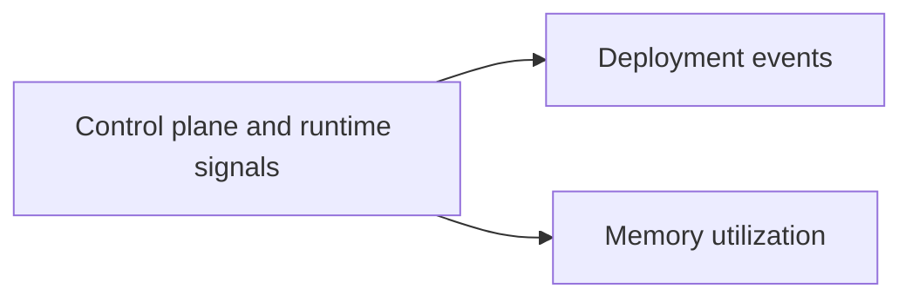

# Platform Queries

Platform queries help you investigate symptoms that often come from changes around the function rather than only inside the handler. Typical examples are deployments, configuration updates, and memory pressure revealed by Lambda `REPORT` lines.

## Included Queries

| Query | Use it for |
|---|---|
| [Deployment Events](./deployment-events.md) | Find `UpdateFunctionCode` and related CloudTrail activity near an incident |
| [Memory Utilization](./memory-utilization.md) | Compare `Max Memory Used` with configured memory size from `REPORT` lines |

## Investigation Pattern

1. Ask whether the symptom started after a deploy or configuration change.
2. Use Lambda-generated `REPORT` lines to confirm resource pressure before resizing memory or timeout.
3. Correlate platform-level evidence with application-level evidence before rollback or redeploy.

!!! tip
    If you are about to change memory size, timeout, alias routing, or VPC settings, pause and capture baseline evidence first. Platform changes are easier to justify when tied to `REPORT` lines or CloudTrail timestamps.

## See Also

- [CloudWatch Query Library](../index.md)
- [Correlation Queries](../correlation/index.md)
- [Architecture Overview](../../architecture-overview.md)
- [Deploy vs Errors](../correlation/deploy-vs-errors.md)
- [Evidence Map](../../evidence-map.md)

## Sources

- [Logging AWS Lambda function invocations](https://docs.aws.amazon.com/lambda/latest/dg/monitoring-cloudwatchlogs.html)
- [Logging AWS API calls with CloudTrail](https://docs.aws.amazon.com/lambda/latest/dg/logging-using-cloudtrail.html)
- [CloudWatch Logs Insights query syntax](https://docs.aws.amazon.com/AmazonCloudWatch/latest/logs/CWL_QuerySyntax.html)
