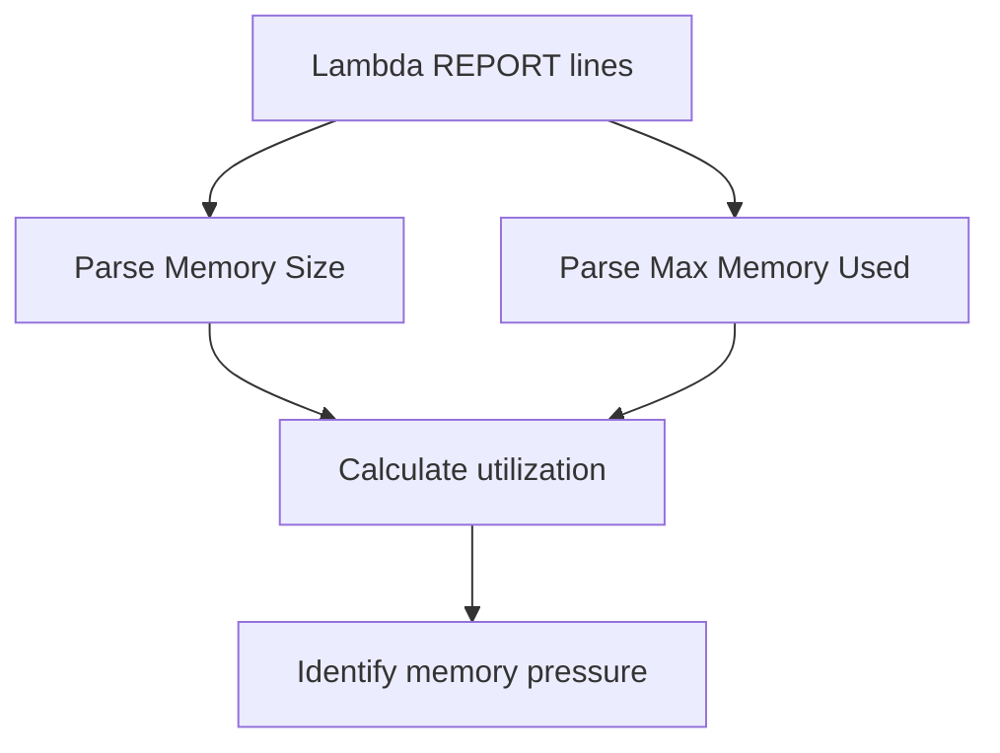

# Lambda Memory Utilization

## When to Use
Use this query when duration is rising, the function crashes with memory-related symptoms, or you are deciding whether to increase the memory setting. It reads Lambda `REPORT` lines to compare `Max Memory Used` against the configured memory size.



## Prerequisites
-    Log group: `/aws/lambda/$FUNCTION_NAME`
-    IAM permissions: `logs:StartQuery`, `logs:GetQueryResults`, and `logs:DescribeLogGroups`
-    Standard Lambda `REPORT` lines must be present in the function log group

## Query
```text
fields @timestamp, @message
| filter @message like /REPORT RequestId:/
| parse @message /Memory Size: (?<memorySizeMb>[0-9]+) MB/
| parse @message /Max Memory Used: (?<maxMemoryUsedMb>[0-9]+) MB/
| stats avg(maxMemoryUsedMb) as avgMaxMemoryUsedMb, max(maxMemoryUsedMb) as peakMemoryUsedMb, max(memorySizeMb) as configuredMemoryMb by bin(15m) as timeWindow
| fields timeWindow, configuredMemoryMb, avgMaxMemoryUsedMb, peakMemoryUsedMb, round((peakMemoryUsedMb * 100.0) / configuredMemoryMb, 2) as peakUtilizationPercent
| sort timeWindow desc
```

## Example Output
| timeWindow | configuredMemoryMb | avgMaxMemoryUsedMb | peakMemoryUsedMb | peakUtilizationPercent |
| --- | ---: | ---: | ---: | ---: |
| 2026-04-07 14:00:00 | 512 | 401 | 498 | 97.27 |
| 2026-04-07 13:45:00 | 512 | 356 | 442 | 86.33 |
| 2026-04-07 13:30:00 | 512 | 211 | 260 | 50.78 |

## How to Read the Results
!!! tip
    If `peakUtilizationPercent` is consistently above 80 to 90 percent, memory pressure may be contributing to long duration or instability. If utilization stays low while duration is still high, the bottleneck is more likely CPU-independent waiting, such as downstream latency.

## Variations
-    List the most memory-heavy individual invocations:

    ```text
    fields @timestamp, @message
    | filter @message like /REPORT RequestId:/
    | parse @message /Memory Size: (?<memorySizeMb>[0-9]+) MB/
    | parse @message /Max Memory Used: (?<maxMemoryUsedMb>[0-9]+) MB/
    | fields @timestamp, memorySizeMb, maxMemoryUsedMb, round((maxMemoryUsedMb * 100.0) / memorySizeMb, 2) as utilizationPercent
    | sort utilizationPercent desc
    | limit 50
    ```

-    Compare memory use during cold starts only:

    ```text
    fields @timestamp, @message
    | filter @message like /REPORT RequestId:/ and @message like /Init Duration:/
    | parse @message /Memory Size: (?<memorySizeMb>[0-9]+) MB/
    | parse @message /Max Memory Used: (?<maxMemoryUsedMb>[0-9]+) MB/
    | stats avg(maxMemoryUsedMb) as avgColdStartMemoryMb, max(maxMemoryUsedMb) as peakColdStartMemoryMb by bin(15m) as timeWindow
    | sort timeWindow desc
    ```

## See Also
-    [Platform Queries](./index.md)
-    [Cold Start Duration](../invocation/cold-start-duration.md)
-    [Out of Memory Diagnosis Card](../../quick-diagnosis-cards.md)
-    [Memory Exhaustion Playbook](../../playbooks/performance/memory-exhaustion.md)

## Sources
-    https://docs.aws.amazon.com/AmazonCloudWatch/latest/logs/CWL_QuerySyntax.html
-    https://docs.aws.amazon.com/lambda/latest/dg/configuration-memory.html
-    https://docs.aws.amazon.com/lambda/latest/dg/monitoring-cloudwatchlogs.html
