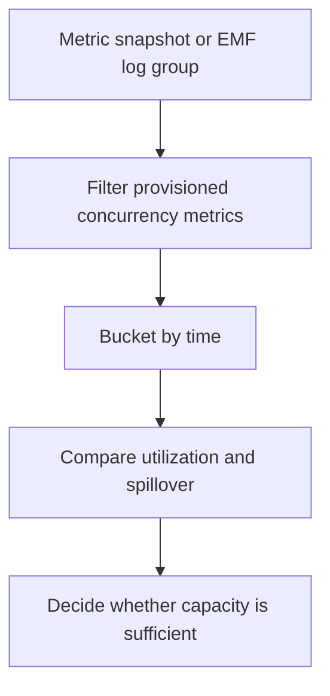

# Lambda Provisioned Concurrency

## When to Use
Use this query when you need to confirm whether provisioned concurrency is absorbing burst traffic or spilling requests into standard on-demand execution. It is useful when teams export Lambda concurrency metrics into a CloudWatch Logs log group and want a single Logs Insights view of utilization and spillover behavior.



## Prerequisites
-    Log group: a custom metric snapshot log group or EMF log group that contains Lambda provisioned concurrency metrics
-    IAM permissions: `logs:StartQuery`, `logs:GetQueryResults`, and `logs:DescribeLogGroups`
-    Select the log group that stores metric records such as `{"functionName":"$FUNCTION_NAME","metricName":"ProvisionedConcurrentExecutions","value":18}` and `{"functionName":"$FUNCTION_NAME","metricName":"ProvisionedConcurrencySpilloverInvocations","value":4}`
-    This query depends on exported metric samples in logs. The authoritative metrics remain `ProvisionedConcurrentExecutions` and `ProvisionedConcurrencySpilloverInvocations` in CloudWatch Metrics.

## Query
```sql
fields @timestamp, functionName, metricName, value
| filter functionName = "$FUNCTION_NAME"
| filter metricName = "ProvisionedConcurrentExecutions" or metricName = "ProvisionedConcurrencySpilloverInvocations"
| stats max(if(metricName = "ProvisionedConcurrentExecutions", value, 0)) as provisionedConcurrencyInUse,
    sum(if(metricName = "ProvisionedConcurrencySpilloverInvocations", value, 0)) as spilloverInvocations by bin(5m) as timeWindow
| sort timeWindow desc
```

## Example Output
| timeWindow | provisionedConcurrencyInUse | spilloverInvocations |
| --- | ---: | ---: |
| 2026-04-07 14:00:00 | 25 | 18 |
| 2026-04-07 13:55:00 | 25 | 7 |
| 2026-04-07 13:50:00 | 19 | 0 |

## How to Read the Results
!!! tip
    If `provisionedConcurrencyInUse` stays near the configured provisioned level and `spilloverInvocations` rises, burst demand is exceeding pre-initialized capacity. If spillover remains zero while utilization is low, provisioned concurrency may be overprovisioned for the current traffic pattern.

## Variations
-    Increase resolution during a scaling event:

    ```sql
    fields @timestamp, functionName, metricName, value
    | filter functionName = "$FUNCTION_NAME"
    | filter metricName = "ProvisionedConcurrentExecutions" or metricName = "ProvisionedConcurrencySpilloverInvocations"
    | stats max(if(metricName = "ProvisionedConcurrentExecutions", value, 0)) as provisionedConcurrencyInUse,
        sum(if(metricName = "ProvisionedConcurrencySpilloverInvocations", value, 0)) as spilloverInvocations by bin(1m) as timeWindow
    | sort timeWindow desc
    ```

-    Show only periods with spillover:

    ```sql
    fields @timestamp, functionName, metricName, value
    | filter functionName = "$FUNCTION_NAME"
    | filter metricName = "ProvisionedConcurrentExecutions" or metricName = "ProvisionedConcurrencySpilloverInvocations"
    | stats max(if(metricName = "ProvisionedConcurrentExecutions", value, 0)) as provisionedConcurrencyInUse,
        sum(if(metricName = "ProvisionedConcurrencySpilloverInvocations", value, 0)) as spilloverInvocations by bin(5m) as timeWindow
    | filter spilloverInvocations > 0
    | sort timeWindow desc
    ```

-    Break out results by function version or alias when your metric export includes that field:

    ```sql
    fields @timestamp, functionName, metricName, value, resourceLabel
    | filter functionName = "$FUNCTION_NAME"
    | filter metricName = "ProvisionedConcurrentExecutions" or metricName = "ProvisionedConcurrencySpilloverInvocations"
    | stats max(if(metricName = "ProvisionedConcurrentExecutions", value, 0)) as provisionedConcurrencyInUse,
        sum(if(metricName = "ProvisionedConcurrencySpilloverInvocations", value, 0)) as spilloverInvocations by bin(5m) as timeWindow, resourceLabel
    | sort timeWindow desc, resourceLabel asc
    ```

## See Also
-    [Platform Queries](./index.md)
-    [Throttle Trend](../invocation/throttle-trend.md)
-    [Concurrency vs Throttles](../correlation/concurrency-vs-throttles.md)
-    [Provisioned Concurrency](../../../operations/provisioned-concurrency.md)

## Sources
-    https://docs.aws.amazon.com/AmazonCloudWatch/latest/logs/CWL_QuerySyntax.html
-    https://docs.aws.amazon.com/lambda/latest/dg/monitoring-metrics-types.html
-    https://docs.aws.amazon.com/lambda/latest/dg/provisioned-concurrency.html
-    https://docs.aws.amazon.com/lambda/latest/dg/monitoring-cloudwatchlogs.html
