# Lambda Troubleshooting Decision Tree

Use this tree when you know the symptom but do not yet know whether the failure is in the invoke path, the execution environment, the handler, or a downstream dependency. Follow the symptom branch until you reach the best next playbook.

```mermaid
flowchart TD
    A[Start: What symptom do you see?]

    A --> B[Function returns error]
    A --> C[Function times out]
    A --> D[Function throttled]
    A --> E[Cold start too slow]
    A --> F[Memory pressure or OOM]
    A --> G[Permission denied]
    A --> H[VPC or downstream connectivity failure]

    B --> B1{Error pattern}
    B1 -->|Unhandled exception| B2[Runtime crash playbook]
    B1 -->|Task timed out text| C2[Function timeout playbook]
    B1 -->|AccessDenied or Unauthorized| G2[Permission denied playbook]
    B1 -->|5xx after deployment| P1[Deploy vs errors correlation]

    C --> C1{Where is time spent?}
    C1 -->|High Init Duration| E2[Cold start optimization playbook]
    C1 -->|Handler waits on dependency| H2[Endpoint timeout playbook]
    C1 -->|CPU or memory constrained| F2[Memory exhaustion playbook]
    C1 -->|Unknown| Q1[Timeout errors query]

    D --> D1{Throttle source}
    D1 -->|Account or function concurrency limit| D2[Concurrency limits playbook]
    D1 -->|Burst traffic after deploy| D3[Concurrency vs throttles query]
    D1 -->|Caller sees TooManyRequestsException| Q2[Throttle trend query]

    E --> E1{Cold start driver}
    E1 -->|Large package or layers| E2
    E1 -->|VPC attach overhead or network init| H3[VPC connectivity playbook]
    E1 -->|Java or .NET init heavy| E2
    E1 -->|Need proof from logs| Q3[Cold start duration query]

    F --> F1{Memory symptom}
    F1 -->|Out of memory crash| F2
    F1 -->|Max Memory Used near limit| Q4[Memory utilization query]
    F1 -->|Duration climbs before timeout| C2

    G --> G1{Permission boundary}
    G1 -->|Function execution role| G2
    G1 -->|Invoke permission or resource policy| G3[API Gateway integration playbook]
    G1 -->|Deployment role or config change| P2[Deployment events query]

    H --> H1{Connectivity symptom}
    H1 -->|Function in VPC cannot reach internet| H3
    H1 -->|Database reachable intermittently| H4[RDS Proxy connectivity playbook]
    H1 -->|API call or SDK request stalls| H2
    H1 -->|Need initial triage| H5[VPC timeout diagnosis card]

    B2 --> Z[Investigate playbook or lab]
    C2 --> Z
    D2 --> Z
    D3 --> Z
    E2 --> Z
    F2 --> Z
    G2 --> Z
    G3 --> Z
    H2 --> Z
    H3 --> Z
    H4 --> Z
    P1 --> Z
    P2 --> Z
    Q1 --> Z
    Q2 --> Z
    Q3 --> Z
    Q4 --> Z
    H5 --> Z
```

## How to Use the Tree

1. Pick the symptom you can verify, not the suspected root cause.
2. Use one branch until you reach a specific query or playbook.
3. Collect evidence before making configuration changes.
4. If two branches fit, start with the one that requires the least destructive action.

## Symptom-to-Page Map

| Symptom | Best next page |
|---|---|
| Unhandled exception | [Runtime Exceptions](./cloudwatch/application/runtime-exceptions.md) |
| Timeout | [Timeout Errors](./cloudwatch/application/timeout-errors.md) |
| Throttle | [Throttle Trend](./cloudwatch/invocation/throttle-trend.md) |
| Cold start latency | [Cold Start Duration](./cloudwatch/invocation/cold-start-duration.md) |
| Memory pressure | [Memory Utilization](./cloudwatch/platform/memory-utilization.md) |
| Deployment regression | [Deploy vs Errors](./cloudwatch/correlation/deploy-vs-errors.md) |
| VPC connectivity | [VPC Connectivity Playbook](./playbooks/networking/vpc-connectivity.md) |

!!! tip
    The fastest investigations usually start by deciding whether the invocation failed before your code ran, during initialization, during handler execution, or after the handler when the caller interpreted the response.

## See Also

- [Troubleshooting Hub](./index.md)
- [Mental Model](./mental-model.md)
- [Quick Diagnosis Cards](./quick-diagnosis-cards.md)
- [CloudWatch Query Library](./cloudwatch/index.md)
- [Playbooks](./playbooks/index.md)

## Sources

- [Troubleshoot Lambda function invocation issues](https://docs.aws.amazon.com/lambda/latest/dg/troubleshooting-invocation.html)
- [Troubleshoot Lambda networking issues](https://docs.aws.amazon.com/lambda/latest/dg/troubleshooting-networking.html)
- [Troubleshoot Lambda function configuration issues](https://docs.aws.amazon.com/lambda/latest/dg/troubleshooting-configuration.html)
- [Lambda quotas](https://docs.aws.amazon.com/lambda/latest/dg/gettingstarted-limits.html)
