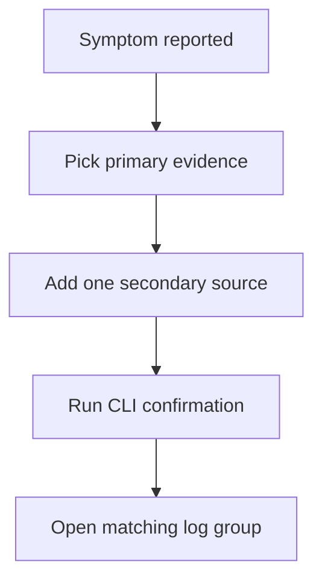

# Evidence Map

Collect the smallest set of evidence that can separate service-path failures from code-path failures. In Lambda, that usually means pairing one primary signal with one secondary corroborating signal.

## Evidence Collection Table

| Symptom | Primary Evidence | Secondary Evidence | CLI Commands | Log Group |
|---|---|---|---|---|
| Function returns error | Function log lines with exception text | `Errors` metric, X-Ray trace | `aws logs tail "/aws/lambda/$FUNCTION_NAME" --since 15m --region "$REGION"` | `/aws/lambda/$FUNCTION_NAME` |
| Function times out | `Task timed out` message and `REPORT` duration | `Duration` metric percentile, downstream service latency | `aws logs tail "/aws/lambda/$FUNCTION_NAME" --since 15m --region "$REGION"` | `/aws/lambda/$FUNCTION_NAME` |
| Function throttled | `Throttles` metric or invoke failures in CloudTrail | `ConcurrentExecutions`, reserved concurrency settings | `aws cloudwatch get-metric-statistics --namespace AWS/Lambda --metric-name Throttles --dimensions Name=FunctionName,Value="$FUNCTION_NAME" --start-time 2026-04-07T00:00:00Z --end-time 2026-04-07T01:00:00Z --period 300 --statistics Sum --region "$REGION"` | CloudTrail log group for Lambda API activity |
| Cold start too slow | `Init Duration` in `REPORT` line | X-Ray init segment, package and layer size review | `aws logs start-query --log-group-name "/aws/lambda/$FUNCTION_NAME" --start-time 1712448000 --end-time 1712451600 --query-string 'fields @timestamp, @message | filter @message like /Init Duration/' --region "$REGION"` | `/aws/lambda/$FUNCTION_NAME` |
| Out of memory | `REPORT` line with high `Max Memory Used` or OOM crash | `Duration` growth, package/runtime footprint | `aws lambda get-function-configuration --function-name "$FUNCTION_NAME" --region "$REGION"` | `/aws/lambda/$FUNCTION_NAME` |
| Permission denied | `AccessDeniedException` or `User is not authorized` text | IAM policy simulator, CloudTrail config changes | `aws lambda get-policy --function-name "$FUNCTION_NAME" --region "$REGION"` | `/aws/lambda/$FUNCTION_NAME` and CloudTrail log group |
| VPC timeout | Long duration, socket timeout, DNS or connection errors | Subnet routing, security groups, NAT path, RDS Proxy metrics | `aws lambda get-function-configuration --function-name "$FUNCTION_NAME" --region "$REGION"` | `/aws/lambda/$FUNCTION_NAME` |

## Log Group Guidance

| Investigation target | Typical log group |
|---|---|
| Function runtime logs | `/aws/lambda/$FUNCTION_NAME` |
| CloudTrail management events for deploy and invoke API activity | Organization or account CloudTrail log group |
| API Gateway execution or access logs | API-specific log group if Lambda is fronted by API Gateway |
| Custom application telemetry | Team-defined log group or EMF log stream |

## Evidence Prioritization Rules

1. Prefer timestamps from AWS-generated records over screenshots or dashboards.
2. Prefer raw `REPORT` lines over memory or duration guesses.
3. Prefer CloudTrail records over human deployment memory.
4. Prefer one precise query over reading many log streams manually.

!!! tip
    If the symptom is intermittent, always preserve the first failing timestamp, one succeeding timestamp, and the most recent deployment or configuration change time. That three-point timeline is often enough to isolate the domain.

## See Also

- [Troubleshooting Hub](./index.md)
- [Mental Model](./mental-model.md)
- [Quick Diagnosis Cards](./quick-diagnosis-cards.md)
- [CloudWatch Query Library](./cloudwatch/index.md)
- [Methodology: Log Sources Map](./methodology/log-sources-map.md)

## Sources

- [Monitoring Lambda functions with CloudWatch](https://docs.aws.amazon.com/lambda/latest/dg/monitoring-functions.html)
- [Logging AWS Lambda function invocations](https://docs.aws.amazon.com/lambda/latest/dg/monitoring-cloudwatchlogs.html)
- [Analyzing log data with CloudWatch Logs Insights](https://docs.aws.amazon.com/AmazonCloudWatch/latest/logs/AnalyzingLogData.html)
- [Logging AWS API calls with CloudTrail](https://docs.aws.amazon.com/lambda/latest/dg/logging-using-cloudtrail.html)
- [Troubleshoot Lambda networking issues](https://docs.aws.amazon.com/lambda/latest/dg/troubleshooting-networking.html)
