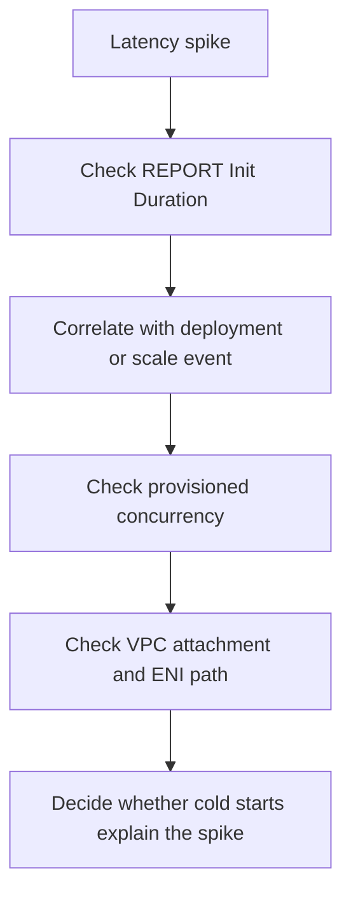

# First 10 Minutes: Cold Start Spikes

Use this checklist when latency jumps during scale-out, after deployment, or after a configuration change.

## Fast Diagnosis Model



## 10-Minute Checklist

### 1) Confirm latency moved, not just error rate

```bash
aws cloudwatch get-metric-statistics \
    --namespace AWS/Lambda \
    --metric-name Duration \
    --dimensions Name=FunctionName,Value="$FUNCTION_NAME" \
    --start-time "2026-04-07T00:00:00Z" \
    --end-time "2026-04-07T00:10:00Z" \
    --period 60 \
    --extended-statistics p95 p99 \
    --region "$REGION"
```

### 2) Inspect recent `REPORT` lines for `Init Duration`

```bash
aws logs tail "/aws/lambda/$FUNCTION_NAME" \
    --since 10m \
    --filter-pattern "REPORT" \
    --region "$REGION"
```

### 3) Correlate with deployment timing

```bash
aws cloudtrail lookup-events \
    --lookup-attributes AttributeKey=ResourceName,AttributeValue="$FUNCTION_NAME" \
    --max-results 20 \
    --region "$REGION"
```

Look for `UpdateFunctionCode`, `UpdateFunctionConfiguration`, `PublishVersion`, and alias updates near the latency spike.

### 4) Check provisioned concurrency configuration

```bash
aws lambda list-aliases \
    --function-name "$FUNCTION_NAME" \
    --region "$REGION"

aws lambda get-provisioned-concurrency-config \
    --function-name "$FUNCTION_NAME" \
    --qualifier live \
    --region "$REGION"
```

### 5) Check whether the function is VPC-attached

```bash
aws lambda get-function-configuration \
    --function-name "$FUNCTION_NAME" \
    --query '{VpcConfig:VpcConfig,MemorySize:MemorySize,Timeout:Timeout}' \
    --region "$REGION"
```

If VPC-attached, confirm subnet capacity and network path because ENI allocation and private routing can increase cold start impact.

## What Strongly Suggests Cold Starts

- `Init Duration` appears in affected log lines and is materially higher than steady-state invoke time.
- The spike begins right after deployment, scale-out, or provisioned concurrency exhaustion.
- Only first requests on new environments are slow.
- VPC-attached versions are slower than non-VPC versions under the same load.

## See Also

- [First 10 Minutes](./index.md)
- [Timeout Failures](./timeout-failures.md)
- [Cold Start Latency Lab](../lab-guides/cold-start-latency.md)
- [High Duration Lab](../lab-guides/high-duration.md)
- [Log Sources Map](../methodology/log-sources-map.md)

## Sources

- [Lambda execution environment](https://docs.aws.amazon.com/lambda/latest/dg/lambda-runtime-environment.html)
- [Monitoring metrics for Lambda functions](https://docs.aws.amazon.com/lambda/latest/dg/monitoring-metrics.html)
- [Configuring provisioned concurrency for a function](https://docs.aws.amazon.com/lambda/latest/dg/provisioned-concurrency.html)
- [Giving Lambda functions access to resources in an Amazon VPC](https://docs.aws.amazon.com/lambda/latest/dg/configuration-vpc.html)
