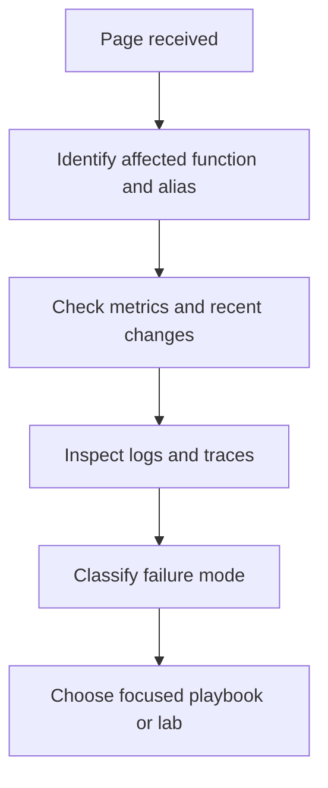

# First 10 Minutes

When a Lambda alert fires, spend the first 10 minutes separating symptom, blast radius, and recent change. Do not start by changing code. Start by confirming what failed, when it started, and whether the problem is isolated to one function, one alias, one event source, or all traffic.

## Triage Goal



## What to Confirm First

1. **Which function is failing?** Confirm `$FUNCTION_NAME`, alias, version, and `$REGION`.
2. **What changed recently?** Check deployment, configuration, IAM, event source, VPC, or downstream service changes.
3. **Is the issue active now?** Look at current error rate, duration, concurrency, and throttles.
4. **What is the dominant symptom?** Invocation errors, cold start spike, timeout, throttle, permission failure, or networking issue.

## 10-Minute Triage Checklist

### 1) Check current metrics

```bash
aws cloudwatch get-metric-statistics \
    --namespace AWS/Lambda \
    --metric-name Errors \
    --dimensions Name=FunctionName,Value="$FUNCTION_NAME" \
    --start-time "2026-04-07T00:00:00Z" \
    --end-time "2026-04-07T00:10:00Z" \
    --period 60 \
    --statistics Sum \
    --region "$REGION"

aws cloudwatch get-metric-statistics \
    --namespace AWS/Lambda \
    --metric-name Duration \
    --dimensions Name=FunctionName,Value="$FUNCTION_NAME" \
    --start-time "2026-04-07T00:00:00Z" \
    --end-time "2026-04-07T00:10:00Z" \
    --period 60 \
    --extended-statistics p95 p99 \
    --region "$REGION"
```

### 2) Check recent configuration and deployment state

```bash
aws lambda get-function \
    --function-name "$FUNCTION_NAME" \
    --region "$REGION"

aws lambda get-function-configuration \
    --function-name "$FUNCTION_NAME" \
    --region "$REGION"

aws cloudtrail lookup-events \
    --lookup-attributes AttributeKey=ResourceName,AttributeValue="$FUNCTION_NAME" \
    --max-results 20 \
    --region "$REGION"
```

### 3) Check the latest logs

```bash
aws logs tail "/aws/lambda/$FUNCTION_NAME" \
    --since 10m \
    --region "$REGION"
```

### 4) Classify the failure quickly

| Symptom | First clue | Next page |
|---|---|---|
| Requests failing with exceptions | `Errors` metric, stack trace in logs | [Invocation Errors](./invocation-errors.md) |
| Latency spike after deploy or scale-out | `REPORT` lines show high `Init Duration` | [Cold Start Spikes](./cold-start-spikes.md) |
| Requests timing out near configured limit | `Duration` approaches timeout, task timed out log | [Timeout Failures](./timeout-failures.md) |

## Fast Reality Checks

- If all versions fail, suspect shared configuration, IAM, VPC, or downstream dependency.
- If only new traffic fails after a deployment, compare alias, version, and handler/package settings.
- If only VPC-attached functions fail, check route tables, endpoints, security groups, and NAT path.
- If errors rise without code changes, check throttling, upstream request shape, and downstream latency.

## Escalation Rule

If you cannot identify the symptom class in 10 minutes, capture metrics, logs, trace IDs, recent CloudTrail changes, and current configuration before escalating. That evidence is more valuable than an early speculative fix.

## See Also

- [Invocation Errors](./invocation-errors.md)
- [Cold Start Spikes](./cold-start-spikes.md)
- [Timeout Failures](./timeout-failures.md)
- [Troubleshooting Method](../methodology/troubleshooting-method.md)
- [Log Sources Map](../methodology/log-sources-map.md)

## Sources

- [Monitoring metrics for Lambda functions](https://docs.aws.amazon.com/lambda/latest/dg/monitoring-metrics.html)
- [Viewing CloudWatch logs for Lambda](https://docs.aws.amazon.com/lambda/latest/dg/monitoring-cloudwatchlogs-view.html)
- [Lambda execution environment](https://docs.aws.amazon.com/lambda/latest/dg/lambda-runtime-environment.html)
- [Logging AWS Lambda API calls with AWS CloudTrail](https://docs.aws.amazon.com/lambda/latest/dg/logging-using-cloudtrail.html)
