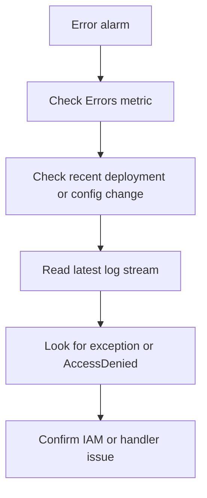

# First 10 Minutes: Invocation Errors

Use this checklist when invocations start failing with exceptions, malformed input handling, permission errors, or runtime crashes.

## Failure Triage Flow



## 10-Minute Checklist

### 1) Confirm the error spike

```bash
aws cloudwatch get-metric-statistics \
    --namespace AWS/Lambda \
    --metric-name Errors \
    --dimensions Name=FunctionName,Value="$FUNCTION_NAME" \
    --start-time "2026-04-07T00:00:00Z" \
    --end-time "2026-04-07T00:10:00Z" \
    --period 60 \
    --statistics Sum \
    --region "$REGION"
```

### 2) Check for a recent deployment or configuration change

```bash
aws lambda get-function-configuration \
    --function-name "$FUNCTION_NAME" \
    --region "$REGION"

aws cloudtrail lookup-events \
    --lookup-attributes AttributeKey=ResourceName,AttributeValue="$FUNCTION_NAME" \
    --max-results 20 \
    --region "$REGION"
```

### 3) Read the latest function logs

```bash
aws logs tail "/aws/lambda/$FUNCTION_NAME" \
    --since 10m \
    --region "$REGION"
```

Look for:

- `Task timed out`
- `Runtime.ExitError`
- unhandled exception stack traces
- `AccessDeniedException`
- handler import or module load failures

### 4) Check execution role permissions

```bash
aws lambda get-function-configuration \
    --function-name "$FUNCTION_NAME" \
    --query 'Role' \
    --output text \
    --region "$REGION"

aws iam simulate-principal-policy \
    --policy-source-arn "arn:aws:iam::<account-id>:role/service-role/example-lambda-role" \
    --action-names dynamodb:GetItem s3:GetObject kms:Decrypt \
    --region "$REGION"
```

### 5) Check whether a specific version or alias is affected

```bash
aws lambda list-aliases \
    --function-name "$FUNCTION_NAME" \
    --region "$REGION"

aws lambda list-versions-by-function \
    --function-name "$FUNCTION_NAME" \
    --region "$REGION"
```

## What to Decide in 10 Minutes

| Evidence | Likely cause | Immediate action |
|---|---|---|
| New error spike started immediately after `UpdateFunctionCode` | bad deployment package or handler | compare version, roll alias if needed |
| `AccessDeniedException` in logs | missing IAM permission | inspect execution role and recent IAM changes |
| Import or handler load failure | invalid handler or packaging problem | inspect `Handler`, runtime, archive layout |
| Runtime exception with same input path | application bug or data issue | isolate payload pattern and reproduce |

## See Also

- [First 10 Minutes](./index.md)
- [Timeout Failures](./timeout-failures.md)
- [Function Timeout Lab](../lab-guides/function-timeout.md)
- [Permission Denied Lab](../lab-guides/permission-denied.md)
- [Deployment Failed Lab](../lab-guides/deployment-failed.md)

## Sources

- [Monitoring metrics for Lambda functions](https://docs.aws.amazon.com/lambda/latest/dg/monitoring-metrics.html)
- [Lambda function configuration](https://docs.aws.amazon.com/lambda/latest/dg/configuration-function-common.html)
- [Viewing CloudWatch logs for Lambda](https://docs.aws.amazon.com/lambda/latest/dg/monitoring-cloudwatchlogs-view.html)
- [Execution role for Lambda](https://docs.aws.amazon.com/lambda/latest/dg/lambda-intro-execution-role.html)
- [Logging AWS Lambda API calls with AWS CloudTrail](https://docs.aws.amazon.com/lambda/latest/dg/logging-using-cloudtrail.html)
