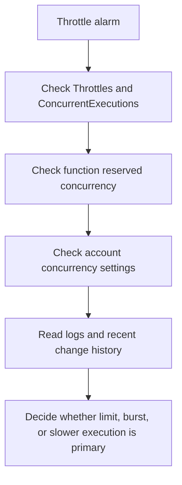

# First 10 Minutes: Throttling Errors

Use this checklist when Lambda starts returning `TooManyRequestsException`, upstream retries increase, or event source backlog grows during traffic spikes.

## Throttle Triage Flow



## 10-Minute Checklist

### 1) Confirm the throttle spike

```bash
aws cloudwatch get-metric-statistics \
    --namespace AWS/Lambda \
    --metric-name Throttles \
    --dimensions Name=FunctionName,Value="$FUNCTION_NAME" \
    --start-time "2026-04-07T00:00:00Z" \
    --end-time "2026-04-07T00:10:00Z" \
    --period 60 \
    --statistics Sum \
    --region "$REGION"

aws cloudwatch get-metric-statistics \
    --namespace AWS/Lambda \
    --metric-name ConcurrentExecutions \
    --dimensions Name=FunctionName,Value="$FUNCTION_NAME" \
    --start-time "2026-04-07T00:00:00Z" \
    --end-time "2026-04-07T00:10:00Z" \
    --period 60 \
    --statistics Maximum \
    --region "$REGION"
```

### 2) Check whether reserved concurrency is capping the function

```bash
aws lambda get-function-concurrency \
    --function-name "$FUNCTION_NAME" \
    --region "$REGION"

aws lambda list-aliases \
    --function-name "$FUNCTION_NAME" \
    --region "$REGION"
```

If the function has a low reserved concurrency value, treat that as the first likely bottleneck.

### 3) Check account-level concurrency headroom

```bash
aws lambda get-account-settings \
    --region "$REGION"
```

Focus on `ConcurrentExecutions` and `UnreservedConcurrentExecutions` to decide whether the problem is local to one function or shared across the account.

### 4) Check recent change history and current configuration

```bash
aws lambda get-function-configuration \
    --function-name "$FUNCTION_NAME" \
    --query '{Timeout:Timeout,MemorySize:MemorySize,Runtime:Runtime}' \
    --region "$REGION"

aws cloudtrail lookup-events \
    --lookup-attributes AttributeKey=ResourceName,AttributeValue="$FUNCTION_NAME" \
    --max-results 20 \
    --region "$REGION"
```

Look for a deployment, timeout change, memory change, or alias shift near the start of the throttle spike.

### 5) Read logs and compare with execution duration

```bash
aws logs tail "/aws/lambda/$FUNCTION_NAME" \
    --since 10m \
    --region "$REGION"

aws cloudwatch get-metric-statistics \
    --namespace AWS/Lambda \
    --metric-name Duration \
    --dimensions Name=FunctionName,Value="$FUNCTION_NAME" \
    --start-time "2026-04-07T00:00:00Z" \
    --end-time "2026-04-07T00:10:00Z" \
    --period 60 \
    --extended-statistics p95 p99 \
    --region "$REGION"
```

Look for:

- `TooManyRequestsException`
- retry amplification from callers or event sources
- longer execution time before throttle growth
- concurrency plateau during the incident window

## What to Decide in 10 Minutes

| Evidence | Likely cause | Immediate action |
|---|---|---|
| Throttles begin when function concurrency reaches a fixed cap | reserved concurrency too low | raise or review reserved concurrency setting |
| Multiple functions degrade and unreserved headroom is near zero | account concurrency exhaustion | reduce competing load or request quota increase |
| Throttles start with a sudden invoke burst | burst traffic outpaced scaling | inspect caller backoff, batching, and event source behavior |
| Duration rises before throttles grow | slower execution consumed concurrency | inspect downstream latency, rollback, or reduce work per invoke |

## See Also

- [First 10 Minutes](./index.md)
- [Invocation Errors](./invocation-errors.md)
- [Timeout Failures](./timeout-failures.md)
- [Throttle Trend](../cloudwatch/invocation/throttle-trend.md)
- [Concurrency vs Throttles](../cloudwatch/correlation/concurrency-vs-throttles.md)
- [Throttling Playbook](../playbooks/invocation-errors/throttling.md)

## Sources

- [Lambda concurrency](https://docs.aws.amazon.com/lambda/latest/dg/lambda-concurrency.html)
- [Monitoring metrics for Lambda functions](https://docs.aws.amazon.com/lambda/latest/dg/monitoring-metrics.html)
- [Lambda quotas](https://docs.aws.amazon.com/lambda/latest/dg/gettingstarted-limits.html)
- [Logging AWS Lambda API calls with AWS CloudTrail](https://docs.aws.amazon.com/lambda/latest/dg/logging-using-cloudtrail.html)
- [Viewing CloudWatch logs for Lambda](https://docs.aws.amazon.com/lambda/latest/dg/monitoring-cloudwatchlogs-view.html)
