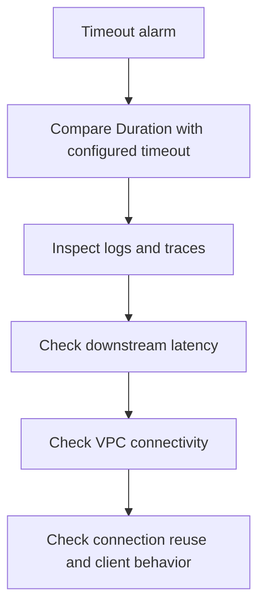

# First 10 Minutes: Timeout Failures

Use this checklist when Lambda invocations run until the configured timeout and fail with `Task timed out`.

## Timeout Triage Flow



## 10-Minute Checklist

### 1) Confirm the timeout setting and recent duration

```bash
aws lambda get-function-configuration \
    --function-name "$FUNCTION_NAME" \
    --query '{Timeout:Timeout,MemorySize:MemorySize,VpcConfig:VpcConfig}' \
    --region "$REGION"

aws cloudwatch get-metric-statistics \
    --namespace AWS/Lambda \
    --metric-name Duration \
    --dimensions Name=FunctionName,Value="$FUNCTION_NAME" \
    --start-time "2026-04-07T00:00:00Z" \
    --end-time "2026-04-07T00:10:00Z" \
    --period 60 \
    --extended-statistics p95 p99 \
    --region "$REGION"
```

### 2) Check logs for timeout evidence

```bash
aws logs tail "/aws/lambda/$FUNCTION_NAME" \
    --since 10m \
    --region "$REGION"
```

Look for:

- `Task timed out after ... seconds`
- long gaps before downstream response logs
- retry loops or repeated connection setup

### 3) Check downstream dependency latency

```bash
aws xray get-service-graph \
    --start-time 1712448000 \
    --end-time 1712448600 \
    --region "$REGION"
```

If X-Ray is not enabled, inspect application logs around outbound calls and compare with service-side metrics.

### 4) Check VPC connectivity if the function runs in a VPC

```bash
aws lambda get-function-configuration \
    --function-name "$FUNCTION_NAME" \
    --query 'VpcConfig' \
    --region "$REGION"
```

If VPC-attached, suspect route tables, NAT egress, security groups, DNS resolution, or missing VPC endpoints.

### 5) Check connection reuse behavior

Common clues:

- every invocation creates fresh SDK clients or database connections
- TLS handshake or socket setup dominates latency
- warm invocations are almost as slow as cold invocations

## What to Decide in 10 Minutes

| Evidence | Likely cause | Immediate next step |
|---|---|---|
| `Duration` is consistently just below timeout | true work exceeds configured limit | inspect downstream latency and handler design |
| Timeouts only in VPC version | network path issue | inspect VPC route, endpoint, NAT, and security groups |
| Timeouts after new dependency rollout | code path regression | compare deployment version and trace spans |
| Warm and cold invocations both slow | downstream or connection setup issue | inspect X-Ray and client reuse pattern |

## See Also

- [First 10 Minutes](./index.md)
- [Invocation Errors](./invocation-errors.md)
- [Function Timeout Lab](../lab-guides/function-timeout.md)
- [VPC Connectivity Lab](../lab-guides/vpc-connectivity.md)
- [NAT Gateway Issues Lab](../lab-guides/nat-gateway-issues.md)

## Sources

- [Configuring function timeout](https://docs.aws.amazon.com/lambda/latest/dg/configuration-timeout.html)
- [Monitoring metrics for Lambda functions](https://docs.aws.amazon.com/lambda/latest/dg/monitoring-metrics.html)
- [Configuring AWS X-Ray for Lambda](https://docs.aws.amazon.com/lambda/latest/dg/services-xray.html)
- [Giving Lambda functions access to resources in an Amazon VPC](https://docs.aws.amazon.com/lambda/latest/dg/configuration-vpc.html)
- [Best practices for working with AWS Lambda functions](https://docs.aws.amazon.com/lambda/latest/dg/best-practices.html)
